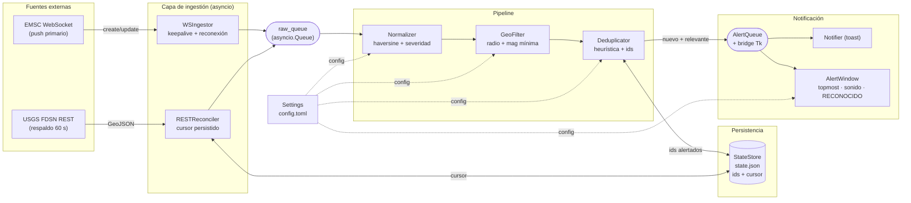
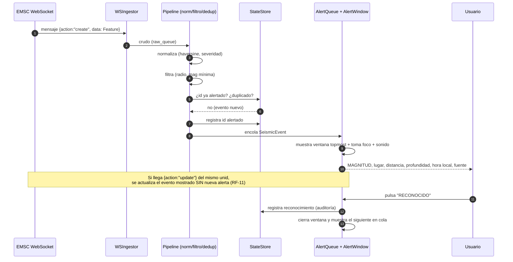
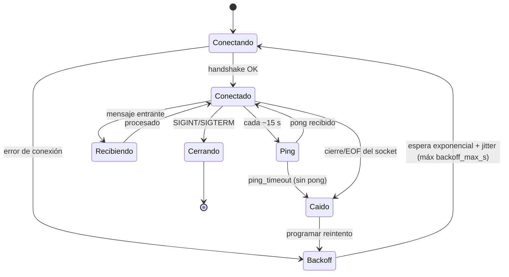
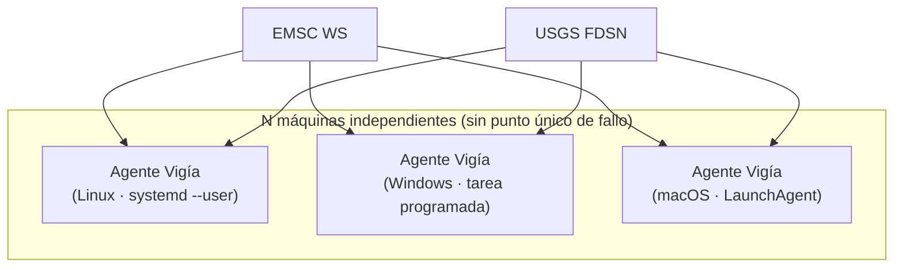

# ARCHITECTURE — Vigía-eew

| Campo | Valor |
|---|---|
| Documento | Arquitectura del sistema y diagramas |
| Versión | 1.0 (borrador para revisión) |
| Estado | 🟡 Pendiente de aprobación |
| Relacionado | `docs/PRD.md`, `docs/API-SPEC.md`, `docs/TECHNICAL-DESIGN.md`, `docs/DATA-MODEL.md`, `docs/IMPLEMENTATION-PLAN.md` |

> Los diagramas están en **Mermaid** (texto renderizable en GitHub y la mayoría de visores Markdown).

---

## 1. Visión general

Vigía es un **proceso asyncio único por máquina** sin punto único de fallo (RNF-02). Recibe sismos
por **push** (WebSocket EMSC, vía primaria) y los reconcilia con un **respaldo de baja frecuencia**
(polling USGS cada 60 s). Un *pipeline* los normaliza, filtra por zona y deduplica; los eventos
nuevos y relevantes disparan una **alerta de escritorio no descartable** (ventana superpuesta +
toast + sonido). El estado crítico se **persiste** para sobrevivir reinicios.

## 2. Componentes

| Componente | Rol | RF |
|---|---|---|
| **WSIngestor (EMSC)** | Conexión WebSocket, keepalive 15 s, reconexión con backoff, emite crudos | RF-01..RF-04 |
| **RESTReconciler (USGS)** | Polling 60 s con cursor persistido; red de seguridad | RF-05, RF-06 |
| **Normalizer** | Crudo→`SeismicEvent`; haversine; severidad | RF-07, RF-08, RF-13 |
| **GeoFilter** | Descarta fuera de radio o bajo magnitud mínima | RF-12 |
| **Deduplicator** | Heurística inter-fuente; ids persistidos; maneja `update` | RF-09..RF-11 |
| **Notifier (toast)** | Toast nativo informativo (`desktop-notifier`) | RF-14 |
| **AlertWindow (overlay)** | Ventana Tkinter topmost, con foco, no descartable | RF-15..RF-19 |
| **AlertQueue + bridge** | Cola de eventos; puente asyncio↔Tk | RF-20 |
| **Sound** | Audio por severidad | RF-17 |
| **StateStore** | Persistencia JSON atómica (ids, cursor) | RF-06, RF-10 |
| **Settings** | Carga/valida `config.toml` (pydantic) | RF-24 |
| **Supervisor** | Orquesta tasks asyncio; reinicia ante fallo | RNF-03, RNF-04 |
| **Autostart** | systemd / LaunchAgent / tarea programada | RF-22, RF-23 |
| **CLI (`vigia-eew`)** | Arranque, `--simulate`, autostart | RF-21, RF-26 |

## 3. Diagrama de arquitectura — flujo de datos

## 4. Diagrama de secuencia — de EMSC a la ventana de alerta

## 5. Diagrama de estados — conexión WebSocket

## 6. Qué pasa si… (escenarios de resiliencia)

| Escenario | Comportamiento esperado | Mecanismo / RF |
|---|---|---|
| **El WS cae** | Se detecta cierre/ping_timeout → estado `Caido` → `Backoff` exponencial con jitter → reconexión perpetua. El proceso **no muere**. | RF-03, RNF-03; §5 |
| **El WS deja de recibir en silencio** | El **keepalive (ping 15 s)** detecta la pérdida vía `ping_timeout` y fuerza reconexión. | RF-02 |
| **REST falla (429/5xx/timeout)** | Se respeta `Retry-After` (429); se salta el ciclo y se reintenta a los 60 s; el **cursor se mantiene**; sin abortar. | RF-05; Technical Design §8 |
| **Llega un `update`** | Mismo `unid` ya visto → se **actualiza** el evento mostrado/encolado (p. ej. magnitud) **sin** disparar alerta nueva. | RF-11, CU-3 |
| **Dos fuentes reportan el mismo sismo** | La heurística (≤100 km, ≤90 s, ≤0.5 mag) lo reconoce como duplicado → **una sola** alerta. | RF-09, CU-4 |
| **El agente reinicia con alertas pendientes** | `StateStore` recuerda `ids_alertados` → los ya reconocidos **no se vuelven a alertar**; el `cursor_usgs` evita reprocesar histórico. | RF-06, RF-10, CU-10 |
| **JSON inválido / esquema inesperado** | Validación pydantic descarta el item y registra; el flujo continúa. | RNF-03 |
| **Pérdida total de red** | Ambas ingestas reintentan; al volver la red, USGS **reconcilia** lo perdido durante la caída. | RF-05, OBJ-3 |
| **"No molestar" del SO** | El toast puede silenciarse, pero la **ventana superpuesta topmost con foco** garantiza la alerta. | RF-15, RF-16, RNF-05 |
| **Falla la UI** | Aislada del pipeline (puente desacoplado); la ingestión sigue; se reintenta mostrar. | ADR-006 |

## 7. Despliegue

Cada máquina ejecuta su propio agente (sin SPOF). El autoarranque por SO (systemd `--user`,
LaunchAgent, tarea programada) mantiene el proceso vivo tras el inicio de sesión.

## 8. Evolución futura — relay central (no v1)

Se documenta (ADR-008) la migración a un **relay FastAPI** que consuma EMSC/USGS una sola vez y haga
*fan-out* por WebSocket a muchos clientes Vigía, **reutilizando el contrato interno** (`SeismicEvent`)
como payload para no romper el modelo de datos.

