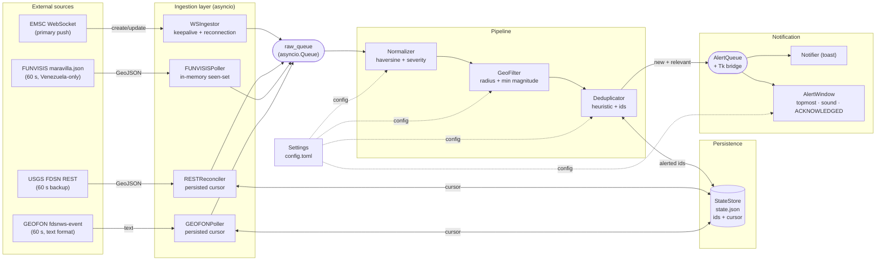
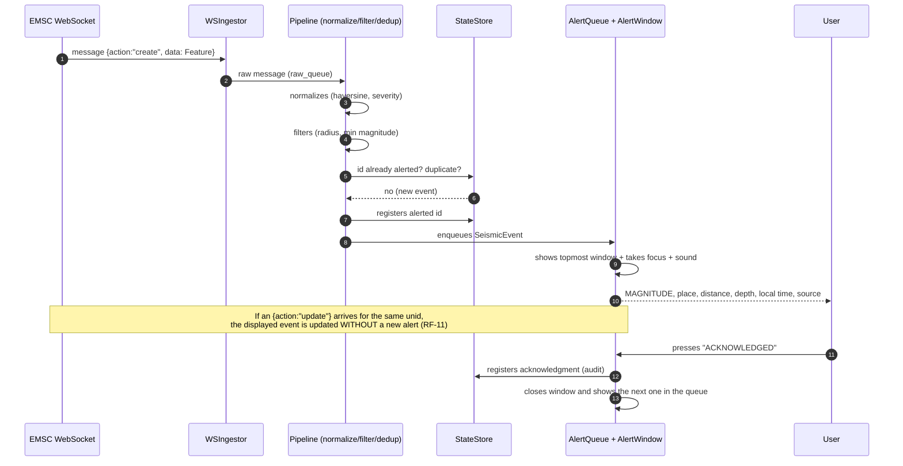
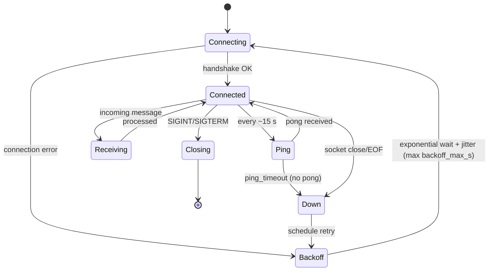
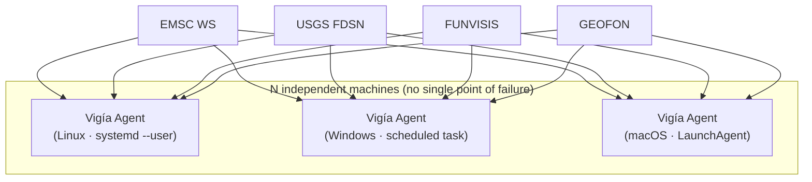
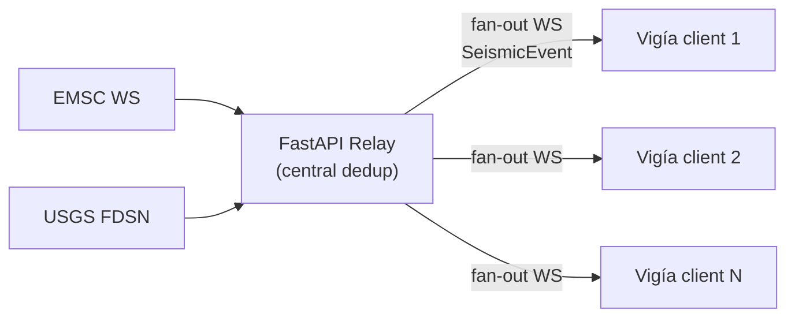

# ARCHITECTURE — Vigía-eew

| Field | Value |
|---|---|
| Document | System architecture and diagrams |
| Version | 1.0 (draft for review) |
| Status | 🟡 Pending approval |
| Related | `docs/PRD.md`, `docs/API-SPEC.md`, `docs/TECHNICAL-DESIGN.md`, `docs/DATA-MODEL.md`, `docs/IMPLEMENTATION-PLAN.md` |

> Diagrams are in **Mermaid** (renderable text on GitHub and most Markdown viewers).

---

## 1. Overview

Vigía is a **single asyncio process per machine** with no single point of failure (RNF-02). It
receives earthquakes via **push** (WebSocket EMSC, primary channel) and reconciles them with
**three low-frequency REST backups**: USGS and GEOFON (independent global networks, each
polling every 60 s with a persisted cursor) and FUNVISIS (Venezuela-only local coverage,
60 s polling, in-memory seen-set). A *pipeline* normalizes, filters by zone, and deduplicates
them across all four sources; new and relevant events trigger an **undismissable desktop
alert** (overlay window + toast + sound). Critical state is **persisted** to survive restarts.

## 2. Components

| Component | Role | RF |
|---|---|---|
| **WSIngestor (EMSC)** | WebSocket connection, 15 s keepalive, backoff reconnection, emits raw messages | RF-01..RF-04 |
| **RESTReconciler (USGS)** | 60 s polling with persisted cursor; safety net | RF-05, RF-06 |
| **FUNVISISPoller** | 60 s polling of `maravilla.json`; Venezuela-only local coverage; in-memory seen-set (no cursor) | RF-38 |
| **GEOFONPoller** | 60 s polling of `fdsnws-event` (text format); independent global-network redundancy; persisted cursor | RF-39 |
| **Normalizer** | Raw→`SeismicEvent`; haversine; severity | RF-07, RF-08, RF-13 |
| **GeoFilter** | Discards events outside radius, below minimum magnitude, or from a previous local day (RF-40, default-on) | RF-12, RF-40 |
| **Deduplicator** | Inter-source heuristic; persisted ids; handles `update` | RF-09..RF-11 |
| **Notifier (toast)** | Native informational toast (`desktop-notifier`) | RF-14 |
| **AlertWindow (overlay)** | Topmost Tkinter window, with focus, undismissable | RF-15..RF-19 |
| **AlertQueue + bridge** | Event queue; asyncio↔Tk bridge | RF-20 |
| **Sound** | Audio by severity | RF-17 |
| **StateStore** | Atomic JSON persistence (ids, cursor) | RF-06, RF-10 |
| **Settings** | Loads/validates `config.toml` (pydantic) | RF-24 |
| **Supervisor** | Orchestrates asyncio tasks; restarts on failure | RNF-03, RNF-04 |
| **Autostart** | systemd / LaunchAgent / scheduled task | RF-22, RF-23 |
| **CLI (`vigia-eew`)** | Startup, `--simulate`, autostart | RF-21, RF-26 |

## 3. Architecture diagram — data flow

## 4. Sequence diagram — from EMSC to the alert window

## 5. State diagram — WebSocket connection

## 6. What happens if… (resilience scenarios)

| Scenario | Expected behavior | Mechanism / RF |
|---|---|---|
| **The WS goes down** | Close/ping_timeout is detected → `Down` state → exponential `Backoff` with jitter → perpetual reconnection. The process **does not die**. | RF-03, RNF-03; §5 |
| **The WS silently stops receiving** | The **keepalive (15 s ping)** detects the loss via `ping_timeout` and forces reconnection. | RF-02 |
| **REST fails (429/5xx/timeout)** | `Retry-After` is honored (429); the cycle is skipped and retried after 60 s; the **cursor is kept**; no abort. | RF-05; Technical Design §8 |
| **FUNVISIS or GEOFON is unreachable/changes format** | That poller's cycle is skipped and retried after 60 s (own timeout/backoff); the other three sources are unaffected; the process **does not die**. | RF-38, RF-39 |
| **An `update` arrives** | Same `unid` already seen → the displayed/queued event is **updated** (e.g. magnitude) **without** triggering a new alert. | RF-11, CU-3 |
| **Two sources report the same earthquake** | The heuristic (≤100 km, ≤90 s, ≤0.5 mag) recognizes it as a duplicate → **a single** alert. | RF-09, CU-4 |
| **The agent restarts with pending alerts** | `StateStore` remembers `alerted_ids` → already-acknowledged ones **are not re-alerted**; `usgs_cursor`/`geofon_cursor` avoid reprocessing history. | RF-06, RF-10, CU-10 |
| **A source reports an earthquake from a previous day** (stale REST backlog, replayed signature, clock skew) | `GeoFilter`'s freshness check discards it before it reaches `Deduplicator` — no alert, regardless of source. | RF-40 |
| **The agent was off for days; the persisted USGS/GEOFON cursor is stale** | The first poll after restart floors `starttime` at local midnight instead of the stale cursor's date, bounding the backlog fetched (the freshness filter above still guarantees nothing old gets alerted even without this). | RF-41 |
| **Invalid JSON / unexpected schema** | pydantic validation discards the item and logs it; the flow continues. | RNF-03 |
| **Total network loss** | Both ingestion paths keep retrying; once the network returns, USGS **reconciles** what was missed during the outage. | RF-05, OBJ-3 |
| **OS "do not disturb"** | The toast may be silenced, but the **topmost, focused overlay window** guarantees the alert. | RF-15, RF-16, RNF-05 |
| **UI fails** | Isolated from the pipeline (decoupled bridge); ingestion keeps running; showing the alert is retried. | ADR-006 |
| **The agent runs for a long time with many alerts** | `Deduplicator.register()` prunes `alerted_ids`/`recent_signatures` older than 24 h before every `save()`, so `state.json` stays bounded instead of growing forever. | RF-42 |

## 7. Deployment

Each machine runs its own agent (no SPOF). OS-specific autostart (systemd `--user`, LaunchAgent,
scheduled task) keeps the process alive after login.

## 8. Future evolution — central relay (not v1)

ADR-008 documents the migration to a **FastAPI relay** that consumes EMSC/USGS once and does
*fan-out* over WebSocket to many Vigía clients, **reusing the internal contract** (`SeismicEvent`)
as the payload so as not to break the data model.

