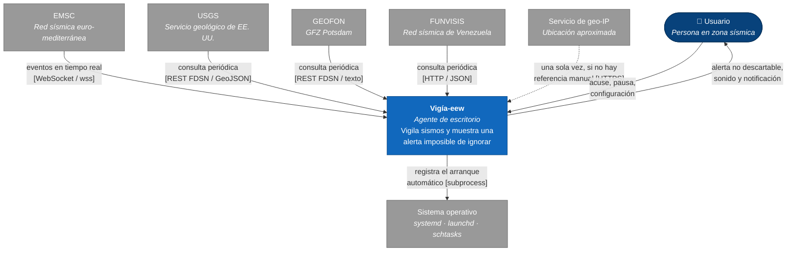
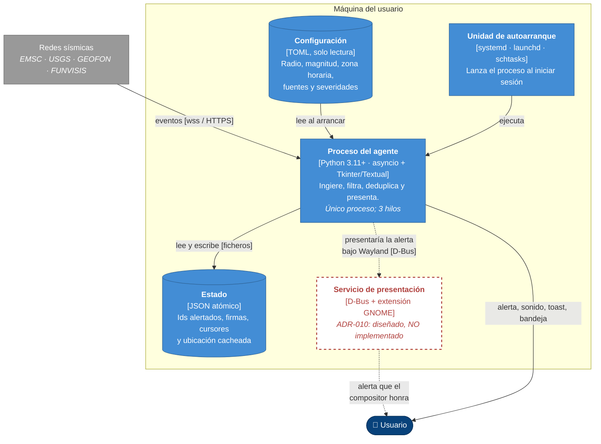
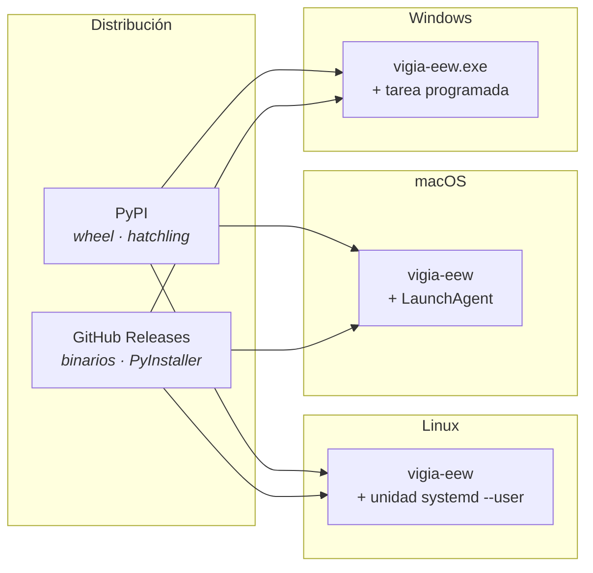
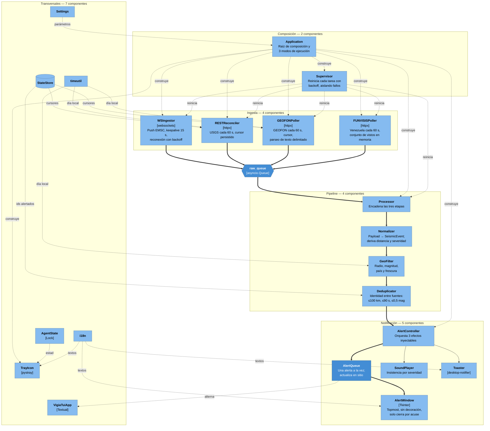
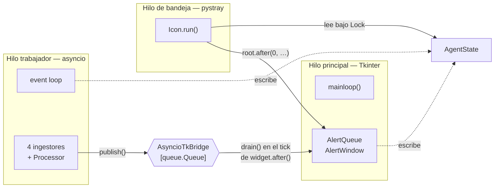

# Arquitectura C4 — Vigía-eew

> 2026-09-06 · Commit de referencia: `c3a2c29` (v0.6.0) · Describe el sistema **como es hoy**.
> Fuentes: [`docs/reverse-sdd/01-ARQUITECTURA.md`](reverse-sdd/01-ARQUITECTURA.md) (arquitectura
> narrativa), [`docs/reverse-sdd/02-STACK-TECNOLOGICO.md`](reverse-sdd/02-STACK-TECNOLOGICO.md)
> (stack) y [`docs/arch-eval/`](arch-eval/) (métricas del grafo). Este documento **no añade
> hechos nuevos**: reorganiza los ya verificados en las cuatro vistas del modelo C4.

## Cómo leer este documento

| Nivel | Pregunta que responde | Audiencia | Dónde vive |
|---|---|---|---|
| **1 · Contexto** | ¿Con qué habla el sistema y para quién existe? | cualquiera | §1 |
| **2 · Contenedores** | ¿En qué unidades desplegables se divide? | técnica | §2 |
| **3 · Componentes** | ¿De qué piezas se compone cada contenedor? | desarrollo | §3 |
| **4 · Código** | ¿Cómo se relacionan clases y funciones? | desarrollo | **no se modela a mano** — §4 |

**Nota sobre los diagramas.** Están en Mermaid con sintaxis `flowchart`, no con la sintaxis nativa
`C4Context`/`C4Container`/`C4Component`. La razón es de portabilidad: la sintaxis C4 de Mermaid
sigue marcada como experimental y su renderizado varía entre visores, mientras que `flowchart`
se ve igual en GitHub, en el IDE y en cualquier previsualizador. Las convenciones C4 (persona,
sistema externo, contenedor, componente, frontera) se expresan con forma, color y `subgraph`.
Los cinco diagramas de este archivo **se validaron con el analizador de Mermaid 11.17.2**; ninguno
se dio por bueno a simple vista.

---

## 1. Nivel 1 — Contexto

Un usuario, un agente en su máquina, cinco servicios externos. **No hay servidor propio ni
backend**: el agente habla directamente con las redes sísmicas, decisión deliberada para evitar un
punto único de fallo (ADR-008).

### Actores y por qué están

| Elemento | Tipo | Rol | Evidencia |
|---|---|---|---|
| Usuario | Persona | Recibe la alerta y la acusa; es el único que puede cerrarla | `src/vigia_eew/notify/alert_window.py:38` |
| **Vigía-eew** | Sistema | El agente. Un proceso por máquina | `src/vigia_eew/app.py:54` |
| EMSC | Sistema externo | **Canal primario**: menor latencia | `src/vigia_eew/ingest/ws_emsc.py:37` |
| USGS | Sistema externo | Respaldo con cursor: recupera lo que el push pierde | `src/vigia_eew/ingest/rest_usgs.py:42` |
| GEOFON | Sistema externo | Red global **independiente**: cubre el punto ciego compartido de EMSC y USGS | `src/vigia_eew/ingest/rest_geofon.py:52` |
| FUNVISIS | Sistema externo | Cobertura local venezolana (M2–3) que las redes internacionales no catalogan | `src/vigia_eew/ingest/rest_funvisis.py:40` |
| Geo-IP | Sistema externo | Opcional y de una sola vez, solo si el usuario no configuró coordenadas | `src/vigia_eew/geoloc.py:39` |
| Sistema operativo | Sistema externo | Recibe la unidad de autoarranque | `src/vigia_eew/autostart/__init__.py:1` |

**Lo que NO existe en este nivel** y suele darse por supuesto: no hay base de datos, ni servicio en
la nube, ni telemetría, ni cuenta de usuario. El agente no envía nada hacia afuera salvo las
peticiones a las cuatro redes.

---

## 2. Nivel 2 — Contenedores

Aquí el modelo C4 revela algo que conviene decir sin rodeos: **este sistema tiene esencialmente un
solo contenedor ejecutable.** Todo el código de producto —ingesta, pipeline, notificación, los dos
frontends— vive en un único proceso Python. Los demás contenedores son artefactos en disco.

Forzar más contenedores sería inventar estructura donde no la hay. La consecuencia práctica: el
nivel 2 es delgado y **el nivel 3 es donde está la arquitectura real** de este sistema.

### Contenedores

| Contenedor | Tecnología | Responsabilidad | Estado |
|---|---|---|---|
| Proceso del agente | Python ≥3.11, asyncio + Tkinter/Textual | Todo el comportamiento del sistema | ✅ en producción |
| Estado | JSON atómico vía `platformdirs` | Evitar re-alertas tras reinicio; cursores de fuente | ✅ `src/vigia_eew/state.py:33` |
| Configuración | TOML validado por pydantic, **solo lectura** | Parámetros del usuario | ✅ `src/vigia_eew/config.py:142` |
| Unidad de autoarranque | Nativa por plataforma | Arrancar al iniciar sesión | ✅ `src/vigia_eew/autostart/` |
| **Servicio de presentación D-Bus** | D-Bus + extensión de GNOME Shell | Presentar la alerta donde Tkinter no puede | ❌ **diseñado, sin código** |

El quinto contenedor es la observación que este nivel aporta y que la vista narrativa no hacía
evidente: **la solución a Wayland introduce el primer segundo proceso del sistema.** Deja de ser un
cambio de módulo y pasa a ser un cambio de topología, con su propio ciclo de vida, su
descubrimiento en el bus y su modo degradado. Por eso el plan de la v2 lo trata como *spike* con
tiempo límite antes de comprometerlo ([`docs/sdd/specs/05-IMPLEMENTATION-PLAN.md`](sdd/specs/05-IMPLEMENTATION-PLAN.md), Fase 4).

### Vista de despliegue

Sin contenedores Docker, sin IaC y sin orquestador: es software de escritorio. La ausencia es
deliberada y está registrada en las restricciones de stack de la constitución.

---

## 3. Nivel 3 — Componentes del proceso del agente

El proceso se organiza en cinco agrupaciones. Las flechas gruesas son el camino de un sismo desde
que llega hasta que el usuario lo ve.

### Componentes y responsabilidades

| Componente | Ubicación | Hace | **No** hace |
|---|---|---|---|
| `WSIngestor` | `ingest/ws_emsc.py:37` | Mantiene el WebSocket y reconecta | Filtrar, deduplicar ni decidir si algo se alerta |
| `RESTReconciler` | `ingest/rest_usgs.py:42` | Reconcilia lo que el push pierde | Competir con el push |
| `GEOFONPoller` | `ingest/rest_geofon.py:52` | Sondea GEOFON y parsea texto delimitado | Reutilizar el parseo GeoJSON de USGS (deliberado, ADR-016) |
| `FUNVISISPoller` | `ingest/rest_funvisis.py:40` | Detecta novedad con conjunto de vistos | Usar cursor: el endpoint no lo admite |
| `Processor` | `pipeline/processor.py:32` | Encadena normalizar → filtrar → deduplicar | Conocer la fuente del evento |
| `Normalizer` | `pipeline/normalize.py:38` | Traduce al contrato interno y **deriva** distancia y severidad | Copiar campos derivados del origen |
| `GeoFilter` | `pipeline/filter.py:52` | Aplica los cuatro filtros | Suprimir cuando no puede evaluar con confianza |
| `Deduplicator` | `pipeline/dedup.py:45` | Resuelve identidad entre fuentes y persiste lo alertado | Ver eventos que el filtro descartó |
| `AlertController` | `notify/controller.py:32` | Orquesta ventana, sonido y toast como callbacks inyectables | Saber qué frontend está activo |
| `AlertQueue` | `notify/queue.py:25` | Una alerta a la vez, FIFO, actualiza en sitio | Descartar eventos durante la pausa |
| `AlertWindow` | `notify/alert_window.py:47` | Ventana no descartable | Cerrarse por `Escape`, la X o pérdida de foco |
| `Application` | `app.py:54` | Construye todo y orquesta los tres modos | — **ver la nota siguiente** |
| `Supervisor` | `supervisor.py:27` | Reinicia tareas con backoff sin derribar el proceso | Propagar el fallo de una tarea a las demás |
| `StateStore` | `state.py:33` | Persiste atómicamente y poda a 24 h | Ser una base de datos |
| `AgentState` | `agent_state.py:14` | Instantánea compartida entre los tres hilos, con `Lock` | Persistirse |

**La excepción del nivel 3.** `Application` es el único componente que no tiene una responsabilidad
acotada: importa **25 de los 40 módulos** del sistema, cinco veces más que el siguiente
(`[METRIC: docs/arch-eval/analysis/file_level_graph.txt]`). Es a la vez raíz de composición y
punto por el que entra toda feature nueva. Es el hallazgo P1 de la evaluación arquitectónica y lo
que ADR-001 propone partir; en el nivel 3 se nota porque es la única caja de la que salen flechas
punteadas hacia casi todo el diagrama.

### Vista de tiempo de ejecución: los tres hilos

C4 no cubre concurrencia, pero en este sistema es la decisión estructural más importante después
del pipeline, así que va como vista suplementaria.

**Único punto de cruce asyncio↔Tk**: `AsyncioTkBridge` (`notify/queue.py:102`). En el modo `--tui`
este puente **no existe**: Textual es asyncio-nativo y el supervisor corre como *worker* en el mismo
bucle (ADR-013).

⚠️ **Defecto conocido en esta vista**: `Application._loop` y `._sup` se escriben en el hilo de
asyncio y se leen en el de Tk **sin sincronizar**, a diferencia de `AgentState`, que sí usa `Lock`.
Es el hallazgo P2-1 de la evaluación arquitectónica, con corrección propuesta en
[ADR-002](arch-eval/adr/ADR-002-sincronizar-estado-compartido-de-application.md).

---

## 4. Nivel 4 — Código

**Este nivel no se modela a mano, por decisión explícita.** Un diagrama de clases dibujado a mano
queda obsoleto en el primer refactor y nadie lo actualiza. Las tres capas de conocimiento generadas
sobre el repositorio ya lo cubren, y se regeneran solas:

| Necesidad | Herramienta | Artefacto |
|---|---|---|
| Grafo semántico navegable de todo el código | Graphify | [`graphify-out/graph.html`](../graphify-out/graph.html) — 1.289 nodos, 2.821 aristas, 74 comunidades nombradas |
| Panorama de una página: hubs, comunidades, ciclos | Graphify | [`graphify-out/GRAPH_REPORT.md`](../graphify-out/GRAPH_REPORT.md) |
| Grafo de imports con fan-in/fan-out por archivo | Análisis propio | [`docs/arch-eval/analysis/file_level_graph.txt`](arch-eval/analysis/file_level_graph.txt) — 40 módulos, 97 aristas, **0 ciclos** |
| Símbolos, llamantes, radio de impacto | CodeGraph | `codegraph init .` — índice local, 1.387 nodos (no versionado; ver `docs/CONTEXT_REPORT.md` §4) |
| **El porqué** de cada decisión | lat.md | [`lat.md/`](../lat.md/) — 6 archivos de intención, `lat check` en verde |

Dos datos del nivel 4 que conviene tener presentes al leer el nivel 3:

- **Cero ciclos de dependencia** entre los 40 módulos. El ciclo que reporta el análisis por
  directorio es un falso positivo de granularidad, verificado y documentado en
  [`docs/arch-eval/01-INFORME-EVALUACION.md`](arch-eval/01-INFORME-EVALUACION.md).
- **`config` y `models` tienen fan-in 14 y fan-out 0**: no dependen de nada del sistema. Es el
  principio de dependencias estables cumplido de forma exacta.

---

## 5. Qué cambia en la v2

Las vistas de arriba describen la v0.6.0. Los cambios especificados en
[`docs/sdd/specs/`](sdd/specs/) afectan a cada nivel así:

| Nivel | Cambio en la v2 | Requisito |
|---|---|---|
| 1 · Contexto | Sin cambios: los mismos actores y las mismas cinco integraciones | — |
| 2 · Contenedores | **Aparece un segundo proceso**: el servicio de presentación D-Bus | REQ-ALE-004 |
| 3 · Componentes | `Application` se parte en `Application` + `wiring`; el registro declarativo de fuentes sustituye a las cuatro fábricas enumeradas; un selector de frontend decide entre D-Bus, Tk y TUI | TD-01, TD-02, TD-03 |
| 3 · Tiempo de ejecución | El estado compartido entre hilos se sincroniza y se documenta | REQ-OPS-002, REQ-OPS-003 |
| 4 · Código | Las fronteras entre paquetes pasan a ser contratos que el CI verifica | REQ-OBS-005 |

El único cambio de **topología** —no de estructura interna— es el segundo contenedor. Es también
el de mayor riesgo y el que sigue pendiente de una decisión de alcance: si la garantía de alerta
bajo Wayland bloquea el release de la v2.

---

## Verificación de este documento

- **5 diagramas Mermaid**, todos validados con el analizador de Mermaid 11.17.2. Sintaxis
  `flowchart` por portabilidad; la sintaxis nativa `C4Context`/`C4Container`/`C4Component` también
  analiza correctamente si se prefiere migrarlos.
- **Todas las referencias a código** (`archivo:línea`) provienen de las citas ya verificadas en
  `docs/reverse-sdd/` y `docs/arch-eval/`, donde se comprobaron contra archivo y número de línea.
- **Ningún hecho nuevo**: este documento reorganiza, no descubre. Si algo aquí contradice a
  `docs/reverse-sdd/01-ARQUITECTURA.md`, ese documento manda y esto es un error a corregir.
