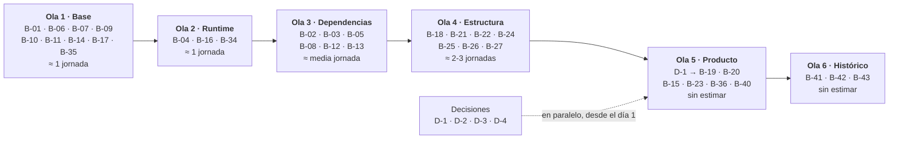

# Backlog priorizado — actualizaciones, mejoras y nuevas funcionalidades

> 2026-09-06 · Commit base: `c3a2c29` (v0.6.0) · **Alcance: `vigia-eew`**, único repositorio conectado.
> Consolida en una sola lista los ítems que hoy viven repartidos en cinco planes, y añade las
> capacidades que los documentos mencionan pero que ningún plan había convertido en tarea.
>
> **Revisión 2 (2026-09-06):** se añaden el panel gráfico de configuración (B-35..B-38) y el
> devcontainer (B-34, que sube de P3 condicional a P1), y se **repriorizan las funcionalidades
> documentadas y no implementadas** — ver §1.1. Cambios detallados en §9.
>
> **Revisión 3 (2026-09-06):** se añaden **cuatro ítems** — selección y priorización de redes
> sísmicas (**B-40**) e histórico persistente con listado y mapa (**B-41, B-42, B-43**). El
> histórico **enmienda la restricción "sin base de datos"** de la constitución y saca esa entrada
> de §7. Los cuatro entran en el corte de la v1.0 por decisión del mantenedor. Ver §10.

## 0. Cómo leer las prioridades

**La prioridad de este backlog no es la severidad de un hallazgo.** Un hallazgo P2 puede generar
un ítem P0 si desbloquea a otros cinco; un P1 de severidad puede ser P2 de backlog si depende de
una decisión pendiente. Se anota el origen de cada ítem para que la traza no se pierda.

| Prioridad | Criterio |
|---|---|
| **P0** | Bloquea a otros ítems, o cierra un riesgo de seguridad alcanzable por un tercero |
| **P1** | Cierra un hallazgo medido, **una capacidad ya documentada que nunca se implementó**, o una promesa del producto que hoy no se cumple |
| **P2** | Mejora medible o capacidad nueva, sin riesgo abierto asociado |
| **P3** | **Condicional**: solo se ejecuta si se cumple su disparador explícito |

**Esfuerzo:** S ≤ 1 h · M ≤ media jornada · L > 1 jornada · XL sin estimar.
**Tipo:** 🔄 actualización · ⚙️ mejora · ✨ nueva funcionalidad · ⬜ decisión (no es código).
**Doc:** 📗 especificada en el repositorio y sin implementar · 🆕 nueva, sin documentación previa.

---

## 1. Tabla maestra

Los 43 ítems, ordenados por prioridad y luego por dependencia.

| ID | Ítem | Tipo | Doc | Prio | Esf. | Depende de | Origen |
|---|---|---|---|---|---|---|---|
| **B-01** | Versionar `uv.lock` | 🔄 | — | **P0** | S | — | P-05, reproducibilidad |
| **B-02** | Piso de seguridad `Pillow>=12.3.0,<13` | 🔄 | — | **P0** | S | B-01 | **P-02**: el rango admite 34 avisos |
| **B-03** | Actualizar `pip` a ≥ 26.2 (CVE-2026-13346) | 🔄 | — | **P0** | S | B-01 | SCA del paso 4 |
| **B-04** | Subir el runtime a Python ≥ 3.13 | 🔄 | — | **P0** | M | B-01 | **P-01**: 3.11 y 3.12 en security-only |
| **B-19** | Declarar el alcance de la garantía bajo Wayland | ✨ | 📗 | **P1** | S | D-1 | **REQ-ALE-003** · Art. 1 |
| **B-20** | Presentación bajo Wayland: spike + implementación | ✨ | 📗 | **P1** | L | D-1 | **ADR-010**, especificado y sin código desde v0.1 |
| **B-14** | Validar assets de empaquetado antes del build | ✨ | 📗 | P1 | S | — | REQ-OPS-007 · 2 releases rotas |
| **B-15** | Smoke del binario producido con `--simulate` | ✨ | 📗 | P1 | M | B-14 | REQ-OPS-008 · TC-007.7 |
| **B-18** | Registro declarativo de fuentes | ⚙️ | 📗 | P1 | M | B-06 | arch P2-4 · REQ-ING-009 |
| **B-22** | ID de correlación de punta a punta | ✨ | 📗 | P1 ↑ | M | B-18 | **REQ-OBS-002** · arch P3-1 |
| **B-35** | ADR: permitir escritura de configuración (enmienda ADR-007) | ⚙️ | 🆕 | P1 | S | — | Habilita B-36..B-38 |
| **B-34** | Devcontainer + guía de contribución | ⚙️ | 🆕 | P1 ↑ | M | B-04 | **Decisión del mantenedor: abrir a colaboradores** |
| **B-05** | Techo superior en los 9 rangos de runtime | 🔄 | — | P1 | S | B-04 | P-05: hasta 8 mayores de margen |
| **B-06** | Contratos de fronteras con `import-linter` | ⚙️ | — | P1 | S | — | arch P2-2 · ADR-003 |
| **B-07** | Test que reproduce la carrera de apagado | ⚙️ | — | P1 | S | — | arch **P2-1** · ADR-002 |
| **B-08** | Sincronizar `_loop` y `_sup` con lock + evento | ⚙️ | — | P1 | S | B-07 | arch P2-1 · ADR-002 |
| **B-09** | Umbral de cobertura que hace fallar el CI | ⚙️ | — | P1 | S | — | code-audit **P2-1** |
| **B-10** | `ruff format` en el gate + formatear 19 archivos | ⚙️ | — | P1 | S | — | code-audit P2-2 |
| **B-11** | Markers de test: unitarias / integración / GUI | ⚙️ | — | P1 | S | — | code-audit P2-3 |
| **B-12** | Gate de DRY, complejidad y formato | ⚙️ | — | P1 | S | B-10 | code-audit P2-4 |
| **B-13** | Gate de **resolución mínima** en CI | ✨ | — | P1 | S | B-05 | P-02: impide que vuelva |
| **B-16** | Matriz de Python (3.13 + 3.14) en `ci.yml` | ✨ | — | P1 | S | B-04 | hoy la CI no fija ninguna versión |
| **B-17** | Auditar las 6 deps de macOS y Windows en sus runners | ✨ | — | P1 | S | B-01 | hueco declarado del SCA |
| **B-36** | **Panel gráfico de configuración** (Tk) | ✨ | 🆕 | P2 | L | B-35 | **Petición del mantenedor** |
| **B-40** | **Selección y priorización de redes sísmicas** | ✨ | 🆕 | P2 | L | B-18, B-36 | **Petición del mantenedor** |
| **B-41** | **Histórico persistente de eventos evaluados** (SQLite) | ✨ | 🆕 | P2 | L | B-22, **E-05** | **Petición del mantenedor** |
| **B-42** | **Listado consultable del histórico** | ✨ | 🆕 | P2 | M | B-41 | **Petición del mantenedor** |
| **B-43** | **Mapa del histórico con teselas de OpenStreetMap** | ✨ | 🆕 | P2 | L | B-42 | **Petición del mantenedor** |
| **B-21** | Extraer el cableado a `wiring.py` | ⚙️ | — | P2 | M | B-18 | arch **P1-1**: fan-out 25/40 |
| **B-23** | Build de Linux en contenedor con base fijada | ✨ | — | P2 | M | B-04 | glibc del runner, riesgo nuevo |
| **B-24** | Documentar el contrato de hilos en `lat.md` | ⚙️ | 📗 | P2 | S | B-08 | REQ-OPS-003 · Art. 6 |
| **B-25** | Batch P3 de calidad (9 ítems agrupados) | ⚙️ | — | P2 | M | B-12 | code-audit P3-1..P3-9 |
| **B-26** | Bajar complejidad cognitiva de 2 funciones | ⚙️ | — | P2 | S | B-12 | code-audit P3-5 |
| **B-27** | `lat check` en el gate de pre-commit | ⚙️ | — | P2 | S | B-06 | Art. 9 · deriva spec↔código |
| **B-28** | Backlinks `# @lat:` en los 3 sitios de mayor valor | ⚙️ | — | P2 | M | B-27 | CONTEXT_REPORT §6.3 |
| **B-31** | Fronteras de país a Natural Earth 1:50m | ✨ | 📗 | P3 | M | **activar el filtro por defecto** | ADR-014, error de ±decenas de km |
| **B-32** | Modo de recuperación histórica (`--backfill`) | ✨ | 📗 | P3 | M | un caso de uso real | ADR-017 lo dejó como escotilla |
| **B-33** | Relay central opcional (FastAPI + fan-out WS) | ✨ | 📗 | P3 | XL | despliegue multi-máquina | ADR-008 · API-SPEC §7 |
| **B-37** | Panel de configuración en la TUI | ✨ | 🆕 | P3 | M | B-36 | Paridad de frontends |
| **B-38** | Recarga de configuración sin reiniciar | ✨ | 🆕 | P3 | M | B-36 | Evitar el reinicio tras guardar |
| **B-29** | Extracción semántica de `docs/` en Graphify | ⚙️ | — | P3 | S | un backend LLM | CONTEXT_REPORT §6.1 |
| **B-30** | Unificar los dos pollers FDSN en una base común | ⚙️ | — | P3 | M | **una 5ª fuente FDSN** | ADR-016 lo difirió con criterio |
| **B-39** | Automatizar la actualización de dependencias | ⚙️ | — | P3 | S | cadencia manual insuficiente | migración §6 |

**Reparto:** 4 P0 · 19 P1 · 12 P2 · 8 P3 · por tipo: 5 🔄 · 19 ⚙️ · 19 ✨.
**Documentadas y sin implementar (📗): 10 ítems**, de los cuales **6 son ahora P1**.
**Capacidad nueva pedida (🆕): 9 ítems** — B-34..B-38 y B-40..B-43.

### 1.1 Funcionalidades documentadas y no implementadas — orden de ataque

El criterio que se pidió: **lo que el proyecto ya prometió por escrito va antes que lo nuevo.**
Estas diez capacidades están especificadas en el repositorio —en un ADR, en un RF o en un
requisito EARS— y nunca llegaron a código.

| Orden | ID | Capacidad | Dónde está documentada | Desde | Prio |
|---|---|---|---|---|---|
| 1 | **B-19** | Declarar dónde la alerta está garantizada y dónde no | REQ-ALE-003 · Art. 1 de la constitución | v2 | **P1** |
| 2 | **B-20** | Presentación bajo Wayland (D-Bus + extensión de shell) | **ADR-010**, `docs/TECHNICAL-DESIGN.md` §11 | **v0.1.0** | **P1** |
| 3 | **B-14** | Validación de assets antes de empaquetar | REQ-OPS-007 · TC-007.4 | v2 | P1 |
| 4 | **B-15** | Smoke del binario producido | REQ-OPS-008 · TC-007.7 | v2 | P1 |
| 5 | **B-18** | Registro declarativo de fuentes | REQ-ING-009 · ADR-001 | v2 | P1 |
| 6 | **B-22** | Identificador de correlación en los registros | REQ-OBS-002 | v2 | **P1 ↑** |
| 7 | **B-24** | Contrato de hilos documentado | REQ-OPS-003 · Art. 6 | v2 | P2 |
| 8 | **B-31** | Fronteras de país a 1:50m | ADR-014, "upgrade path" | v0.2.1 | P3 |
| 9 | **B-32** | Modo de recuperación histórica | ADR-017, "escape hatch" | v0.6.0 | P3 |
| 10 | **B-33** | Relay central | ADR-008 · API-SPEC §7 | v0.1.0 | P3 |

**El caso que más pesa es B-20.** ADR-010 se escribió en la v0.1.0, se profundizó en un commit
propio (`230b0b8`) y **nunca se implementó**. Es la única brecha entre lo que el producto promete
—una alerta imposible de ignorar— y lo que cumple en el escritorio Linux más común. Las tres
etapas de auditoría lo señalaron desde ángulos distintos.

Los tres últimos (B-31, B-32, B-33) están documentados **como caminos posibles, no como
compromisos**: sus propios ADR los dejaron condicionados. Subirlos de prioridad sería malinterpretar
lo que dicen.

---

## 2. Actualizaciones 🔄

Cambiar versiones de lo que ya existe. Es la única categoría con **cadena estrictamente
secuencial**: el orden no es preferencia, es dependencia técnica.

| ID | Qué | Prio | Esf. | Verificación |
|---|---|---|---|---|
| B-01 | Sacar `uv.lock` de `.gitignore` y revertir el rodeo de caché de la CI | P0 | S | `git ls-files uv.lock` devuelve el archivo; `uv sync --frozen` reproduce en máquina limpia |
| B-04 | `requires-python = ">=3.13"`, más ruff, mypy y los **tres sitios** de `build.yml` | P0 | M | Suite verde en 3.13 **y** 3.14; los tres jobs producen binario |
| B-02 | `Pillow>=12.3.0,<13` | P0 | S | `uv sync --resolution lowest-direct` → Pillow sin avisos |
| B-03 | `uv lock --upgrade-package pip` | P0 | S | `pip-audit --skip-editable` sin `CVE-2026-13346` |
| B-05 | Techo `<X+1` en los 9 rangos. **`tzdata` sin techo**: son datos IANA, no API | P1 | S | 8 de 9 rangos con techo; un `uv lock` no salta de mayor sin cambio explícito |

**Por qué B-04 va antes que B-02 y B-05:** `requires-python` determina qué versiones son
resolubles. Fijar techos y después subir el runtime obliga a rehacer los techos.

---

## 3. Mejoras ⚙️

No añaden capacidad visible; hacen que lo que existe sea verificable, mantenible o seguro.

| ID | Qué | Prio | Esf. | Qué gana el proyecto |
|---|---|---|---|---|
| B-35 | ADR que enmienda ADR-007: la configuración pasa a ser escribible | P1 | S | Sin esto, B-36 contradice una decisión vigente del proyecto |
| B-34 | Devcontainer + `CONTRIBUTING.md` | P1 | M | Un colaborador nuevo pasa de "instalar Python, uv, hooks y adivinar" a "abrir el repo" |
| B-06 | Cuatro contratos de `import-linter` derivados del grafo actual | P1 | S | Las fronteras dejan de depender de tener un solo autor |
| B-07 | Test que **debe fallar** contra el código actual | P1 | S | Convierte el hallazgo P2-1 en evidencia determinista |
| B-08 | Lock + evento de "runtime listo" en `Application` | P1 | S | El apagado deja de depender del *timing* |
| B-09 | `--cov-fail-under` con umbral por criticidad (85/70/40 %) | P1 | S | La cobertura pasa de medirse a exigirse |
| B-10 | `ruff format` en el gate, formateo en commit aislado | P1 | S | Se acaba el ruido de diff por formato |
| B-11 | Markers `integration` y `gui` | P1 | S | El lote rápido se puede correr en pre-commit |
| B-12 | jscpd, lizard y complejidad cognitiva en el gate | P1 | S | Cierra las 3 dimensiones que el gate no cubría |
| B-18 | `dict[Source, SourceSpec]` que sustituye a la escalera y a las 4 fábricas | P1 | M | Añadir una fuente pasa de ≥5 archivos a **3 puntos** |
| B-21 | `wiring.py` separado de `Application` | P2 | M | `app` de fan-out 25 → ≤8; NLOC 450 → <300 |
| B-24 | Tabla de propiedad de datos por hilo | P2 | S | Ningún campo nuevo cruza hilos sin quedar registrado |
| B-25 | Batch P3: duplicación FDSN, `StateStore`, fixture duplicado, sleep en test, 3 tests sin assert, `assert` en `models.py` | P2 | M | Deuda de calidad sin riesgo, agrupada en un solo PR |
| B-26 | Extraer `_parse_row` de `rest_geofon.py`; simplificar `cli.py:56` | P2 | S | Las 2 funciones sobre complejidad 12 bajan del umbral |
| B-27 | `lat check` como hook | P2 | S | La deriva entre spec y código falla como un lint |
| B-28 | Backlinks en `Deduplicator.register()`, `GeoFilter.accepts()` y `_resolve_automatic_reference()` | P2 | M | La revisión se vuelve bidireccional: código ↔ decisión |
| B-29 | `graphify extract` con backend LLM sobre `docs/` | P3 | S | Los 18 documentos entran al grafo semántico |
| B-30 | Base común para los pollers FDSN | P3 | M | **Solo con una 5ª fuente**: con dos, la regla de tres no se cumple |
| B-39 | Renovate o dependabot con agrupación por lote | P3 | S | **Solo si** el `uv lock --upgrade` trimestral se demuestra insuficiente |

### B-34 · Devcontainer y guía de contribución — por qué sube a P1

En la revisión anterior este ítem era P3 con un disparador explícito: *"reevaluar si entra un
segundo mantenedor"*. **El disparador se ha cumplido**: la intención es abrir el proyecto a
colaboradores. Con eso, el argumento que lo mantenía abajo —que el coste de mantener el entorno
supera al beneficio con un solo desarrollador— deja de aplicar.

Qué incluye, y por qué cada parte:

| Pieza | Contenido | Por qué hace falta aquí en concreto |
|---|---|---|
| `.devcontainer/devcontainer.json` | Imagen con Python 3.13, `uv`, y las bibliotecas de sistema de Tk | El proyecto **necesita tkinter**, que no viene en las imágenes base de Python; hoy la CI resuelve esto usando Python gestionado por `uv` `[COMMITS: 0e707a1]` y un colaborador chocaría con lo mismo |
| `postCreateCommand` | `uv sync --extra dev --extra security && uv run pre-commit install` | El gate se instala solo; nadie contribuye con hooks desactivados (Art. 8) |
| Display virtual (Xvfb) | Para que las pruebas de GUI real corran con `VIGIA_GUI_TESTS=1` | Son 3 pruebas hoy excluidas por defecto; en un contenedor pueden ejecutarse siempre |
| `CONTRIBUTING.md` | El gate de tres comandos, la convención de commits, y **el enlace a la constitución** | La constitución dice que `CLAUDE.md` debe apuntar a ella para que cada agente herede los principios; un humano necesita lo mismo |

**Dependencia real:** va después de **B-04**, porque la imagen debe traer la versión de Python que
el proyecto exija. Construirla sobre 3.11 y rehacerla después es trabajo duplicado.

**Lo que este ítem NO incluye:** la automatización de actualización de dependencias, que se separa
en **B-39** y sigue siendo condicional. Son dos cosas distintas que estaban juntas por accidente —
un devcontainer sirve a quien contribuye; renovate sirve a quien mantiene, y su coste de triaje no
cambia por tener colaboradores.

---

## 4. Nuevas funcionalidades ✨

| ID | Capacidad | Doc | Prio | Esf. | Estado hoy |
|---|---|---|---|---|---|
| B-19 | **Declarar dónde la alerta está garantizada y dónde no** | 📗 | P1 | S | La promesa se hace sin acotar el entorno |
| B-20 | **Presentación bajo Wayland** — D-Bus + extensión de shell, con caída a Tk | 📗 | P1 | L | ADR-010: diseñado en v0.1.0, **sin una línea de código** |
| B-14 | **Validación de assets antes del empaquetado** | 📗 | P1 | S | Sin test; rompió 2 releases consecutivas |
| B-15 | **Smoke del binario producido** ejecutándolo con `--simulate` | 📗 | P1 | M | Los recursos faltantes solo se descubren en ejecución |
| B-13 | **Gate de resolución mínima** — auditar el piso de los rangos | — | P1 | S | No existe; por eso P-02 pasó desapercibido |
| B-16 | **Matriz de versiones de Python en CI** | — | P1 | S | `ci.yml` no fija ninguna versión |
| B-17 | **Auditar las deps de macOS y Windows** en los runners que ya existen | — | P1 | S | 6 paquetes nunca auditados |
| B-22 | **Identificador de correlación** de ingesta a presentación | 📗 | P1 ↑ | M | Un sismo por dos fuentes no se sigue como un flujo |
| **B-36** | **Panel gráfico de configuración** | 🆕 | **P2** | **L** | **Hoy la única vía es abrir `config.toml` en el editor del sistema** |
| B-23 | **Build de Linux en contenedor con base fijada** | — | P2 | M | El binario hereda la glibc de `ubuntu-latest` |
| B-31 | **Fronteras de país a 1:50m** | 📗 | P3 | M | Solo si el filtro pasa a activo por defecto |
| B-32 | **Modo `--backfill`** para recuperación histórica acotada | 📗 | P3 | M | Sin caso de uso que lo justifique aún |
| B-37 | **Panel de configuración en la TUI** | 🆕 | P3 | M | Paridad con el modo headless |
| B-38 | **Recarga de configuración sin reiniciar** | 🆕 | P3 | M | Hoy la config se lee una sola vez, al arrancar |
| B-33 | **Relay central opcional** — FastAPI con fan-out por WebSocket | 📗 | P3 | XL | Descartado en v1 por SPOF; la ruta está especificada |
| **B-40** | **Selección y priorización de redes** — el dato de la red más prioritaria prevalece | 🆕 | P2 | L | Hoy solo hay `enabled` por fuente, sin jerarquía |
| **B-41** | **Histórico persistente** de todo evento evaluado, con su veredicto y motivo | 🆕 | P2 | L | **No existe**: el estado solo recuerda qué se alertó, para no repetir |
| **B-42** | **Listado consultable** por fecha, magnitud, distancia, región y red | 🆕 | P2 | M | No existe |
| **B-43** | **Mapa** del histórico sobre teselas de OpenStreetMap | 🆕 | P2 | L | No existe |

### B-35 a B-38 · Panel gráfico de configuración

**Qué se pide:** que el usuario configure el agente desde una interfaz, en lugar de editar un
archivo. Hoy la única vía es el menú de bandeja *"Editar configuración…"*, que abre `config.toml`
con el editor del sistema `[VERIFY: src/vigia_eew/tray.py:52]`.

**Superficie que tiene que cubrir:** **51 campos** repartidos en **10 secciones** —referencia,
filtro, cuatro fuentes, dedup, severidad, notificación y logging. No es un diálogo de tres casillas.

#### El obstáculo que hay que resolver primero (B-35)

**La configuración de este proyecto es de solo lectura por decisión explícita.** ADR-007 eligió
`tomllib` —el lector de la biblioteca estándar, que no tiene escritor— y registró la consecuencia:
*"writing config isn't needed in v1"*. Un panel que guarda cambios **contradice esa decisión**.

Por eso B-35 va primero y es P1 pese a ser una S: escribir el ADR que la enmienda, con cuatro
puntos que el panel tiene que respetar.

| Restricción | Por qué | Cómo se resuelve |
|---|---|---|
| **No perder los comentarios** | La plantilla lleva **46 líneas de comentarios** que documentan cada opción y sus RF asociados; hoy son la ayuda en línea del usuario. Un escritor ingenuo los borra al guardar | `tomlkit` (0.15.1) preserva comentarios y formato; `tomli-w` no. Es la única dependencia nueva que el panel necesita |
| **Validar antes de escribir** | Art. 3, *fail-safe*: un panel que deja en disco una config inválida deja el agente sin arrancar | Validar con los modelos pydantic que ya existen **antes** de tocar el archivo; los errores de validación son el mensaje que ve el usuario |
| **Escritura atómica con respaldo** | El mismo criterio que ya rige `state.json` `[VERIFY: src/vigia_eew/state.py:61]` | Temporal + `rename`, y conservar la versión anterior como `.bak` |
| **Qué pasa tras guardar** | La configuración se lee **una sola vez, al arrancar**: el filtro, el normalizador y los cuatro ingestores reciben la suya al construirse | El panel v1 **avisa de que hace falta reiniciar**. La recarga en caliente es B-38, deliberadamente aparte |

#### Reparto en tres ítems

| ID | Alcance | Prio | Esf. |
|---|---|---|---|
| **B-36** | Panel en Tkinter: secciones plegables, validación en vivo contra pydantic, guardar con respaldo, botón de restaurar valores por defecto. Sustituye a *"Editar configuración…"* en el menú de bandeja, dejando *"Abrir el archivo…"* como salida para quien la prefiera | P2 | L |
| **B-37** | Equivalente en la TUI, para el modo headless por SSH | P3 | M |
| **B-38** | Recarga en caliente: aplicar los cambios sin reiniciar el proceso | P3 | M |

**Por qué B-36 es P2 y no P1.** No cierra ningún hallazgo medido ni una promesa incumplida: la
configuración por archivo **funciona**, está documentada y sembrada automáticamente en el primer
arranque. Es una mejora real de usabilidad —especialmente para el usuario no técnico, que es el
destinatario del producto— pero por el criterio de §0 va después de los cuatro P0 y de las
capacidades que el proyecto ya prometió. Si la prioridad de negocio es otra, es un cambio de una
línea en esta tabla; lo que no cambia es que **B-35 tiene que ir antes**.

**Riesgo a vigilar:** el panel es el primer componente que **escribe** en el archivo que el usuario
también puede editar a mano. Si alguien tiene el archivo abierto en su editor mientras guarda desde
el panel, uno de los dos pierde. El ADR de B-35 debe decidir qué hacer —detectar la modificación
externa por *mtime* y avisar es lo mínimo.

### B-40 · Selección y priorización de redes sísmicas

**Qué se pide:** que la lista de redes sea una lista —con casillas y orden— en vez de cuatro
secciones separadas con un `enabled` cada una, y que ese orden **signifique algo**.

**Qué significa el orden, decidido:** cuando el mismo sismo llega por varias redes y el deduplicador
las une, **prevalecen los datos de la red mejor posicionada**, aunque haya llegado después. Es la
opción que de verdad cambia lo que el usuario ve: hoy gana la que llega primero, que es un accidente
de latencia, no una decisión.

Un caso concreto de por qué importa: un sismo local venezolano llega por EMSC con magnitud estimada
automáticamente y por FUNVISIS con magnitud revisada. Hoy se muestra la que llegó antes. Con
prioridad, el usuario decide cuál de las dos considera más fiable **para su geografía**.

| Restricción | Por qué |
|---|---|
| La prioridad **no decide si se alerta** | Eso lo decide el filtro. Una red de baja prioridad que reporta un sismo relevante alerta igual; solo cede sus datos si otra mejor posicionada reporta el mismo |
| La prioridad **no cambia el orden de consulta** | Las cuatro fuentes siguen siendo independientes y concurrentes (RF/REQ-ING-010). Serializarlas por prioridad retrasaría la alerta, que es lo contrario del producto |
| Una red sin prioridad declarada **no queda fuera** | Se ordena al final. Un archivo de configuración de la v0.6.0 sigue siendo válido |

**Depende de B-18** (registro declarativo de fuentes): la prioridad es un campo de la especificación
de cada fuente, y sin registro habría que añadirlo en cuatro sitios.

### B-41, B-42, B-43 · Histórico de sismos, listado y mapa

**Qué se pide:** que el agente recuerde los sismos, se puedan consultar, y se vean en un mapa por
región y magnitud.

**Qué se guarda, decidido:** **todo evento evaluado, alertado o descartado, con el motivo del
descarte.** Guardar solo los alertados haría la tabla más pequeña, pero dejaría sin responder la
pregunta que hoy no se puede investigar: *"¿por qué no me avisó de ese sismo?"*. Con el veredicto
registrado, la respuesta es una consulta — fuera de radio, bajo la magnitud mínima, de otro día, o
duplicado de otro que sí alertó.

Encaja con **B-22**: el identificador de correlación es lo que enlaza las llegadas de un mismo sismo
por redes distintas, y es la clave natural del histórico. Por eso B-41 depende de él.

#### El obstáculo: la constitución dice que no hay base de datos

**"Persistencia: JSON atómico en disco. Sin base de datos"** es una restricción de stack vigente, y
"Base de datos" estaba en §7 como descartado, con este argumento: *"el estado son unos KB en memoria
consultados por pertenencia"*.

**Ese argumento sigue siendo cierto para el estado operativo, y falso para el histórico.** Son dos
cosas distintas que hasta ahora no hacía falta distinguir:

| | Estado operativo | Histórico |
|---|---|---|
| Para qué | No repetir una alerta | Consultar el pasado |
| Tamaño | Unos KB, podado a 24 h | Decenas de miles de filas al año |
| Consulta | Pertenencia: ¿ya alerté esto? | Rango de fechas, magnitud, región, red |
| Se lee | En cada evento, en caliente | Cuando el usuario abre la vista |

Un JSON que crece sin límite y hay que cargar entero en memoria para filtrar por rango de fechas es
la razón por la que existen las bases de datos. **La enmienda E-05 acota la restricción al estado
operativo**, que es lo que siempre quiso proteger.

**El motivo por el que la enmienda es defendible: SQLite es biblioteca estándar.** No añade
dependencia, no añade servicio que administrar, no añade proceso. El archivo vive junto al estado,
en el mismo directorio por plataforma.

#### El mapa: teselas de OpenStreetMap

**No añade ninguna dependencia.** `httpx` ya está para las fuentes REST, `Pillow` ya está por la
bandeja, y el lienzo es Tk de la biblioteca estándar: descargar la tesela, decodificarla y pintarla
se hace con lo que el proyecto ya tiene.

Tres consecuencias que hay que aceptar por escrito, porque son nuevas para este producto:

| Consecuencia | Cómo se acota |
|---|---|
| **El agente pedirá datos a un destino que no es una fuente sísmica** | Solo al abrir el mapa, nunca en segundo plano. Caché en disco para no repetir |
| **La zona que el usuario mira queda expuesta al servidor de teselas** | La caché la reduce; el mapa es una vista que el usuario abre, no algo que corre siempre |
| **Uso y atribución** | Cliente identificado, sin descargas masivas, y **"© OpenStreetMap contributors"** visible en el mapa |

**Degradación (Art. 3):** sin red y sin caché, el mapa no está disponible y **el listado sigue
funcionando**. El histórico es la funcionalidad; el mapa es una vista sobre él.

> **Efecto sobre B-31, que conviene anotar:** se evaluó si el mapa dispararía el ítem de fronteras
> vectoriales a 1:50m. **No lo hace** — con teselas, las fronteras vienen dibujadas en la propia
> tesela. B-31 sigue siendo P3, condicionado a que el filtro de país pase a activo por defecto.

---

## 5. Decisiones pendientes ⬜

No son código y **bloquean ítems del backlog**. Ninguna puede tomarse por defecto.

| ID | Decisión | Bloquea | Por qué no la decido yo |
|---|---|---|---|
| **D-1** | ¿La alerta bajo Wayland bloquea el release de la v2? | B-19, B-20 | Define si REQ-ALE-004 es `[MUST]` o `[SHOULD]`, y con ello el alcance de la fase de mayor riesgo. Es el hallazgo A-01 del Analyze |
| **D-2** | ¿Qué se hace con `pystray`? Mantener con riesgo aceptado / migrar / retirar la bandeja donde no funciona | informa B-02, B-23, B-36 | 1.085 días sin publicar, y es quien arrastra Pillow al árbol. Si la bandeja se retira en Linux, el panel de B-36 necesita otra vía de acceso |
| **D-3** | ¿Se enmienda la constitución a Python ≥ 3.13? | formaliza B-04, B-34 | Cambiar una restricción de stack exige enmienda con changelog, según la propia constitución |
| **D-4** | ¿Se adopta este backlog como fuente única, retirando las listas de los cinco planes? | la gobernanza del resto | Si no, hay dos sitios donde marcar un ítem como hecho, y divergen |

**Decisión ya tomada en esta revisión:** abrir el proyecto a colaboradores. Es lo que activa B-34 y
lo que hace que el bus factor 1 pase de riesgo aceptado a problema con solución en marcha.

---

## 6. Orden de ejecución sugerido

| Ola | Contenido | Esfuerzo | Qué se gana al cerrarla |
|---|---|---|---|
| **1 · Base** | B-01, B-06, B-07, B-09, B-10, B-11, B-14, B-17, **B-35** | ≈ 1 jornada | El gate cubre las ocho dimensiones, la carrera queda demostrada, y la escritura de config queda decidida antes de escribir el panel |
| **2 · Runtime** | B-04, B-16, **B-34** | ≈ 1 jornada | Runtime con soporte real, verificado en dos versiones, **y un colaborador puede empezar el mismo día** |
| **3 · Dependencias** | B-02, B-03, B-05, B-08, B-12, B-13 | ≈ media jornada | Los rangos dejan de admitir versiones vulnerables, y un gate lo impide en el futuro |
| **4 · Estructura** | B-18, B-21, **B-22**, B-24, B-25, B-26, B-27 | ≈ 2-3 jornadas | Añadir una fuente cuesta 3 puntos, y un sismo se sigue de punta a punta en los logs |
| **5 · Producto** | B-19, B-20, B-15, B-23, **B-36**, **B-40** | sin estimar | La promesa central pasa a ser verificable, la configuración deja de exigir un editor de texto, y el usuario decide qué red manda |
| **6 · Histórico** | **B-41, B-42, B-43** | sin estimar | El agente deja de olvidar: se puede responder por qué avisó, y por qué no |

**B-34 entra en la ola 2, justo después del cambio de runtime.** Es lo antes que puede entrar sin
tener que rehacer la imagen, y cuanto antes exista, antes puede alguien más empezar a aportar en
las olas 3 a 5.

---

## 7. Fuera del backlog

Propuestas evaluadas y **descartadas**, con su razón.

| Propuesta | Por qué no |
|---|---|
| Contenerizar el producto | Necesita sesión gráfica, audio y bus del usuario; exponerlos desmonta el aislamiento |
| Reestructurar en `core/` + `adapters/` | Resolvería un ciclo que **no existe**: 0 a nivel de archivo |
| Microservicios | La complejidad distribuida se paga a diario; ADR-008 lo descartó por SPOF |
| **Base de datos para el estado operativo** | Sigue descartada: son unos KB consultados por pertenencia y podados a 24 h. **Lo que la revisión 3 admite es una base de datos para el histórico**, que es otro problema — ver B-41 |
| Migrar de `uv` a Poetry / PDM | No cierra ningún hallazgo |
| Sustituir `httpx` por otro cliente | Sin avisos de seguridad; sería un cambio por señal de mantenimiento, no por defecto |
| Fijar dependencias con `==` en `pyproject.toml` | El lockfile ya da esa garantía; `==` rompe la instalación en entornos con otras versiones |
| Contenedor de inyección de dependencias | Indirección sobre un grafo de 40 módulos que cabe en la cabeza |
| Partir `StateStore` | 12 métodos públicos sobre un documento único es una fachada, no un god object |
| **Sustituir el archivo de configuración por la GUI** | El archivo sigue siendo la fuente de verdad: es lo que permite versionarlo, copiarlo entre máquinas y editarlo por SSH. La GUI es **otra vía de acceso**, no un reemplazo |
| **Configuración en base de datos o formato binario** | Perdería la legibilidad y los 46 comentarios que hoy documentan cada opción |
| **Servidor de teselas propio, o teselas empaquetadas** | Un juego de teselas mundial son gigabytes; uno propio es un servicio que administrar. El mapa usa OpenStreetMap con caché local |
| **Que la prioridad de red decida si se alerta** | Perdería sismos locales que solo cataloga FUNVISIS. Quién alerta lo decide el filtro; la prioridad solo resuelve **qué dato prevalece** al deduplicar |
| **Enviar el histórico a ninguna parte** | Es un archivo local. No hay sincronización, ni respaldo remoto, ni telemetría |

*Retirado de esta lista en la revisión 2:* el devcontainer, que pasa a ser **B-34**.
*Matizado en la revisión 3:* "base de datos", que sigue descartada para el estado operativo y se
admite —vía enmienda— solo para el histórico.

---

## 8. Trazabilidad

| Documento de origen | Ítems que aporta |
|---|---|
| [`code-audit/02-PLAN-REMEDIACION.md`](code-audit/02-PLAN-REMEDIACION.md) | B-03, B-09, B-10, B-11, B-12, B-25, B-26 |
| [`arch-eval/02-PLAN-MIGRACION.md`](arch-eval/02-PLAN-MIGRACION.md) + sus 3 ADR | B-06, B-07, B-08, B-18, B-21, B-22 |
| [`sdd/specs/05-IMPLEMENTATION-PLAN.md`](sdd/specs/05-IMPLEMENTATION-PLAN.md) + los 56 REQ | B-13..B-17, B-19, B-20, B-22, B-24 |
| [`PAQUETERIA-VERSIONADO.md`](PAQUETERIA-VERSIONADO.md) | B-01..B-05, B-13, B-17 |
| [`PLAN-MIGRACION-PAQUETERIA.md`](PLAN-MIGRACION-PAQUETERIA.md) | B-01..B-05, B-13, B-17, B-23, B-34, B-39 |
| [`CONTEXT_REPORT.md`](CONTEXT_REPORT.md) | B-27, B-28, B-29 |
| `docs/TECHNICAL-DESIGN.md` (ADR-007, 008, 010, 014, 016, 017) | B-20, B-30, B-31, B-32, B-33, **B-35** |
| **Petición directa del mantenedor** | **B-34..B-38** y **B-40..B-43** |
| Los 42 RF del [`PRD.md`](PRD.md) original | **Ninguno pendiente**: los 42 están implementados y verificados por las 17 HU |

**Dato que conviene tener presente:** ningún ítem corrige un requisito funcional incumplido de la
v0.6.0. Lo que el backlog contiene es **una promesa sin acotar** (Wayland), **capacidades
documentadas que nunca se construyeron**, **huecos de gate**, **higiene de dependencias** y
**capacidad nueva pedida** — no deuda funcional.

---

## 9. Registro de cambios

| Rev. | Fecha | Cambios |
|---|---|---|
| 1 | 2026-09-06 | Versión inicial: 34 ítems consolidados de cinco planes |
| **2** | 2026-09-06 | **+5 ítems** (B-35..B-39) · **B-34** reformulado y subido de P3 condicional a **P1** · **B-22** subido de P2 a **P1** por ser capacidad documentada · nueva columna **Doc** y nueva §1.1 con las 9 capacidades documentadas sin implementar · el devcontainer sale de "fuera del backlog" · B-39 se separa de B-34 · dos entradas nuevas en §7 sobre lo que la GUI **no** hace |
| **3** | 2026-09-06 | **+4 ítems** (B-40..B-43): priorización de redes, histórico persistente, listado y mapa · **"base de datos" sale de §7** matizada, vía enmienda **E-05** · tres entradas nuevas en §7 sobre lo que el histórico y el mapa **no** hacen · nueva **Ola 6** · el corte de la v1.0 pasa a incluir las cuatro capacidades |

**Lo que la revisión 3 decide, y que no era obvio:**

1. **La prioridad de red resuelve datos, no alertas.** Se evaluó usarla como umbral de confianza para
   alertar y se descartó: perdería los sismos locales que solo cataloga FUNVISIS, que es la razón por
   la que esa fuente existe.
2. **El histórico guarda también los descartes.** Es lo que convierte *"¿por qué no me avisó?"* de
   una investigación manual en una consulta.
3. **"Sin base de datos" se acota, no se deroga.** El estado operativo sigue siendo JSON; solo el
   histórico usa SQLite, que además es biblioteca estándar.
4. **B-31 se evaluó y NO sube de prioridad.** Con teselas de OpenStreetMap las fronteras vienen en la
   tesela, así que el mapa no dispara la necesidad de fronteras vectoriales propias.

**Los tres cambios de prioridad de la revisión 2, con su razón:**

1. **B-34 · P3 → P1.** Su disparador documentado era *"un segundo mantenedor"*, y se ha cumplido.
2. **B-22 · P2 → P1.** El criterio de P1 se amplía para incluir "capacidad ya documentada que nunca
   se implementó", y el ID de correlación es REQ-OBS-002.
3. **B-19 y B-20 encabezan el orden de §1.1.** No cambian de prioridad —ya eran P1— pero pasan a
   ser los primeros de la tabla maestra, porque ADR-010 lleva especificado sin construir desde la
   primera versión del proyecto.
