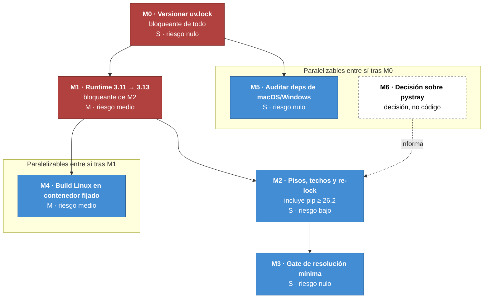

# Plan de migración de paquetería, contenedores y actualización

> 2026-09-06 · Commit base: `c3a2c29` (v0.6.0)
> **Alcance: un repositorio** — `vigia-eew`. Es el único conectado en esta sesión; si hay más
> repositorios en el proyecto, este plan no los cubre y necesitan el suyo.
>
> Insumo: los hallazgos P-01 a P-06 y las acciones A-1 a A-7 de
> [`docs/PAQUETERIA-VERSIONADO.md`](PAQUETERIA-VERSIONADO.md), más la evidencia de
> [`docs/code-audit/`](code-audit/) y [`docs/reverse-sdd/02-STACK-TECNOLOGICO.md`](reverse-sdd/02-STACK-TECNOLOGICO.md).

---

## 1. Qué resuelve este plan y qué deja fuera

**Resuelve:** el runtime, los rangos de dependencias, la reproducibilidad de la resolución, y la
reproducibilidad del binario Linux. Nada más.

**No resuelve** — y esto es deliberado, para no pisar planes ya escritos:

| Materia | Su plan | Por qué no está aquí |
|---|---|---|
| Umbral de cobertura, `ruff format`, markers de test, gate DRY/complejidad | [`docs/code-audit/02-PLAN-REMEDIACION.md`](code-audit/02-PLAN-REMEDIACION.md) R-01..R-04 | Es calidad de código, no paquetería |
| `import-linter`, sincronización de hilos, registro de fuentes, `wiring.py`, ID de correlación | [`docs/arch-eval/02-PLAN-MIGRACION.md`](arch-eval/02-PLAN-MIGRACION.md) F0..F4 | Es arquitectura interna |
| Frontend D-Bus para Wayland, los 56 requisitos de la v2 | [`docs/sdd/specs/05-IMPLEMENTATION-PLAN.md`](sdd/specs/05-IMPLEMENTATION-PLAN.md) | Es producto nuevo |
| Los 5 huecos P1 de pruebas de empaquetado (validar assets, smoke del binario) | code-audit R-06 y [HU-007](reverse-sdd/HU/HU-007-empaquetado-binarios-release.md) | Es cobertura de pruebas, no versionado |

**Un solapamiento real, resuelto por adjudicación explícita:** la acción A-4 (actualizar `pip` por
CVE-2026-13346) es la misma que R-05 del plan de remediación. **La ejecuta este plan**, dentro de
la fase M2, porque aquí ocurre el re-`lock` que la materializa. R-05 queda como referencia cruzada,
no como tarea duplicada.

Ver §6 para la lista completa de lo que este plan **no** hará.

---

## 2. Grafo de dependencias entre fases



### La cadena bloqueante, y por qué lo es

**M0 → M1 → M2 → M3** es estrictamente secuencial. No es burocracia; cada eslabón cambia el
resultado del siguiente:

1. **M0 antes que nada.** Sin `uv.lock` versionado no se puede *demostrar* que una resolución
   cambió: cualquier verificación posterior compara contra un archivo que no existe en el
   repositorio. Además la propia CI lleva un rodeo por esto —
   `cache-dependency-glob: pyproject.toml`, con el comentario *"uv.lock is gitignored in this repo"*
   `[VERIFY: .github/actions/setup-python-env/action.yml:16]` — que M0 elimina.

2. **M1 antes que M2.** `requires-python` **determina qué versiones son resolubles**. Subir el piso
   a 3.13 estrecha el conjunto de wheels válidos y puede cambiar qué resuelve cada dependencia. Si
   se fijan techos primero y se sube el runtime después, hay que rehacer los techos. En el orden
   correcto se hace una sola vez.

3. **M2 antes que M3.** El gate de resolución mínima (`--resolution lowest`) solo tiene sentido
   cuando los pisos ya son los correctos; ejecutarlo antes solo confirmaría el hallazgo P-02 que ya
   está documentado.

**M4 depende de M1** porque la imagen base del contenedor de build tiene que traer la versión de
Python que el proyecto exige. **M5 y M6 son independientes** y pueden avanzar en paralelo desde el
primer día.

**M6 informa a M2 sin bloquearlo:** si se decidiera retirar la bandeja en todas las plataformas,
`pystray` y con él `Pillow` saldrían del árbol y A-1 dejaría de aplicar. Como la bandeja seguirá
existiendo al menos en Windows y macOS, **el piso de Pillow hace falta igual**. Por eso es flecha
punteada y no dependencia dura.

---

## 3. Fases

### M0 · Versionar `uv.lock` 🔴 bloqueante

| | |
|---|---|
| **Cierra** | A-2 · parte de P-02 y de P-05 |
| **Esfuerzo** | S (< 1 h) |
| **Riesgo** | **Nulo.** Solo se añade un archivo al control de versiones |
| **Depende de** | — |

Sacar `uv.lock` de `.gitignore`, commitearlo, y revertir el rodeo de la caché de CI a
`cache-dependency-glob: uv.lock` (el valor por defecto de la acción).

**Hecho cuando:** `git ls-files uv.lock` devuelve el archivo; la CI cachea por el lock; `uv sync
--frozen` reproduce el entorno exacto en una máquina limpia.

**Vuelta atrás:** volver a ignorarlo. Sin efecto sobre el código.

> Nota: este cambio hace que a partir de ahora **cada actualización de dependencia aparezca en el
> diff**. Es el efecto buscado, pero conviene saber que los PRs de dependencias se volverán más
> ruidosos y más informativos a la vez.

---

### M1 · Subir el runtime de 3.11 a 3.13 🔴 bloqueante

| | |
|---|---|
| **Cierra** | A-5 · P-01 |
| **Esfuerzo** | M (media jornada) |
| **Riesgo** | **Medio** — es el único cambio que puede romper el comportamiento |
| **Depende de** | M0 |

Python 3.11 y 3.12 están ambos en fase **security-only**; 3.13 está en *bugfix* hasta octubre de
2027 y con soporte hasta octubre de 2029.

Puntos a tocar, todos localizados:

| Archivo | Cambio |
|---|---|
| `pyproject.toml:14` | `requires-python = ">=3.13"` |
| `pyproject.toml:87` | `target-version = "py313"` (ruff) |
| `pyproject.toml:93` | `python_version = "3.13"` (mypy) |
| `.github/workflows/build.yml:39, 54, 69` | `python-version: "3.11"` → `"3.13"` — **tres sitios** |
| `pyproject.toml` classifiers | retirar 3.11 y 3.12, añadir 3.13 y 3.14 |

**Añadir además matriz de versiones en `ci.yml`**, que hoy no fija ninguna: probar en **3.13 y
3.14**. Es lo que convierte el cambio de runtime en verificado en lugar de supuesto.

**Riesgos concretos y su mitigación:**

| Riesgo | Mitigación |
|---|---|
| Alguna dependencia sin wheel para 3.13/3.14 | Se detecta en el `uv lock` de esta misma fase, antes de tocar código |
| Cambios de comportamiento de la stdlib entre 3.11 y 3.13 | Las 344 pruebas son el detector; **si la suite pasa en 3.13 y 3.14, la fase está hecha** |
| Usuarios en 3.11/3.12 quedan fuera | Real. Subir el piso es un cambio incompatible: exige versión mayor o menor con nota en `CHANGELOG.md` |

**Hecho cuando:** `pytest`, `ruff check`, `mypy src` en verde **en 3.13 y en 3.14**; los tres jobs
de `build.yml` producen binarios; el `CHANGELOG.md` declara el cambio de requisito.

**Vuelta atrás:** revertir el commit. Al ser un cambio de metadatos y CI, sin lógica, `git revert`
lo deshace por completo.

---

### M2 · Pisos de seguridad, techos superiores y re-`lock`

| | |
|---|---|
| **Cierra** | A-1, A-3, A-4 · P-02, P-05, P-06 |
| **Esfuerzo** | S (1–2 h) |
| **Riesgo** | Bajo |
| **Depende de** | M1 |

Reescribir los nueve rangos de runtime con **piso de seguridad y techo de versión mayor**:

| Actual | Propuesto | Razón del cambio |
|---|---|---|
| `Pillow>=10.0` | `Pillow>=12.3.0,<13` | **34 avisos** en la versión mínima que el rango actual permite; 12.3.0 es el primer release con cero |
| `websockets>=12.0` | `websockets>=16.0,<18` | El rango admite 5 versiones mayores por encima del piso |
| `httpx>=0.27` | `httpx>=0.28,<0.29` | Sigue en 0.x: sin garantía semver, el techo debe ser la menor |
| `pydantic>=2.6` | `pydantic>=2.13,<3` | 7 versiones menores de margen sin techo |
| `textual>=0.60` | `textual>=8.2,<9` | 8 versiones mayores de margen sin techo |
| `platformdirs>=4.0` | `platformdirs>=4.10,<5` | — |
| `desktop-notifier>=5.0` | `desktop-notifier>=6.2,<7` | — |
| `pystray>=0.19` | `pystray>=0.19.5,<0.20` | Sin publicar desde 2023; el techo documenta que no se espera movimiento |
| `tzdata>=2024.1` | `tzdata>=2026.2` | **Sin techo, a propósito**: son datos IANA, no API. Un techo aquí congelaría zonas horarias |

En el mismo re-`lock`, **actualizar `pip` a ≥ 26.2** (CVE-2026-13346) con
`uv lock --upgrade-package pip`.

**Hecho cuando:** `uv lock` resuelve sin conflicto; el diff del lock se revisa entero;
`pip-audit --skip-editable` no reporta `CVE-2026-13346`; la suite sigue verde en 3.13 y 3.14.

**Vuelta atrás:** `git revert` de `pyproject.toml` y `uv.lock` juntos. Al estar el lock versionado
(M0), la vuelta atrás es exacta — **que es precisamente por lo que M0 va primero**.

---

### M3 · Gate de resolución mínima

| | |
|---|---|
| **Cierra** | A-7 |
| **Esfuerzo** | S |
| **Riesgo** | Nulo |
| **Depende de** | M2 |

Un job de CI que resuelve con `uv sync --resolution lowest-direct` y audita **ese** entorno, no el
del lockfile. Es lo que convierte este análisis en permanente: sin él, el hallazgo P-02 vuelve a
colarse el día que alguien añada una dependencia con rango abierto.

**Hecho cuando:** el job existe y pasa; y al bajar temporalmente el piso de Pillow a `>=10.0`,
**falla**. Sin esa prueba negativa el gate no está hecho.

---

### M4 · Build de Linux en contenedor con base fijada 🐳

| | |
|---|---|
| **Cierra** | riesgo de portabilidad del binario, no reportado antes |
| **Esfuerzo** | M |
| **Riesgo** | Medio (toca la ruta de release) |
| **Depende de** | M1 |
| **Paralelizable con** | M2, M3 |

**Este es el único uso de contenedores que este plan propone, y el porqué importa.**

El AppImage y los paquetes `.deb`/`.rpm` se construyen hoy en `ubuntu-latest`
`[VERIFY: .github/workflows/build.yml:64]`. Un binario de PyInstaller **enlaza contra la glibc de
la máquina que lo construye**. Como GitHub va moviendo qué versión de Ubuntu es "latest", el
binario publicado **eleva silenciosamente su glibc mínima** y deja de arrancar en distribuciones
más antiguas — sin que nada en el repositorio cambie y sin ningún aviso.

Para un agente de alerta sísmica, cuyo valor es estar disponible en la máquina que el usuario ya
tiene, esto es un riesgo real de disponibilidad.

**Propuesta:** construir el binario Linux dentro de un contenedor con base fijada (una imagen
`manylinux` o una etiqueta concreta de Ubuntu, no `latest`), de modo que la glibc mínima del
artefacto sea **una decisión declarada y no un efecto colateral del runner**.

**Beneficio adicional:** el mismo contenedor reproduce el build en local, lo que hoy no es posible
sin replicar el runner a mano.

**Hecho cuando:** el `Dockerfile` de build está en `packaging/`, con su base pinneada por digest; el
AppImage producido declara su glibc mínima; y `objdump -T` sobre el binario confirma que no exige
una glibc superior a la declarada.

**Vuelta atrás:** el job antiguo sigue disponible; se revierte cambiando el workflow.

---

### M5 · Auditar las dependencias exclusivas de macOS y Windows

| | |
|---|---|
| **Cierra** | el hueco declarado en `docs/PAQUETERIA-VERSIONADO.md` §7 |
| **Esfuerzo** | S |
| **Riesgo** | Nulo |
| **Depende de** | M0 |
| **Paralelizable con** | M1, M6 |

Seis paquetes quedaron sin auditar por no ser instalables en Linux: `pyobjc-core`,
`pyobjc-framework-cocoa`, `pyobjc-framework-quartz`, `rubicon-objc`, `pywin32-ctypes` y `colorama`
(`docs/code-audit/analysis/deps-omitidas-plataforma.txt`).

**El repositorio ya tiene runners de `macos-latest` y `windows-latest`**
`[VERIFY: .github/workflows/build.yml:34]`, así que cerrar el hueco es añadir un `pip-audit` en
esos jobs, no infraestructura nueva.

**Hecho cuando:** el informe de SCA cubre 90/90 paquetes sin la nota de omitidos por plataforma.

---

### M6 · Decidir la política sobre `pystray` ⬜ decisión, no código

| | |
|---|---|
| **Cierra** | A-6 · P-03 |
| **Esfuerzo** | Decisión + nota escrita |
| **Riesgo** | El de no decidir |
| **Depende de** | — |
| **Paralelizable con** | todo |

`pystray` lleva **1.085 días sin publicar**, es quien arrastra `Pillow` al árbol, y las dos
limitaciones conocidas de la bandeja no tienen a quién reportarse con expectativa de arreglo.

Tres salidas, y la decisión debe quedar **escrita** en `lat.md/notification.md` sea cual sea:

| Opción | Coste | Consecuencia |
|---|---|---|
| (a) Mantener y aceptar el riesgo | Nulo | Es defendible: la bandeja es *best-effort* por Art. 3 y ninguna garantía del producto depende de ella |
| (b) Migrar a un envoltorio activo (`tray_manager`) | S | No resuelve el fondo: sigue siendo pystray por debajo |
| (c) Retirar la bandeja donde no funciona (GNOME/Wayland) y remitir al modo terminal | M | Menos superficie que mantener; el modo terminal sí cumple la garantía de alerta |

**No decidir es la peor de las tres**, porque deja la dependencia sin dueño y el riesgo sin
registrar.

---

## 4. Contenedores: la posición del proyecto

Merece un apartado propio porque la respuesta corta puede parecer una omisión.

### Lo que NO se va a contenerizar, y por qué

**El producto.** Vigía-eew es un agente de escritorio que debe abrir una ventana en la sesión
gráfica del usuario, reproducir sonido en su tarjeta, poner un ícono en su bandeja y registrarse en
el arranque de su sistema operativo. Meterlo en un contenedor exigiría exponer el socket de la
sesión gráfica, el servidor de audio y el bus del sistema — es decir, **desmontar el aislamiento que
justifica el contenedor** para conseguir algo que el paquete nativo ya hace mejor.

Está registrado como restricción de stack en la constitución de la v2 (*"Contenedores: **Ninguno.**
Es un agente de escritorio"*) y el análisis de arquitectura lo confirma:
`[TOOL: detect_stack.py → 0 Dockerfiles]`. La dimensión 8 de la auditoría de código quedó como
**fuera de alcance**, no como pendiente.

### Lo que sí tiene sentido contenerizar

Solo el **build**, y por una razón concreta: fijar la glibc del binario Linux (fase M4). No es
contenerizar el producto — es contenerizar la máquina que lo fabrica.

| Uso | ¿Se propone? | Razón |
|---|---|---|
| Ejecutar el agente en producción | ❌ No | Necesita sesión gráfica, audio y bus del usuario |
| Distribuir como imagen | ❌ No | El usuario final no tiene un runtime de contenedores; tiene un escritorio |
| **Build reproducible del binario Linux** | ✅ **Sí, M4** | El binario hereda la glibc del runner y eso hoy no está declarado |
| Matriz de versiones de Python en CI | ❌ No hace falta | `setup-python` en el runner ya lo resuelve, sin capa extra |
| Entorno de desarrollo (devcontainer) | 🟡 Opcional | Útil si entran colaboradores; hoy hay **un solo mantenedor** y el bus factor no lo justifica |

**Si en el futuro apareciera el relay central** que ADR-008 documenta como evolución posible, ese
componente **sí** sería un servicio contenerizable, y sería el momento de revisar esta sección. No
antes.

---

## 5. Ruta crítica y agrupación en entregas

| Entrega | Fases | Esfuerzo acumulado | Qué se gana |
|---|---|---|---|
| **E1 — Reproducibilidad** | M0, M5, M6 (decisión) | ~2 h | El lockfile viaja con el repo; el SCA cubre las tres plataformas; la dependencia huérfana tiene dueño |
| **E2 — Runtime** | M1 | media jornada | El proyecto deja de nacer sobre versiones en security-only, y se prueba en dos versiones |
| **E3 — Superficie de dependencias** | M2, M3 | ~3 h | Los rangos dejan de admitir versiones vulnerables, y un gate lo impide en el futuro |
| **E4 — Portabilidad del binario** | M4 | media jornada | La glibc mínima pasa a ser una decisión declarada |

**E1 puede empezar hoy y no depende de nada.** E2 es la única entrega con riesgo real de romper
algo, y su red de seguridad son las 344 pruebas existentes.

---

## 6. Qué NO se va a hacer

Lista explícita, para que este plan no se solape con los anteriores ni crezca por acumulación.

### No, porque ya tiene plan propio

| Acción | Su dueño |
|---|---|
| `--cov-fail-under`, markers de test, `ruff format`, jscpd/lizard en el gate | code-audit R-01..R-04 |
| Validación de assets de empaquetado y smoke del binario | code-audit R-06 / [HU-007](reverse-sdd/HU/HU-007-empaquetado-binarios-release.md) |
| `import-linter`, `Lock` en `Application`, registro de fuentes, `wiring.py` | arch-eval F0..F3 |
| ID de correlación en los registros | arch-eval F4 / SDD REQ-OBS-002 |
| Frontend D-Bus para Wayland | SDD Plan, Fase 4 |
| Enmendar formalmente la constitución al piso 3.13 | Requiere fila en su tabla de Enmiendas; **este plan solo ejecuta el cambio técnico (M1)**, no enmienda el documento |

### No, porque sería sobreingeniería

| Propuesta | Por qué no |
|---|---|
| Migrar de `uv` a Poetry/PDM/pip-tools | `uv` funciona, la CI lo usa y el equipo lo conoce. Cambiar de gestor no resuelve ninguno de los hallazgos |
| Adoptar renovate/dependabot | Con un mantenedor y nueve dependencias de runtime, el coste de triaje de PRs automáticos supera al de un `uv lock --upgrade` trimestral. **Reevaluar si entra un segundo mantenedor** |
| Sustituir `httpx` por `aiohttp` o `requests` | Sin avisos de seguridad y con uso sencillo (GET con timeout). Un cambio de cliente HTTP toca los cuatro ingestores por una señal de mantenimiento, no por un defecto |
| Fijar dependencias con `==` en vez de rangos | El lockfile ya da esa garantía a quien lo usa; `==` en `pyproject.toml` haría el paquete incompatible con cualquier entorno que ya tenga otra versión |
| Vendorizar dependencias | Traslada el problema de actualización de PyPI al repositorio, sin resolverlo |
| Contenerizar el producto | §4 |
| Migrar a `pyproject.toml` con PEP 735 (dependency groups) | Los extras actuales funcionan; el cambio no cierra ningún hallazgo |

### No todavía

| Propuesta | Cuándo reconsiderarla |
|---|---|
| Subir a Python 3.14 como piso | Cuando 3.13 entre en security-only (~octubre de 2027) o si alguna dependencia lo exige |
| Devcontainer | Si entra un segundo colaborador |
| Contenedorizar un servicio | Si se implementa el relay central de ADR-008 |
| Unificar los dos pollers FDSN | Si entra una quinta fuente (ADR-016 ya lo difirió) |

---

## 7. Verificación del plan completo

Comandos re-ejecutables; el plan está hecho cuando los seis dan el resultado indicado:

```bash
git ls-files uv.lock                              # M0 → devuelve el archivo
uv sync --frozen && python -VV                    # M1 → Python 3.13.x
uv run pytest && uv run mypy src                  # M1 → verde en 3.13 y 3.14
grep -c '>=.*,<' pyproject.toml                   # M2 → 8 de los 9 rangos con techo (tzdata no lleva)
uv run pip-audit --skip-editable                  # M2 → sin CVE-2026-13346
uv sync --resolution lowest-direct && uv run pip-audit   # M3 → 0 avisos también en el piso
```

**La prueba que de verdad cierra el plan** es la última: auditar la resolución *mínima*, no la del
lockfile. Es la que hoy encontraría los 34 avisos de Pillow, y la que impide que vuelvan.
