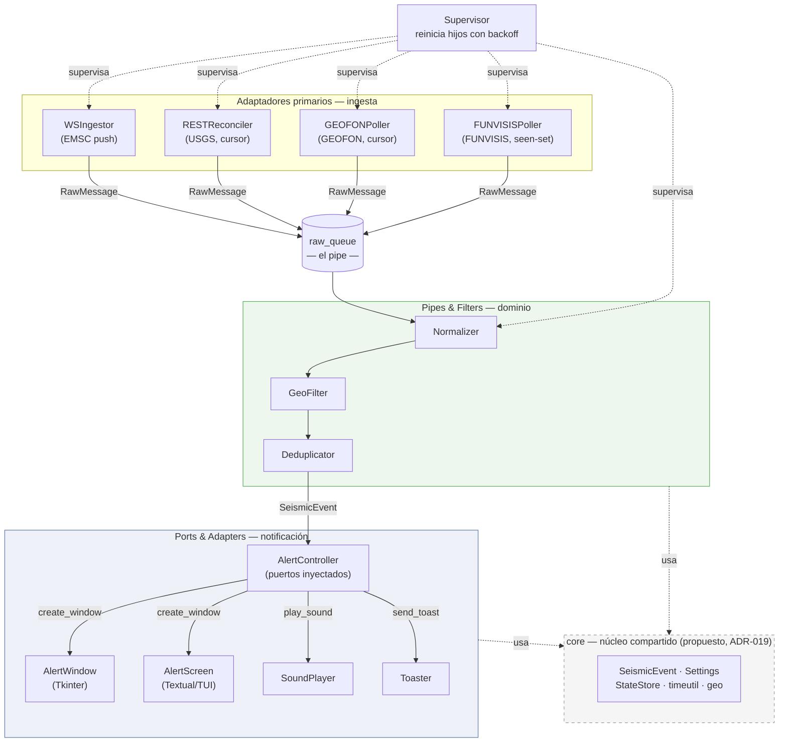

# Estilo arquitectónico — análisis y recomendación

> Producido con el skill `arch-patterns` (modo Recommend), sobre la evidencia de
> `01-INFORME-EVALUACION.md`. Commit de referencia: `8660eea`.

## 1. Los seis insumos de decisión

| Insumo | Situación real de Vigía-eew | Fuente |
|---|---|---|
| **Organización** | 1 desarrollador (`[METRIC: bus factor 100 % en todos los módulos]`). Madurez DevOps **alta** para el tamaño: CI con gates, escaneo de seguridad, builds nativos en 3 SO | `analysis/arch_signals.json`, `.github/workflows/` |
| **Dominio** | Un solo contexto acotado (alerta sísmica). Complejidad moderada y bien acotada: normalizar, filtrar, deduplicar, notificar. Sin regulación | `01-INFORME-EVALUACION.md` |
| **Escalabilidad** | **No es un eje**. Un proceso por máquina, 4 conexiones salientes, coste sub-milisegundo por evento. No hay carga que repartir | ADR-008 |
| **Consistencia** | Estado local en JSON atómico. Sin transacciones multi-entidad. Idempotencia real vía dedup por id + firma | `[VERIFY: src/vigia_eew/state.py:33]` |
| **Evolución** | Activa: 15 releases en 7 semanas. El eje de cambio es **añadir fuentes y frontends**, no escalar | `docs/reverse-sdd/03-EVOLUCION.md` |
| **Operación** | Software de escritorio del usuario final. Sin infraestructura, sin presupuesto de nube. Radio de impacto de un fallo: **una máquina** | ADR-008 |

Dos insumos deciden casi todo: **no hay problema de escala** y **el radio de impacto es una
sola máquina**. Cualquier propuesta distribuida cobra su precio diario a cambio de resolver
un problema que este sistema no tiene.

## 2. Qué arquitectura tiene ya (nombrada con precisión)

El repositorio **ya implementa** una combinación coherente que nunca se nombró como tal.
Sus 18 ADRs documentan decisiones puntuales; ninguno dice qué estilo es el conjunto.

| Capa de decisión | Estilo | Dónde vive | Evidencia |
|---|---|---|---|
| **Base** | **Monolito Modular** | Un proceso, módulos por responsabilidad (`ingest`, `pipeline`, `notify`, `autostart`) con API pública y sin ciclos | `[METRIC: 0 ciclos a nivel de archivo; pipeline fan-out 2]` |
| **Interior del pipeline** | **Pipes & Filters** | `raw_queue` es el *pipe*; `normalize → filter → dedup` son los *filters*, cada uno con contrato de E/S | `[VERIFY: src/vigia_eew/pipeline/processor.py:54]` |
| **Interior de la notificación** | **Ports & Adapters** (hexagonal ligero) | `create_window`, `play_sound`, `send_toast` son puertos inyectados; Tkinter y Textual son dos adaptadores reales del mismo puerto | `[VERIFY: src/vigia_eew/notify/controller.py:35]`, `[VERIFY: src/vigia_eew/app.py:313]` |
| **Complemento de resiliencia** | **Supervisor** (estilo Erlang/OTP) | Reinicia hijos con backoff sin tumbar el proceso | `[VERIFY: src/vigia_eew/supervisor.py:80]` |

Que existan **dos adaptadores reales** del puerto `create_window` (ventana Tkinter y modal
Textual) es lo que hace legítimo llamarlo hexagonal y no sobreingeniería: la abstracción
existe porque hay variación real, no "por flexibilidad".

**La recomendación de fondo, entonces, no es cambiar de arquitectura: es nombrar la que
hay** y protegerla (ADR-020), porque un contribuidor nuevo hoy no puede deducir el estilo
del árbol de directorios.

## 3. Finalistas evaluados y por qué no

Solo las filas que importan para este caso:

| Atributo (peso aquí) | Monolito Modular (actual) | Layered / N-capas | Relay central + clientes | EDA con broker |
|---|---|---|---|---|
| **Resiliencia** (crítico) | 🟢 supervisor local; un fallo afecta a una máquina | 🟢 igual | 🔴 el relay es SPOF: si cae, **todos** ciegos a la vez | 🟡 el broker es un SPOF nuevo |
| **Latencia** (crítico) | 🟢 push directo desde EMSC | 🟢 igual | 🟡 un salto más en el camino crítico | 🔴 dos saltos más |
| **Testabilidad** (alto) | 🟢 89 % sin red gracias a puertos inyectados | 🟡 las capas suelen filtrar infraestructura | 🟡 exige dobles del relay | 🔴 exige broker en tests |
| **Coste operativo** (alto) | 🟢 **cero**: no hay infraestructura | 🟢 cero | 🔴 servidor, despliegue, monitorización, guardias | 🔴 broker gestionado |
| **Evolutividad** (alto) | 🟢 demostrado: 2 fuentes y 2 frontends sin deformar | 🟡 añadir una fuente suele tocar todas las capas | 🟢 desplegar una fuente nueva centralmente | 🟢 alto desacoplamiento |
| **Radio de impacto** (crítico) | 🟢 una máquina | 🟢 una máquina | 🔴 toda la base de usuarios | 🔴 toda la base |

- **Layered** se descarta porque el sistema **no tiene forma de capas**: no hay
  request/response ni UI→servicio→repositorio. Tiene forma de **flujo** (un evento entra,
  se transforma en etapas, sale una alerta), y ese es exactamente el dominio de Pipes &
  Filters.
- **Relay central** (evaluado y rechazado ya en ADR-008) sigue siendo la peor opción para
  una herramienta de seguridad: convierte N fallos independientes en un fallo total
  correlacionado. Ese ADR aguanta perfectamente esta revisión.
- **EDA con broker** resolvería un desacoplamiento que ya está resuelto en proceso por
  `raw_queue`, a cambio de infraestructura y de un SPOF. Sin múltiples consumidores
  independientes, no compra nada.
- **Microservicios / DOMA / Cell-Based**: no aplican. Requieren escala y varios equipos
  autónomos; aquí hay un desarrollador y un proceso de escritorio.

## 4. Anti-patrones a los que la elección queda expuesta

Los del catálogo para Monolito Modular + Pipes & Filters, con su estado real medido:

| Anti-patrón | Estado hoy | Mitigación |
|---|---|---|
| **Módulos que importan las interioridades de otros** | 🟢 no ocurre `[METRIC: 0 ciclos]` | ADR-020 lo vuelve verificable |
| **"utils" compartido que se convierte en módulo oculto** | 🟡 **es el riesgo real**: el paquete raíz ya acumula 9 módulos compartidos sin nombre de módulo (DEB-01) | ADR-019: darle nombre (`core/`) y frontera |
| **Acoplamiento implícito por formatos intermedios** (Pipes & Filters) | 🟢 mitigado por diseño: `SeismicEvent` y `RawMessage` son contratos pydantic explícitos | Mantener la invariante de contrato único |
| **Hexágono anémico** (puertos que calcan la infraestructura) | 🟢 no ocurre: los puertos son de dominio (`create_window(data, severity, on_acknowledge)`), no calcan Tkinter | Al añadir un frontend, adaptarlo al puerto, no ampliar el puerto |
| **Sin transacciones globales** (Pipes & Filters) | 🟢 no aplica: el pipeline no tiene invariantes multi-etapa; el estado se persiste en un solo punto | — |

El único ámbar es exactamente DEB-01, que ya tiene ADR. Esa coincidencia es una buena
señal: el análisis por evidencia y el análisis por catálogo llegaron al mismo sitio por
caminos distintos.

## 5. Diagrama del estilo



## 6. Recomendación

```
Recomendación: Monolito Modular + Pipes & Filters (pipeline) y Ports & Adapters
               (notificación), con Supervisor como complemento de resiliencia.
               Es la arquitectura que YA tiene: la decisión es ratificarla y
               nombrarla, no cambiarla.

Por qué: (1) no existe eje de escala — un proceso por máquina, 4 conexiones;
         (2) el radio de impacto de un fallo debe permanecer en una máquina,
             que es justo lo que un relay o un broker destruirían;
         (3) ya demostró absorber cambio: 2 fuentes y 2 frontends sin deformarse.

No elegí Layered porque: el sistema tiene forma de flujo, no de capas
                        request/response; forzarlo haría tocar todas las capas
                        para añadir una fuente.
No elegí Relay central porque: convierte N fallos independientes en un fallo
                        total correlacionado — inaceptable en una herramienta de
                        seguridad (ADR-008 se ratifica).
No elegí EDA con broker porque: `raw_queue` ya desacopla en proceso; el broker
                        añadiría un SPOF e infraestructura sin un segundo
                        consumidor que lo justifique.
No elegí Microservicios/DOMA porque: exigen escala y varios equipos autónomos;
                        aquí hay un desarrollador y un binario de escritorio.

Riesgos / anti-patrones a vigilar:
  - "utils" compartido que se vuelve módulo oculto → ES EL RIESGO ACTIVO (DEB-01),
    mitigado por ADR-019 (nombrarlo `core/`) + ADR-020 (frontera exigible).
  - Puertos que empiecen a calcar el toolkit de UI → al añadir un frontend,
    adaptarlo al puerto existente, nunca ampliar el puerto para acomodarlo.
  - Formatos intermedios implícitos → mantener `SeismicEvent`/`RawMessage` como
    los únicos contratos entre etapas.

Revisar cuando:
  - Aparezca una 5.ª fuente FDSN → entonces sí extraer el poller FDSN común
    (ADR-016 lo difirió a la 3.ª; jscpd mide 0,85 %, aún no duele).
  - Se sume un 2.º desarrollador → ADR-020 pasa de recomendable a obligatorio.
  - Alguien pida alertas para una organización (no para una máquina) → recién ahí
    reabrir ADR-008 y evaluar el relay, con su coste operativo sobre la mesa.
```
