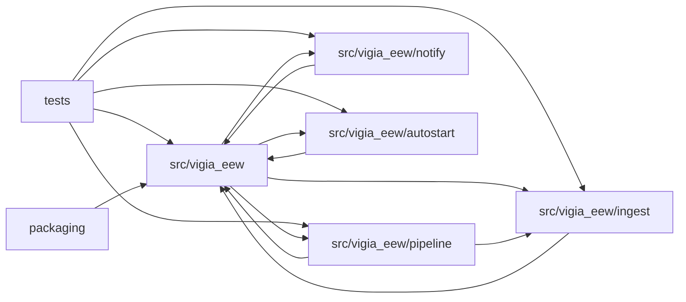

# Grafo de dependencias (módulos)

**Repo:** `/sessions/busy-eloquent-cray/mnt/vigia-eew` · Archivos: 722 · Módulos: 8 · Aristas: 15

## 🔴 Ciclos de dependencia (SCCs) — evidencia P1

1. `src/vigia_eew` ↔ `src/vigia_eew/autostart` ↔ `src/vigia_eew/ingest` ↔ `src/vigia_eew/notify` ↔ `src/vigia_eew/pipeline`

### Pares mutuos (A→B y B→A)

- `src/vigia_eew` ↔ `src/vigia_eew/autostart`
- `src/vigia_eew` ↔ `src/vigia_eew/ingest`
- `src/vigia_eew` ↔ `src/vigia_eew/notify`
- `src/vigia_eew` ↔ `src/vigia_eew/pipeline`

## Métricas por módulo (orden: acoplamiento)

| Módulo | Archivos | LOC | Fan-in | Fan-out | Inestabilidad | Score |
|---|---|---|---|---|---|---|
| `src/vigia_eew` | 19 | 1771 | 6 | 4 | 0.4 | 24 |
| `src/vigia_eew/pipeline` | 5 | 398 | 2 | 2 | 0.5 | 4 |
| `src/vigia_eew/ingest` | 5 | 566 | 3 | 1 | 0.25 | 3 |
| `src/vigia_eew/notify` | 7 | 583 | 2 | 1 | 0.33 | 2 |
| `src/vigia_eew/autostart` | 4 | 271 | 2 | 1 | 0.33 | 2 |
| `.venv_sandbox/lib` | 643 | 211217 | 0 | 0 | None | 0 |
| `tests` | 37 | 3433 | 0 | 5 | 1.0 | 0 |
| `packaging` | 2 | 64 | 0 | 1 | 1.0 | 0 |

## ⚠️ Candidatos a god-module (verificar en Fase 1)

- `src/vigia_eew` — fan-in 6, fan-out 4, 1771 LOC

## Módulos huérfanos (¿código muerto o entrypoints?)

- `.venv_sandbox/lib`

## Diagrama

