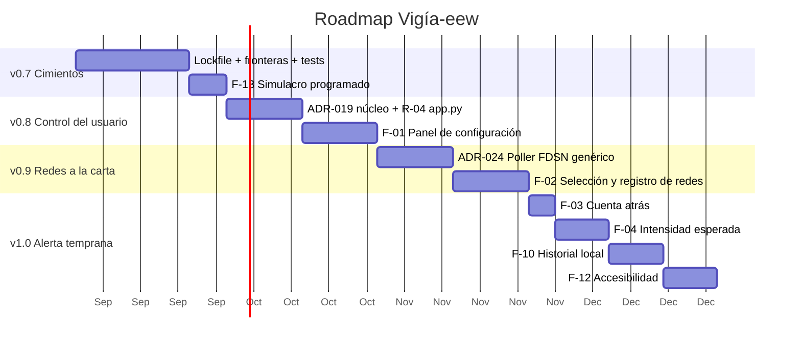

# Roadmap — Vigía-eew

> Fecha: 2026-08-16 · Base: `535740c` (v0.6.0)
> Integra tres fuentes que hasta ahora vivían separadas: el catálogo de funcionalidades
> ([`NUEVAS-FUNCIONALIDADES.md`](NUEVAS-FUNCIONALIDADES.md)), el plan de remediación de la
> auditoría ([`code-audit/02-PLAN-REMEDIACION.md`](../code-audit/02-PLAN-REMEDIACION.md))
> y el plan de migración arquitectónica
> ([`arch-eval/02-PLAN-MIGRACION.md`](../arch-eval/02-PLAN-MIGRACION.md)).

## Principio de ordenación

Un roadmap que solo lista funcionalidades y aparca la deuda produce la trampa clásica: la
tercera release cuesta el triple que la primera. Aquí cada hito mezcla **una porción de
guardarraíl** con **funcionalidad visible**, en esta proporción aproximada: v0.7 es casi
todo cimiento, y de v0.8 en adelante la funcionalidad domina.

El orden respeta además dos reglas duras:

1. **Lo que hace verificable el estado actual va antes que lo que lo cambia** (lockfile,
   fronteras, marcadores de tests).
2. **Lo que reduce riesgo de pérdida de datos del usuario va antes que lo cosmético** (la
   escritura de `config.toml` antes que el mapa).

---

## v0.7.0 — Cimientos verificables
> *Objetivo: que todo lo posterior se construya sobre algo que una herramienta pueda
> comprobar. Poca funcionalidad visible, y es deliberado.*

| Ítem | Origen | Esfuerzo |
|---|---|---|
| Versionar `uv.lock` y acotar rangos mayores | code-audit **R-01** (P2) | S |
| Contrato "el dominio no importa infraestructura" + hook | arch-eval **Fase 0** / ADR-020 | S |
| Marcador `integration` y separación en CI | code-audit **R-02** (P2) | S |
| Suite por defecto realmente headless | code-audit **R-03** (P2) | S |
| Test de paridad `Settings` ↔ `config.toml.example` | arch-eval **Fase 0** | S |
| **F-13 · Simulacro programado** | catálogo (B) | S |

**Por qué F-13 entra aquí**: es la única funcionalidad de la lista que *también* es un
guardarraíl. Un agente que puede pasar meses sin alertar necesita probarse solo, igual que
un detector de humo.

**Done**: `lint-imports` en verde · `pytest -m integration` selecciona ≥5 tests · `pytest`
sin `DISPLAY` → 0 fallos · `git ls-files uv.lock` no vacío.

---

## v0.8.0 — El usuario toma el control
> *Objetivo: las dos funcionalidades solicitadas. Es la release con más valor percibido
> por línea de código.*

| Ítem | Origen | Esfuerzo |
|---|---|---|
| **F-01 · Panel de configuración desde la bandeja** (RF-43…RF-47) | Delta Spec `2026-08-panel-de-configuracion` | M |
| ADR-023 · Escritura quirúrgica de `config.toml` | delta spec | — |
| Separar núcleo de composición (`core/`) | arch-eval **Fase 1** / ADR-019 | M |
| Extraer el cableado de `app.py` | code-audit **R-04** (P2) | M |

**Secuencia interna que importa**: ADR-019 (mover el núcleo) **antes** que R-04 (partir
`app.py`), porque el segundo se apoya en la separación del primero. Y ambos **después**
del contrato de fronteras de v0.7, que es la red que detecta si el movimiento introduce
una dependencia indebida.

**Done**: guardar un valor inválido deja `config.toml` intacto · los comentarios del
archivo sobreviven a un guardado · ciclos SCC 1→0 · `app.py` < 300 líneas.

---

## v0.9.0 — Redes a la carta y deuda FDSN saldada
> *Objetivo: la segunda funcionalidad solicitada, que arrastra consigo el refactor que
> tres análisis distintos ya habían señalado.*

| Ítem | Origen | Esfuerzo |
|---|---|---|
| **F-02 · Selección y registro de redes** (RF-48…RF-52) | Delta Spec | L |
| ADR-024 · Poller FDSN genérico (unifica USGS + GEOFON) | delta spec | M |
| Cierra code-audit **R-07** y arch-eval **DEB-P3** | — | — |
| Test de contrato contra respuestas grabadas de cada fuente | code-audit **RR-7** | M |

**El detalle que hace valiosa esta release**: registrar redes FDSN es exactamente la
"tercera fuente FDSN" que ADR-016 fijó como condición para unificar los pollers. La
funcionalidad **paga** la deuda en vez de acumularla — que es la forma correcta de saldar
una abstracción diferida: cuando aparece el tercer caso real, no antes.

**Done**: `jscpd src` → 0 clones en `ingest/` · dos redes registradas mantienen cursores
independientes · una red caída no afecta a las demás.

---

## v1.0.0 — De notificador a alerta temprana
> *Objetivo: cerrar la brecha conceptual con ShakeAlert. Es el salto que cambia qué **es**
> el producto, y por eso marca el 1.0.*

| Ítem | Origen | Esfuerzo |
|---|---|---|
| **F-03 · Cuenta atrás hasta la sacudida** | catálogo (A) | S |
| **F-04 · Filtro por intensidad esperada** (modo opcional) | catálogo (A) | M |
| **F-10 · Historial local con motivo de descarte** | catálogo (A) | M |
| **F-12 · Perfil de accesibilidad** | catálogo (A) | M |
| Tests de `logging_conf` + propagación del id de evento | code-audit **R-11**, arch-eval **DEB-05** | M |

**Por qué estas cuatro juntas marcan el 1.0**: F-03 y F-04 convierten "ha ocurrido un
sismo cerca" en "va a temblar así, en tantos segundos". F-10 hace auditable esa promesa.
F-12 la extiende a usuarios para los que hoy solo se cumple a medias — y eso es requisito
del Art. 1 de la constitución, no un extra.

**Riesgo a vigilar**: F-04 cambia el criterio de qué se alerta. Entra como modo
**opcional** con `radius` por defecto; promoverlo a predeterminado exige datos de campo,
no una decisión de diseño.

**Done**: la alerta muestra segundos hasta la sacudida, o dice explícitamente que ya
debería haber llegado · el modo intensidad se puede activar y cae a radio si no puede
calcular · el historial explica por qué se descartó cada evento.

---

## Más allá de 1.0 — no comprometido

| Ítem | Condición que lo activaría |
|---|---|
| **F-05 · SeedLink** (detección propia desde formas de onda) | Que F-03 demuestre en campo que la latencia de catálogo hace inútil la cuenta atrás. Es el único camino a segundos reales, y cuesta 1-2 meses más una dependencia científica pesada — exige su propio ADR |
| **F-06 · Mapa en la alerta** | Que el historial (F-10) muestre que los usuarios no ubican el epicentro con el texto actual |
| **F-08 · Avisos de tsunami** | Identificar primero la fuente autoritativa del Caribe y verificar su formato |
| **F-11 · Múltiples referencias** | Petición real de usuarios; hoy es especulación |
| **F-09 · Descubrimiento FDSN** | Que escribir la URL a mano resulte una barrera medible tras v0.9 |
| **F-14 · Publicar CAP** · **F-07 · Reportes ciudadanos** | Ambos exigen reabrir **ADR-008** (sin relay central). F-07 además choca con el Art. 7 en su forma con servidor. Solo tienen sentido si aparece un caso de uso **organizacional** — un colegio, una empresa — que hoy no existe |
| Resolver **Wayland** (RR-3) | Es el mayor riesgo abierto del producto y **no tiene fecha aquí a propósito**: no es una funcionalidad, es una decisión de plataforma que puede cambiar el frontend entero. Ver `reverse-sdd/05-PLAN-RECONSTRUCCION.md` Fase 4 |

## Vista de conjunto

*Las duraciones asumen un desarrollador a tiempo parcial y son órdenes de magnitud, no
compromisos. El historial real del proyecto —15 releases en 7 semanas— sugiere que puede
ir bastante más rápido.*

## Lo que este roadmap deliberadamente NO promete

- **Detección propia en segundos** antes de v1.0. Con fuentes basadas en catálogo, la
  cuenta atrás de F-03 será a menudo negativa. Prometer "alerta temprana real" sin
  SeedLink sería vender algo que la arquitectura actual no puede dar.
- **Paridad con MyShake en cobertura anticipada**. ShakeAlert se apoya en una red densa de
  sensores públicos que Venezuela no tiene. La ventaja de Vigía-eew es otra: cobertura
  local con FUNVISIS, sin cuenta, sin servidor y sin telemetría.
- **Fechas**. El diagrama ordena y dimensiona; no compromete calendario.
