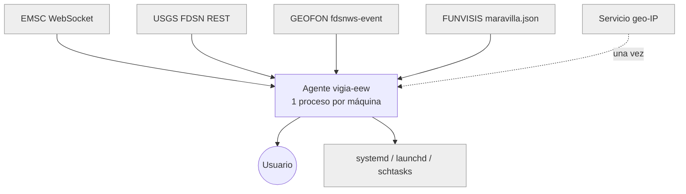
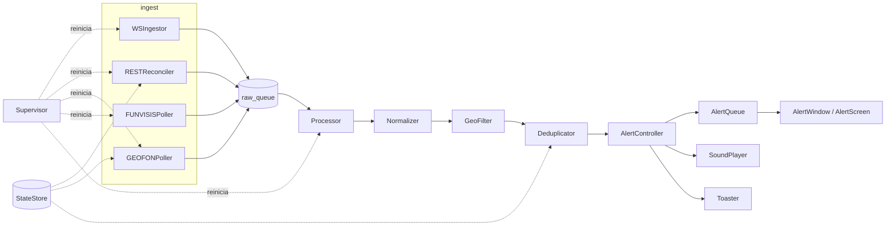
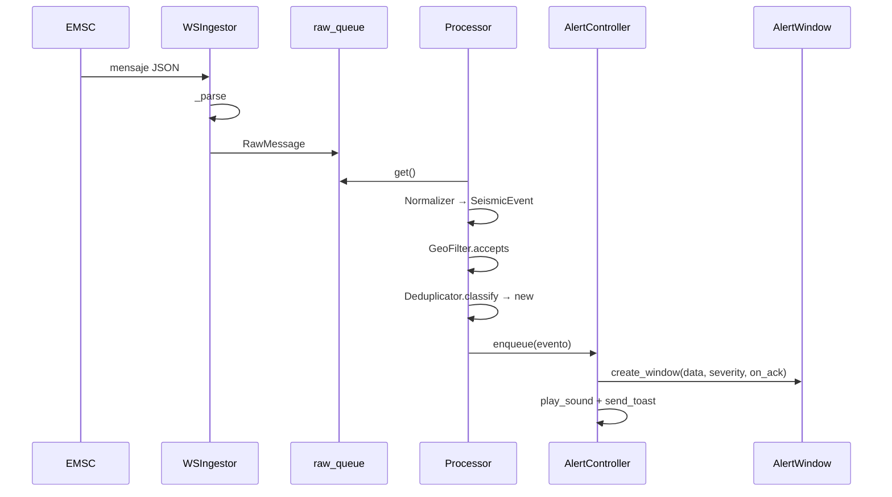

# 01 — Arquitectura (ingeniería inversa)

> Generado el 2026-09-06. Commit de referencia: `c3a2c29`.
> Describe lo que el código **es** hoy, no lo que la documentación aspiracional dice.
> Cada afirmación no trivial lleva una cita de la forma VERIFY con ruta y línea.

## 1. Vista de contexto

**Propósito.** Agente de escritorio que vigila sismos en tiempo real y muestra una alerta
**no descartable** cuando un evento cae dentro del radio y magnitud configurados. Un proceso por
máquina, sin punto único de fallo.

**Actores externos**

| Actor | Tipo | Integración | Evidencia |
|---|---|---|---|
| Usuario de escritorio | Humano | Ventana Tk / TUI / bandeja / toast | `[VERIFY: src/vigia_eew/notify/alert_window.py:47]` |
| EMSC | Sistema consumido | WebSocket persistente (`websockets`) | `[VERIFY: src/vigia_eew/ingest/ws_emsc.py:37]` |
| USGS | Sistema consumido | REST FDSN GeoJSON (`httpx`), cursor persistido | `[VERIFY: src/vigia_eew/ingest/rest_usgs.py:42]` |
| GEOFON (GFZ Potsdam) | Sistema consumido | REST `fdsnws-event`, formato **texto** | `[VERIFY: src/vigia_eew/ingest/rest_geofon.py:52]` |
| FUNVISIS | Sistema consumido | JSON del mapa web, sin cursor | `[VERIFY: src/vigia_eew/ingest/rest_funvisis.py:40]` |
| Servicio de geo-IP | Sistema consumido (opcional, una vez) | REST | `[VERIFY: src/vigia_eew/geoloc.py:39]` |
| SO (systemd / launchd / schtasks) | Sistema consumido | subprocess | `[VERIFY: src/vigia_eew/autostart/__init__.py:1]` |

## 2. Vista de componentes

### 2.1 Ingesta (`src/vigia_eew/ingest/`)

Cuatro ingestores independientes que escriben en una `asyncio.Queue` común de `RawMessage`.

| Componente | Ubicación | Estrategia | Estado que persiste |
|---|---|---|---|
| `WSIngestor` | `[VERIFY: src/vigia_eew/ingest/ws_emsc.py:37]` | push, keepalive 15 s, backoff+jitter `[VERIFY: src/vigia_eew/ingest/ws_emsc.py:111]` | ninguno |
| `RESTReconciler` | `[VERIFY: src/vigia_eew/ingest/rest_usgs.py:42]` | poll 60 s, cursor `[VERIFY: src/vigia_eew/ingest/rest_usgs.py:70]` | `usgs_cursor` |
| `GEOFONPoller` | `[VERIFY: src/vigia_eew/ingest/rest_geofon.py:52]` | poll 60 s, cursor, parse texto `[VERIFY: src/vigia_eew/ingest/rest_geofon.py:133]` | `geofon_cursor` |
| `FUNVISISPoller` | `[VERIFY: src/vigia_eew/ingest/rest_funvisis.py:40]` | poll 60 s, seen-set en memoria `[VERIFY: src/vigia_eew/ingest/rest_funvisis.py:60]` | ninguno |

**No hacen**: filtrar, deduplicar ni decidir si algo se alerta. Solo normalizan a `RawMessage`.

### 2.2 Pipeline (`src/vigia_eew/pipeline/`)

`Processor` `[VERIFY: src/vigia_eew/pipeline/processor.py:32]` consume la cola y encadena:

1. `Normalizer` `[VERIFY: src/vigia_eew/pipeline/normalize.py:38]` → `SeismicEvent`; calcula
   distancia (`haversine_km` `[VERIFY: src/vigia_eew/geo.py:16]`) y severidad
   (`classify_severity` `[VERIFY: src/vigia_eew/models.py:38]`).
2. `GeoFilter.accepts` `[VERIFY: src/vigia_eew/pipeline/filter.py:52]` → radio, magnitud, país
   `[VERIFY: src/vigia_eew/pipeline/filter.py:60]` y frescura `[VERIFY: src/vigia_eew/pipeline/filter.py:71]`.
3. `Deduplicator.classify` `[VERIFY: src/vigia_eew/pipeline/dedup.py:45]` → `new` / `update` /
   `duplicate`; `register` `[VERIFY: src/vigia_eew/pipeline/dedup.py:56]` persiste y poda.

**Orden invariante**: el filtro corre **antes** que el dedup, para que un evento rechazado no
contamine el estado de "primer reportante gana" `[VERIFY: src/vigia_eew/pipeline/processor.py:54]`.

### 2.3 Notificación (`src/vigia_eew/notify/`)

`AlertController` `[VERIFY: src/vigia_eew/notify/controller.py:32]` orquesta tres efectos
**inyectables**: `create_window`, `play_sound`, `send_toast`. `AlertQueue`
`[VERIFY: src/vigia_eew/notify/queue.py:25]` garantiza una alerta a la vez y la actualiza en sitio.

- Ventana no descartable: `configure_undismissable` `[VERIFY: src/vigia_eew/notify/alert_window.py:38]`
- Sonido por severidad: `SoundPlayer` `[VERIFY: src/vigia_eew/notify/sound.py:99]`
- Toast nativo: `Toaster` `[VERIFY: src/vigia_eew/notify/toast.py:40]`
- Formato puro: `format_event` `[VERIFY: src/vigia_eew/notify/presentation.py:56]`

### 2.4 Composición y frontends

`Application` `[VERIFY: src/vigia_eew/app.py:54]` es la raíz de composición: construye supervisor
`[VERIFY: src/vigia_eew/app.py:85]`, filtro `[VERIFY: src/vigia_eew/app.py:137]`, controlador
`[VERIFY: src/vigia_eew/app.py:158]` y bandeja `[VERIFY: src/vigia_eew/app.py:178]`.
Expone tres modos: `execute()` GUI `[VERIFY: src/vigia_eew/app.py:397]`, `run_tui()`
`[VERIFY: src/vigia_eew/app.py:369]` y `simulate()` `[VERIFY: src/vigia_eew/app.py:359]`.

### 2.5 Transversales

| Preocupación | Componente | Evidencia |
|---|---|---|
| Estado persistido | `StateStore` (JSON atómico vía `platformdirs`) | `[VERIFY: src/vigia_eew/state.py:33]` |
| Configuración | `Settings` (pydantic sobre `tomllib`) | `[VERIFY: src/vigia_eew/config.py:142]` |
| Resiliencia | `Supervisor` + `exponential_backoff` | `[VERIFY: src/vigia_eew/supervisor.py:27]`, `[VERIFY: src/vigia_eew/backoff.py:18]` |
| Tiempo local | `timeutil` | `[VERIFY: src/vigia_eew/timeutil.py:23]` |
| i18n | `t()` | `[VERIFY: src/vigia_eew/i18n.py:64]` |
| Logging UTC | `_UTCFormatter` | `[VERIFY: src/vigia_eew/logging_conf.py:23]` |
| Entorno de subprocesos | `system_env` (saneo `LD_LIBRARY_PATH` bajo PyInstaller) | `[VERIFY: src/vigia_eew/subprocess_env.py:25]` |

## 3. Flujos principales

### 3.1 De mensaje EMSC a alerta en pantalla

Saltos verificables: `_parse` `[VERIFY: src/vigia_eew/ingest/ws_emsc.py:61]` →
`process_one` `[VERIFY: src/vigia_eew/pipeline/processor.py:54]` → `enqueue`
`[VERIFY: src/vigia_eew/notify/controller.py:81]` → `_show`
`[VERIFY: src/vigia_eew/notify/controller.py:90]`.

### 3.2 Cruce asyncio ↔ Tkinter

Tk posee el hilo principal; asyncio vive en un hilo trabajador. El único punto de cruce es
`AsyncioTkBridge` `[VERIFY: src/vigia_eew/notify/queue.py:102]`: `publish` desde asyncio,
`drain` `[VERIFY: src/vigia_eew/notify/queue.py:114]` desde el tick de `widget.after()`
`[VERIFY: src/vigia_eew/notify/queue.py:123]`. En modo TUI **este puente no existe**: el supervisor corre como worker
de Textual sobre el mismo loop `[VERIFY: src/vigia_eew/app.py:369]`.

### 3.3 Reconciliación REST con cursor

`_build_params` `[VERIFY: src/vigia_eew/ingest/rest_usgs.py:70]` calcula `starttime` desde el
cursor persistido, con piso en medianoche local `[VERIFY: src/vigia_eew/timeutil.py:50]`.
`poll_once` `[VERIFY: src/vigia_eew/ingest/rest_usgs.py:87]` emite un `RawMessage` por feature y solo entonces avanza
el cursor `[VERIFY: src/vigia_eew/state.py:101]`.

### 3.4 Resolución del punto de referencia

`_prepare` `[VERIFY: src/vigia_eew/app.py:245]` → `_resolve_automatic_reference`
`[VERIFY: src/vigia_eew/app.py:251]`: si no hay `[reference]` manual ni caché, llama a
`detect_ip_location` `[VERIFY: src/vigia_eew/geoloc.py:39]` **una sola vez** y cachea
`[VERIFY: src/vigia_eew/state.py:120]`. Fallo → default sin cachear.

### 3.5 Supervisión y reinicio

`Supervisor.run` `[VERIFY: src/vigia_eew/supervisor.py:62]` lanza cada tarea envuelta en `_guard`
`[VERIFY: src/vigia_eew/supervisor.py:79]`, que la reinicia con backoff
`[VERIFY: src/vigia_eew/supervisor.py:102]` sin derribar el proceso.

## 4. Modelo de datos (mapa)

| Entidad | Rol | Ubicación |
|---|---|---|
| `RawMessage` | payload crudo + fuente | `[VERIFY: src/vigia_eew/ingest/__init__.py:18]` |
| `SeismicEvent` | **contrato interno único** entre capas | `[VERIFY: src/vigia_eew/models.py:51]` |
| `EventSignature` | firma para dedup cruzado | `[VERIFY: src/vigia_eew/models.py:87]` |
| `AlertedId` | id ya alertado + ack | `[VERIFY: src/vigia_eew/models.py:103]` |
| `DetectedLocation` | ubicación geo-IP cacheada | `[VERIFY: src/vigia_eew/models.py:117]` |
| `AppState` | raíz persistida en `state.json` | `[VERIFY: src/vigia_eew/models.py:133]` |
| `AlertData` | proyección de presentación | `[VERIFY: src/vigia_eew/notify/presentation.py:29]` |

Invariante global: todo `datetime` interno es *tz-aware* UTC; se valida y se rechaza lo naive
`[VERIFY: src/vigia_eew/models.py:25]`.

## 5. Decisiones de arquitectura observadas

| # | Decisión | Evidencia | ¿v2? | Justificación |
|---|---|---|---|---|
| AD-1 | Un agente por máquina, sin relay central | `[VERIFY: src/vigia_eew/app.py:54]` | Sí | evita SPOF; el coste (N conexiones) es aceptable |
| AD-2 | Push primario + polling de respaldo | `[VERIFY: src/vigia_eew/ingest/ws_emsc.py:37]` + `[VERIFY: src/vigia_eew/ingest/rest_usgs.py:42]` | Sí | el WS de EMSC pierde mensajes por diseño |
| AD-3 | Contrato interno único (`SeismicEvent`) | `[VERIFY: src/vigia_eew/models.py:51]` | Sí | las 4 fuentes convergen sin lógica *source-aware* aguas abajo |
| AD-4 | Efectos de notificación inyectables | `[VERIFY: src/vigia_eew/notify/controller.py:35]` | Sí | única razón por la que la suite corre headless |
| AD-5 | Puente asyncio↔Tk en un solo punto | `[VERIFY: src/vigia_eew/notify/queue.py:102]` | Sí | Tk no es *thread-safe* |
| AD-6 | Dedup heurístico (100 km / 90 s / 0,5 mag) | `[VERIFY: src/vigia_eew/pipeline/dedup.py:70]` | Revisar | falsos positivos durante enjambres |
| AD-7 | Filtro de país como **lista de bloqueo** | `[VERIFY: src/vigia_eew/pipeline/filter.py:60]` | Sí | los sismos peligrosos de Venezuela son *offshore* |
| AD-8 | Frescura por día **local**, no UTC | `[VERIFY: src/vigia_eew/pipeline/filter.py:71]` | Sí | Venezuela es UTC-4; el corte UTC caería a las 20:00 locales |
| AD-9 | Degradación *fail-safe*, nunca *fail-closed* | `[VERIFY: src/vigia_eew/tray.py:110]`, `[VERIFY: src/vigia_eew/geoloc.py:39]` | Sí | coste asimétrico: alerta perdida ≫ alerta espuria |
| AD-10 | Poda de estado atada a `register()` | `[VERIFY: src/vigia_eew/pipeline/dedup.py:56]` | Revisar | correcta pero deja una ventana sin podar si no hay alertas |
| AD-11 | GEOFON parsea texto, no GeoJSON | `[VERIFY: src/vigia_eew/ingest/rest_geofon.py:133]` | Revisar | duplica lógica FDSN; unificar si entra una 5ª fuente |
| AD-12 | TUI como **modo alternativo**, no capa extra | `[VERIFY: src/vigia_eew/app.py:369]` | Sí | Textual ya es asyncio-nativo; evita el puente |

## 6. Decisiones históricas (superadas)

| Qué había | Qué lo reemplazó | Commits | Lección para v2 |
|---|---|---|---|
| Todo el código y la documentación en **español** (módulos `filtro.py`, `presentacion.py`, `controlador.py`, `procesador.py`, `simulacion.py`, `estado_agente.py`; assets `critico.wav`, `atencion.wav`) | Traducción completa a inglés + capa i18n (`i18n.py`) | `[COMMITS: 7f9132e]` | **Nacer en inglés.** Fue un `feat!` que tocó 30+ archivos y renombró assets; hacerlo tarde es caro |
| Imports relativos dentro del paquete | Imports absolutos | `[COMMITS: e49404d]` | fijar la convención en la fase 1 |
| Ícono de bandeja placeholder generado al vuelo | PNG commiteado como asset | `[COMMITS: 7b1c71c, c38d9f6]` | los assets del empaquetado necesitan validación de formato en CI |
| GEOFON sobre HTTP | GEOFON sobre HTTPS | `[COMMITS: 8e0064a]` | exigir TLS por defecto en los clientes nuevos |

No se detectaron features iniciadas y revertidas: no hay commits `revert:` en la historia.

## 7. Lo que está diseñado pero **no** implementado

`docs/TECHNICAL-DESIGN.md` (ADR-010) especifica un frontend de presentación desacoplado vía D-Bus
más una extensión de GNOME Shell, como respuesta a que bajo Wayland un cliente X11/XWayland no
puede forzar de forma fiable *topmost* ni foco. **No existe código para esto**: la única mención de
D-Bus en `src/` es un comentario sobre el backend de `desktop-notifier`
`[VERIFY: src/vigia_eew/notify/toast.py:8]`, y no hay módulo de servicio D-Bus ni directorio de
extensión GNOME. `[COMMITS: 230b0b8]`

Esto es el límite conocido de la garantía "imposible de ignorar" y el mayor riesgo funcional
heredado por una v2.
