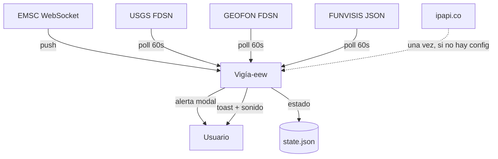
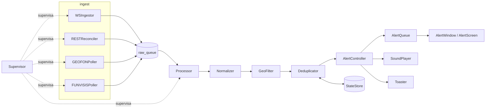
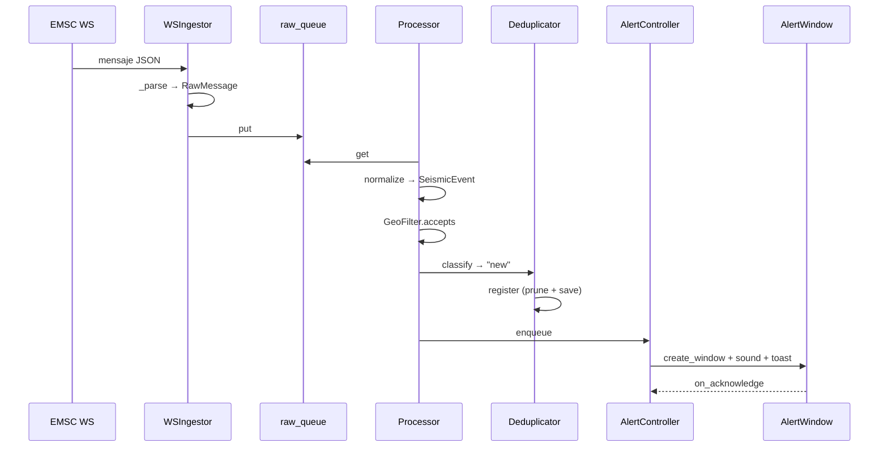

# Arquitectura — Vigía-eew

> Generado por ingeniería inversa el 2026-08-16. Commit de referencia: `6e0f133`.
> Propósito: base para la reconstrucción v2. Describe lo que el código **es** hoy,
> no lo que la documentación aspiracional dice.

## 1. Vista de contexto

Agente de escritorio que vigila cuatro redes sísmicas en tiempo real y muestra una alerta
**imposible de descartar por accidente** cuando un sismo cae dentro del radio y magnitud
configurados. Un proceso por máquina, sin componente servidor
`[VERIFY: src/vigia_eew/app.py:54]`.

**Actores externos:**

| Actor | Rol | Integración | Evidencia |
|---|---|---|---|
| EMSC | Fuente push primaria | WebSocket, keepalive 15 s | `[VERIFY: src/vigia_eew/ingest/ws_emsc.py:37]` |
| USGS | Respaldo global | REST FDSN GeoJSON, cursor | `[VERIFY: src/vigia_eew/ingest/rest_usgs.py:42]` |
| GEOFON (GFZ Potsdam) | Respaldo global independiente | REST FDSN texto pipe, cursor | `[VERIFY: src/vigia_eew/ingest/rest_geofon.py:52]` |
| FUNVISIS | Cobertura local Venezuela | JSON estático, seen-set | `[VERIFY: src/vigia_eew/ingest/rest_funvisis.py:40]` |
| ipapi.co | Geolocalización por IP (una vez) | REST, best-effort | `[VERIFY: src/vigia_eew/geoloc.py:39]` |
| Usuario de escritorio | Recibe y reconoce alertas | Tkinter / TUI / bandeja | `[VERIFY: src/vigia_eew/notify/alert_window.py:48]` |

## 2. Vista de componentes

### 2.1 Ingestión (`ingest/`)
- **Responsabilidad**: hablar con cada red y emitir `RawMessage`. **No** normaliza,
  no filtra, no decide si algo se alerta.
- **Ubicación**: `[VERIFY: src/vigia_eew/ingest/__init__.py:18]` (contrato `RawMessage`)
- **Salida**: `asyncio.Queue` compartida (`raw_queue`)
- Cuatro implementaciones con dos estrategias de novedad distintas: cursor persistido
  (USGS `[VERIFY: src/vigia_eew/ingest/rest_usgs.py:70]`, GEOFON
  `[VERIFY: src/vigia_eew/ingest/rest_geofon.py:80]`) y seen-set en memoria
  (FUNVISIS `[VERIFY: src/vigia_eew/ingest/rest_funvisis.py:86]`).

### 2.2 Pipeline (`pipeline/`)
- **Responsabilidad**: `RawMessage` → decisión de alertar. Encadena normalizar → filtrar
  → deduplicar `[VERIFY: src/vigia_eew/pipeline/processor.py:54]`.
- **Normalizer** `[VERIFY: src/vigia_eew/pipeline/normalize.py:38]`: un `_map_*` por
  fuente (`:76` EMSC, `:92` USGS, `:109` FUNVISIS, `:131` GEOFON) que converge en
  `_build` `[VERIFY: src/vigia_eew/pipeline/normalize.py:150]`.
- **GeoFilter** `[VERIFY: src/vigia_eew/pipeline/filter.py:34]`: radio, magnitud, país,
  frescura — en ese orden `[VERIFY: src/vigia_eew/pipeline/filter.py:52]`.
- **Deduplicator** `[VERIFY: src/vigia_eew/pipeline/dedup.py:31]`: por id y por
  heurística inter-fuente.

### 2.3 Notificación (`notify/`)
- **Responsabilidad**: presentar y serializar alertas. **No** conoce fuentes ni red.
- **AlertController** `[VERIFY: src/vigia_eew/notify/controller.py:32]`: orquesta tres
  efectos recibidos como callbacks inyectados — de ahí que sea testeable sin I/O real.
- **AlertQueue** `[VERIFY: src/vigia_eew/notify/queue.py:25]`: una alerta a la vez.
- **AlertWindow** `[VERIFY: src/vigia_eew/notify/alert_window.py:48]` + política
  no-descartable `[VERIFY: src/vigia_eew/notify/alert_window.py:39]`.
- **presentation.py** `[VERIFY: src/vigia_eew/notify/presentation.py:56]`: funciones
  **puras**; único punto donde UTC se convierte a hora local.

### 2.4 Orquestación
- **Supervisor** `[VERIFY: src/vigia_eew/supervisor.py:28]`: corre las 5 tareas y
  reinicia con backoff la que falle `[VERIFY: src/vigia_eew/supervisor.py:80]`.
- **Application** `[VERIFY: src/vigia_eew/app.py:54]`: cablea todo; expone `execute()`,
  `run_tui()` y `simulate()`.
- **AsyncioTkBridge** `[VERIFY: src/vigia_eew/notify/queue.py:104]`: único cruce de hilos.

## 3. Flujos principales

### 3.1 De EMSC a la ventana de alerta (camino feliz)

Pasos con evidencia: recepción y parseo
`[VERIFY: src/vigia_eew/ingest/ws_emsc.py:61]` → consumo
`[VERIFY: src/vigia_eew/pipeline/processor.py:54]` → normalización
`[VERIFY: src/vigia_eew/pipeline/normalize.py:52]` → filtrado
`[VERIFY: src/vigia_eew/pipeline/filter.py:52]` → dedup
`[VERIFY: src/vigia_eew/pipeline/dedup.py:45]` → registro con poda
`[VERIFY: src/vigia_eew/pipeline/dedup.py:57]` → presentación
`[VERIFY: src/vigia_eew/notify/controller.py:81]`.

### 3.2 Mismo sismo desde dos fuentes → una sola alerta

USGS y EMSC asignan ids distintos al mismo sismo. La heurística
(≤100 km, ≤90 s, ≤0,5 mag) `[VERIFY: src/vigia_eew/pipeline/dedup.py:72]` compara contra
firmas recientes persistidas. Verificado end-to-end en
`[VERIFY: tests/test_resilience.py:107]`.

### 3.3 Actualización de magnitud (EMSC `update`)

EMSC reemite el mismo `unid` con magnitud revisada. El dedup devuelve `"update"`
`[VERIFY: src/vigia_eew/pipeline/dedup.py:45]` y la cola refresca la ventana en sitio sin
re-encolar `[VERIFY: src/vigia_eew/notify/queue.py:69]`. Sin esto, cada revisión de
magnitud generaría una alerta nueva y entrenaría al usuario a descartarlas por reflejo.

### 3.4 Reconexión tras caída del WebSocket

`run()` es un bucle perpetuo que solo sale por cancelación
`[VERIFY: src/vigia_eew/ingest/ws_emsc.py:75]`; el backoff exponencial con jitter viene de
`[VERIFY: src/vigia_eew/backoff.py:18]`. El jitter importa porque, sin él, todas las
instancias reconectarían en lockstep tras una caída compartida.

### 3.5 Arranque con configuración ausente

`Application._prepare` `[VERIFY: src/vigia_eew/app.py:245]` resuelve el punto de
referencia por IP solo si no hay `[reference]` manual ni caché
`[VERIFY: src/vigia_eew/app.py:252]`. `--simulate` nunca pasa por aquí, porque debe
funcionar sin red `[VERIFY: src/vigia_eew/app.py:360]`.

## 4. Modelo de datos (mapa)

| Entidad | Rol | Ubicación |
|---|---|---|
| `SeismicEvent` | Contrato único entre capas | `[VERIFY: src/vigia_eew/models.py:51]` |
| `EventSignature` | Huella para dedup inter-fuente | `[VERIFY: src/vigia_eew/models.py:87]` |
| `AlertedId` | Registro de ya-alertado | `[VERIFY: src/vigia_eew/models.py:103]` |
| `DetectedLocation` | Caché de geolocalización IP | `[VERIFY: src/vigia_eew/models.py:117]` |
| `AppState` | Raíz persistida en `state.json` | `[VERIFY: src/vigia_eew/models.py:133]` |
| `RawMessage` | Payload sin normalizar | `[VERIFY: src/vigia_eew/ingest/__init__.py:18]` |
| `Settings` | Config validada | `[VERIFY: src/vigia_eew/config.py:142]` |

**Invariantes que el modelo hace cumplir**, no la convención:
todo `datetime` es tz-aware UTC y los *naive* se rechazan
`[VERIFY: src/vigia_eew/models.py:25]`; `magtype` se normaliza a minúsculas
`[VERIFY: tests/test_models.py:42]`; distancia y severidad son **siempre** derivadas
`[VERIFY: src/vigia_eew/pipeline/normalize.py:150]`.

## 5. Decisiones de arquitectura observadas

| # | Decisión | Evidencia | ¿Mantener en v2? | Justificación |
|---|---|---|---|---|
| AD-1 | Push primario + polling de respaldo | `[VERIFY: src/vigia_eew/ingest/ws_emsc.py:37]` | **Sí** | EMSC documenta pérdida de mensajes; el respaldo es la red de seguridad |
| AD-2 | Un agente por máquina, sin relay | `[VERIFY: src/vigia_eew/app.py:54]` | **Sí** | Un relay caído deja ciegos a todos a la vez |
| AD-3 | Supervisor que reinicia hijos | `[VERIFY: src/vigia_eew/supervisor.py:80]` | **Sí** | Un agente que muere por un fallo de red es peor que inútil |
| AD-4 | Efectos inyectados como callbacks | `[VERIFY: src/vigia_eew/notify/controller.py:35]` | **Sí** | Permite 348 tests sin I/O real y compartir controlador entre GUI y TUI |
| AD-5 | Dedup heurístico (100 km/90 s/0,5 mag) | `[VERIFY: src/vigia_eew/pipeline/dedup.py:72]` | **Revisar** | Correcto, pero puede confundir sismos distintos durante enjambres |
| AD-6 | Filtros fail-safe (inertes ante duda) | `[VERIFY: src/vigia_eew/pipeline/filter.py:61]` | **Sí** | Una alerta perdida es un fallo de seguridad; una de más, una molestia |
| AD-7 | Tkinter en hilo principal + puente | `[VERIFY: src/vigia_eew/notify/queue.py:104]` | **Revisar** | Funciona, pero Wayland limita topmost/focus (ver §6) |
| AD-8 | Punto-en-polígono offline | `[VERIFY: src/vigia_eew/geocode.py:96]` | **Sí** | Sin dependencia geoespacial ni red por evento |
| AD-9 | Día **local**, no UTC, para frescura | `[VERIFY: src/vigia_eew/timeutil.py:23]` | **Sí** | Venezuela es UTC-4: el corte UTC caería a las 8pm local |
| AD-10 | Texto pipe en GEOFON, no GeoJSON | `[VERIFY: src/vigia_eew/ingest/rest_geofon.py:83]` | **Revisar** | Deliberado (GeoJSON no confirmado), pero duplica el camino de parseo FDSN |

## 6. Decisiones históricas (superadas o no ejecutadas)

- **ADR-010 — frontend desacoplado por D-Bus + extensión GNOME Shell.** Documentado en
  profundidad (`230b0b8`) pero **sin implementar**: no existe módulo D-Bus en `src/`.
  Es el plan de contingencia para el límite real de Wayland, donde el compositor controla
  el apilamiento y una app XWayland no puede forzar topmost de forma confiable. Para la
  v2: esto no es un callejón sin salida, es una decisión pendiente que la v2 debe tomar
  explícitamente antes de comprometerse con Tkinter.
- **Código base en español → inglés** (`7f9132e`, breaking change): el proyecto nació con
  identificadores y docstrings en español y migró a inglés con i18n para el texto de
  usuario. La v2 debe nacer en inglés con i18n desde el día uno; la migración tardía
  tocó todo el árbol.
- **Imports relativos → absolutos** (`e49404d`), inmediatamente después de la migración
  anterior. Adoptar absolutos desde el inicio.

## 7. Transversales

- **Autenticación/autorización**: **ninguna, por diseño.** No hay API keys ni credenciales;
  todas las fuentes son públicas y de solo lectura. La única fuga de información es la IP
  de origen hacia `ipapi.co`, y solo cuando no hay `[reference]` configurado
  `[VERIFY: src/vigia_eew/geoloc.py:39]`.
- **Manejo de errores**: patrón dominante de **aislamiento de fallos**. Cada efecto
  opcional atrapa su propia excepción y degrada en vez de propagar:
  toast `[VERIFY: src/vigia_eew/notify/toast.py:40]`, sonido
  `[VERIFY: tests/test_sound.py:76]`, bandeja `[VERIFY: tests/test_tray.py:121]`,
  geolocalización `[VERIFY: tests/test_geoloc.py:48]`. En el pipeline, un mensaje
  inválido se descarta sin abortar el lote `[VERIFY: tests/test_rest_geofon.py:189]`.
- **Logging/observabilidad**: estructurado clave=valor a consola y archivo rotativo
  `[VERIFY: src/vigia_eew/logging_conf.py:36]`, con timestamps en UTC
  `[VERIFY: src/vigia_eew/logging_conf.py:23]`. Se registran conexiones, reconexiones,
  polls, eventos filtrados, alertas y **reconocimientos** (traza de auditoría).
- **Configuración**: TOML validado por pydantic `[VERIFY: src/vigia_eew/config.py:251]`,
  sembrado desde plantilla en el primer arranque
  `[VERIFY: src/vigia_eew/config.py:176]`. Rutas por SO vía `platformdirs`
  `[VERIFY: src/vigia_eew/config.py:157]`. **Sin secretos** — no hay variables de entorno
  sensibles que gestionar.

## 8. Deuda técnica visible

| # | Deuda | Evidencia | Impacto |
|---|---|---|---|
| DT-1 | `app.py` concentra el cableado de GUI, TUI, bandeja, país y geolocalización | 11 toques en el historial; `[VERIFY: src/vigia_eew/app.py:54]` | Cada feature nueva lo modifica → punto de conflicto y de regresión |
| DT-2 | Dos caminos de parseo FDSN casi idénticos (USGS GeoJSON, GEOFON texto) | `[VERIFY: src/vigia_eew/ingest/rest_usgs.py:70]` vs `[VERIFY: src/vigia_eew/ingest/rest_geofon.py:80]` | La lógica de cursor/floor/Retry-After está duplicada; ADR-016 lo difiere explícitamente hasta una tercera fuente FDSN — que ya llegaría con la v2 |
| DT-3 | ADR-010 (Wayland) documentado y no implementado | Sin módulo D-Bus en `src/` | La garantía central del producto es frágil bajo GNOME/Wayland, el escritorio Linux por defecto hoy |
| DT-4 | `MAX_AGE` de poda no configurable y solo se ejecuta al registrar | `[VERIFY: src/vigia_eew/pipeline/dedup.py:64]` | Aceptado en ADR-018; sin riesgo real, pero `state.json` no está podado en todo instante |
| DT-5 | Dos tests del suite por defecto exigen display real | `[VERIFY: tests/test_tray.py:81]`, `[VERIFY: tests/test_app.py:175]` | Contradice "el suite por defecto corre headless" de `CLAUDE.md`; fallan con `Xlib DisplayNameError` sin `xvfb` |
| DT-6 | `uv.lock` está en `.gitignore` | `[VERIFY: .gitignore:29]` | Sin lockfile versionado no hay builds reproducibles; el CI cachea sobre `pyproject.toml` como workaround (`27e4b45`) |
