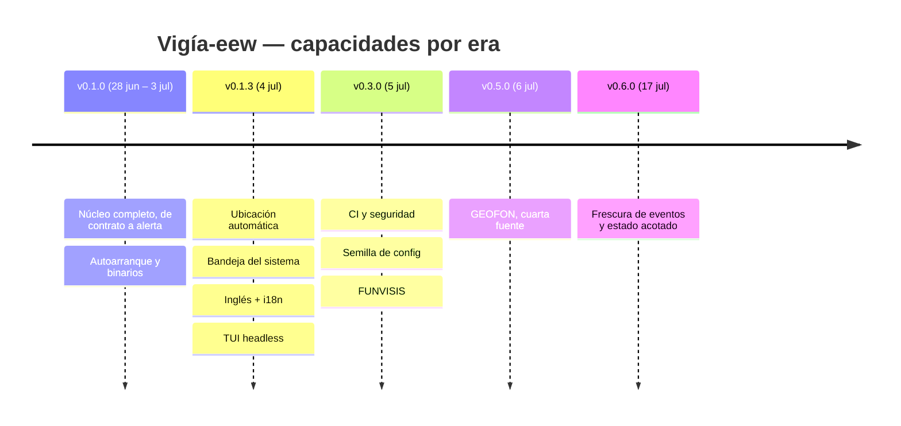

# 03 — Evolución del sistema

> 58 commits (47 sin merges), 2026-06-28 → 2026-07-17. Eras delimitadas por tags de release.
> Autor único: Ernesto Crespo. 97,9 % conventional commits.

## Era 1 — v0.1.0 (2026-06-28 → 2026-07-03, 15 commits)

**Qué ganó el sistema**: existir, de punta a punta. En seis días pasó de un `LICENSE` a un agente
que ingiere sismos de dos redes, los filtra, deduplica y muestra una alerta no descartable, con
autoarranque y binarios por plataforma.

El orden fue estrictamente SDD: primero los artefactos de especificación `[COMMITS: 737d7fa]`,
luego una fase por commit — dominio `[COMMITS: b5c5371]`, ingesta y supervisor
`[COMMITS: fc0ca99]`, pipeline `[COMMITS: b40c20b]`, notificación `[COMMITS: fb50326]`, CLI y
ensamblaje `[COMMITS: 4fb49d0]`, autoarranque `[COMMITS: 5b79ff1]`, pruebas de resiliencia
`[COMMITS: f49d139]` y empaquetado `[COMMITS: b6413e3]`.

**Clusters activos**: C-01 … C-09. **Mayor churn**: `fb50326` (1.084 líneas, capa de notificación).

**Contexto técnico**: el stack quedó fijado aquí y no cambió después — asyncio + Tkinter +
pydantic + httpx/websockets. Los dos primeros fixes del proyecto fueron de empaquetado, no de
lógica: un ícono placeholder con resolución inválida rompía `linuxdeploy`
`[COMMITS: 7b1c71c, c38d9f6]`.

## Era 2 — v0.1.3 → v0.2.1 (2026-07-04, 13 commits)

**Qué ganó el sistema**: dejó de asumir cosas sobre su usuario. Detecta su ubicación por IP cuando
no hay `[reference]` configurado `[COMMITS: c20a59b]`, muestra estado y controles en una bandeja
`[COMMITS: fb3fe14]`, habla el idioma del SO `[COMMITS: 7f9132e]` y corre sin escritorio gracias
al dashboard TUI `[COMMITS: 7f98980]`.

**El evento estructural del proyecto ocurre aquí**: `7f9132e` (`feat!`) traduce **todo** el código,
la documentación y los nombres de módulo del español al inglés, renombra assets
(`critico.wav` → `critical.wav`) e introduce `i18n.py`. Es el commit más invasivo de la historia y
la lección más transferible: nacer en el idioma final. Le sigue `e49404d`, que unifica los imports
a absolutos.

**Fixes de esta era**: dos correcciones consecutivas de recorte de contenido en la ventana de
alerta `[COMMITS: f90c796, f0960ac]` — la hora se cortaba por falta de `wraplength` y el detalle
chocaba contra el borde inferior. Un tercero, `bdc2a9d`, añade `desktop_notifier.resources` al
binario PyInstaller, y `a02607f` sanea `LD_LIBRARY_PATH` al lanzar binarios del sistema desde el
onefile.

**Clusters activos**: C-05, C-10, C-11, C-12, C-13, C-09.

## Era 3 — v0.3.0 → v0.4.1 (2026-07-05, 13 commits)

**Qué ganó el sistema**: red de seguridad de proceso y su primera fuente local. Se añaden los
workflows de CI y seguridad más los hooks de pre-commit `[COMMITS: 97b2a8e]`, la publicación a
PyPI `[COMMITS: 5ee3b1d, f51da9c]`, la siembra automática de `config.toml`
`[COMMITS: a06f7a1]`, el filtro de país offline `[COMMITS: a3a4a1a]` y FUNVISIS como tercera
fuente `[COMMITS: 10bb72d]`.

**Era dominada por CI** (6 de 13 commits son `ci:`), con tres iteraciones sobre el mismo problema:
el runner necesitaba Python gestionado por `uv` para disponer de tkinter `[COMMITS: 0e707a1]`, la
caché tuvo que cambiar de clave porque `uv.lock` está en `.gitignore` `[COMMITS: 27e4b45]`, y el
token de PyPI solo resolvía atado al *environment* `[COMMITS: f51da9c]`.

Un fix funcional relevante: `651c024` hace el agente **import-safe en host headless**, condición
para que la CI pueda importar el paquete sin display.

**Nota de trazabilidad**: el commit de FUNVISIS dice `(RF-05)` en su asunto, pero el requisito que
implementa es **RF-38** según ADR-015. Discrepancia del mensaje, no del código.

## Era 4 — v0.5.0 (2026-07-06, 3 commits)

**Qué ganó el sistema**: redundancia global real. GEOFON entra como cuarta fuente
`[COMMITS: ade1199]` — independiente de EMSC y USGS, con cursor propio y parser de texto
pipe-delimitado en vez de GeoJSON, porque el soporte GeoJSON de GEOFON no pudo confirmarse en
verificación en vivo. El único commit posterior de la era corrige el endpoint a HTTPS
`[COMMITS: 8e0064a]`.

Con cuatro fuentes, el dedup cruzado pasa a comparar entre cuatro catálogos sin cambiar la
heurística, que ya era agnóstica al número de fuentes.

## Era 5 — v0.6.0 (2026-07-17, 3 commits)

**Qué ganó el sistema**: dejó de poder alertar sobre el pasado. Un único commit
`[COMMITS: b0f832c]` entrega tres cosas ligadas: el filtro de frescura por día local (RF-40), el
piso de `starttime` en medianoche local para las consultas REST (RF-41) y el cableado de
`prune()` — que existía con test propio desde la fase 1 pero **ninguna ruta de ejecución llamaba**
(RF-42).

Es la era más reveladora del proyecto: las tres correcciones salieron de investigar un solo
síntoma reportado ("el agente solo alerta de FUNVISIS") y destaparon dos defectos distintos y
reales. `c3a2c29` cierra actualizando `CLAUDE.md`.

## Patrones observados

**Ritmo.** Explosión inicial (28 jun – 6 jul: 55 commits en 9 días), luego silencio de 11 días y
un cierre quirúrgico el 17 de julio. El patrón es de proyecto personal construido en una ráfaga
intensiva, seguido de mantenimiento dirigido por uso real.

**Disciplina SDD sostenida.** Cada feature toca su código, sus tests, `CHANGELOG.md` y los
artefactos en `docs/` en el mismo commit. `docs/IMPLEMENTATION-PLAN.md` se tocó 14 veces —
sincronizado con el código, no abandonado. Dos ADRs (015 y 016) se escribieron *retroactivamente*,
lo que el propio Technical Design admite: única grieta documentada de la disciplina.

**Fixes recurrentes y su lectura.**

| Archivo | Fixes | Síntoma de diseño |
|---|---|---|
| `packaging/build_linux.sh` | 2 `[COMMITS: 7b1c71c, c38d9f6]` | assets de empaquetado sin validación de formato en CI |
| `notify/alert_window.py` | 2 `[COMMITS: f90c796, f0960ac]` | layout Tk sin restricciones de tamaño explícitas; se corrigió por síntoma, dos veces |
| `tray.py` | 2 `[COMMITS: fb3fe14, a06f7a1]` | la ruta de config real vivía en dos sitios hasta que `Application` recibió `config_path` |
| `pyproject.toml` | 2 `[COMMITS: bdc2a9d]` | recursos de terceros faltantes en el binario congelado |

**Puntos calientes de acoplamiento.** `app.py` (10 toques), `config.py` (10) y `cli.py` (9) se
modifican en **casi toda** feature nueva. No es deuda accidental: es el precio de una raíz de
composición explícita. Pero marca los tres archivos donde un cambio mal hecho rompe más cosas —
lo confirma el análisis de grafo (`app.py::Application` es el segundo nodo de mayor
intermediación del sistema, ver `docs/CONTEXT_REPORT.md`).

**Direcciones abandonadas.** Ninguna: no hay commits `revert:` ni features eliminadas. Lo único
diseñado y no construido es el frontend D-Bus del ADR-010 `[COMMITS: 230b0b8]`, que sigue
pendiente, no descartado.

## Lecciones para la v2

1. **Nacer en inglés, con i18n desde la fase 1.** La traducción tardía `[COMMITS: 7f9132e]` tocó
   más de 30 archivos y renombró assets binarios. Ver HU-010.
2. **Resolver Wayland antes de prometer "imposible de ignorar".** Es el único requisito central
   sin implementación que lo garantice en el entorno de escritorio más común de Linux hoy. Ver
   `01-ARQUITECTURA.md` §7 y la Fase 1 del plan de reconstrucción.
3. **Cablear lo que se escribe.** `prune()` vivió con test verde y cero llamadas durante 14 fases
   `[COMMITS: b0f832c]`. Una comprobación de código muerto en el gate de calidad lo habría
   detectado el primer día. Ver HU-016.
4. **Versionar el lockfile.** `uv.lock` en `.gitignore` obligó a cachear CI por `pyproject.toml`
   `[COMMITS: 27e4b45]` y hoy hay saltos de versión mayores entre rango declarado y lock
   (`websockets` 12→16, `textual` 0.60→8.2). Ver `02-STACK-TECNOLOGICO.md` §7.
5. **Validar los assets del empaquetado en CI.** Dos releases se rompieron por un PNG inválido
   `[COMMITS: 7b1c71c, c38d9f6]`. Un chequeo de dimensiones/formato en el build lo cubre. Ver HU-007.
6. **Fijar restricciones de layout, no parchear recortes.** Los dos fixes de `alert_window.py`
   `[COMMITS: f90c796, f0960ac]` atacaron síntomas. La v2 debe especificar el contrato de tamaño
   de la ventana como criterio de aceptación verificable. Ver HU-004.
7. **Frescura y acotación del estado son requisitos, no optimizaciones.** Ambos se descubrieron en
   producción `[COMMITS: b0f832c]`. En la v2 pertenecen al Data Model y al pipeline desde el
   inicio. Ver HU-016.
