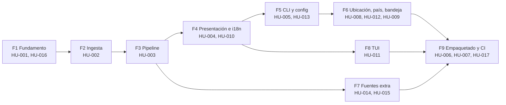

# 05 — Plan de reconstrucción (v2)

> Insumos: `00-INVENTARIO.md`, `01-ARQUITECTURA.md`, `02-STACK-TECNOLOGICO.md`,
> `03-EVOLUCION.md`, `HU/*`, `04-MATRIZ-PRUEBAS.md`.
> La cronología original es la primera pista del orden de dependencias; se corrige donde el grafo
> de dependencias de las HUs dice otra cosa.

## 1. Alcance de la v2

### Se reconstruye a paridad (13 HUs)

HU-001, HU-002, HU-003, HU-005, HU-006, HU-008, HU-009, HU-011, HU-012, HU-013, HU-014, HU-015,
HU-017. Su diseño resistió el uso: ningún fix posterior las contradijo y sus criterios de
aceptación están respaldados por tests existentes.

### Se rediseña (4 HUs)

| HU | Qué cambia | Origen de la decisión |
|---|---|---|
| **HU-004** Alerta no descartable | Resolver Wayland de verdad: implementar ADR-010 (servicio D-Bus + extensión GNOME Shell) o adoptar un frontend nativo. Y fijar el contrato de tamaño de la ventana como criterio verificable, en vez de parchear recortes | `01-ARQUITECTURA.md` §7; fixes `[COMMITS: f90c796, f0960ac]` |
| **HU-007** Empaquetado | Validar los assets del empaquetado en CI antes de invocar al empaquetador, y ejecutar el binario producido con `--simulate` como smoke | 4 de 5 criterios sin test; 2 releases rotas `[COMMITS: 7b1c71c, c38d9f6]` |
| **HU-010** i18n | Nacer en inglés con la capa de traducción desde la fase 1, no traducir después | `[COMMITS: 7f9132e]` tocó 30+ archivos y renombró assets binarios |
| **HU-016** Frescura y poda | Frescura y acotamiento del estado forman parte del Data Model y del pipeline desde el diseño, no como corrección posterior | `[COMMITS: b0f832c]`, tres defectos descubiertos en producción |

### Se descarta

**Nada.** No hay features abandonadas ni revertidas en la historia (cero commits `revert:`). Lo
único diseñado y no construido es el frontend D-Bus del ADR-010 `[COMMITS: 230b0b8]`, que la v2
debe **construir**, no descartar: es lo que sostiene la promesa central del producto en Linux.

## 2. Decisiones de stack para la v2

| Área | Stack actual | Stack v2 | Justificación |
|---|---|---|---|
| Lenguaje | Python ≥ 3.11 | Python ≥ 3.12 | El piso 3.11 existe solo por `tomllib`; subir no cuesta nada |
| Dependencias | rangos `>=` sin techo, `uv.lock` en `.gitignore` | rangos con techo **y lockfile versionado** | `websockets` 12→16, `textual` 0.60→8.2, `mypy` 1.10→2.1 entre rango y lock |
| UI de alerta (Linux) | Tkinter X11/XWayland | Tkinter + servicio D-Bus / extensión GNOME (ADR-010) | Wayland niega *topmost* y foco |
| UI de alerta (otros) | Tkinter | Tkinter | Cero dependencias, contrato cumplido en Windows y macOS |
| TUI | Textual | Textual | Asyncio-nativo y con harness headless: decisión que se paga sola |
| Bandeja | `pystray` + Pillow | `pystray` + Pillow, con soporte macOS **decidido explícitamente** | El conflicto Cocoa/Tk nunca se validó en hardware real |
| Persistencia | JSON atómico | JSON atómico | Adecuado a la escala; no introducir una BD sin necesidad |
| Config | TOML solo lectura + pydantic | igual, separando "materializar" de "cargar" | Ver notas de HU-013 |
| Geo | ray casting puro, Natural Earth 1:110m | igual; 1:50m **solo si** el filtro pasa a activo por defecto | Sin dependencia geoespacial (RNF-06) |
| Gate de calidad | ruff + mypy strict + pytest | añadir **detección de código inalcanzable** | `prune()` vivió 14 fases sin llamadas |

## 3. Fases de construcción

### Fase 1 — Fundamento y contrato

- **HUs**: HU-001, HU-016 (parte de frescura y poda, adelantada al diseño)
- **Prerequisitos**: ninguno
- **Done verificable**: TC-001.1 … TC-001.10, TC-016.1 … TC-016.7 y TC-016.12 en verde
- **Riesgos**: si el acotamiento del estado y la frescura no entran aquí, se repite el defecto
  histórico de descubrirlos en producción

### Fase 2 — Ingesta resiliente

- **HUs**: HU-002
- **Prerequisitos**: Fase 1
- **Done verificable**: TC-002.1 … TC-002.11 y E2E-5 en verde
- **Riesgos**: EMSC documenta pérdida de mensajes; el respaldo por polling no es opcional

### Fase 3 — Pipeline

- **HUs**: HU-003
- **Prerequisitos**: Fases 1–2
- **Done verificable**: TC-003.1 … TC-003.12, E2E-2 y E2E-3 en verde
- **Riesgos**: la heurística de dedup puede fusionar sismos distintos en un enjambre; registrar qué
  firma coincidió para poder diagnosticarlo

### Fase 4 — Presentación e i18n

- **HUs**: HU-004 (rediseñada), HU-010 (desde el inicio, no como traducción posterior)
- **Prerequisitos**: Fase 3
- **Done verificable**: TC-004.1 … TC-004.10 y TC-010.1 … TC-010.8 en verde, **incluyendo el
  comportamiento bajo Wayland**
- **Riesgos**: **el mayor del plan.** ADR-010 está diseñado pero nunca implementado; su alcance
  real (servicio D-Bus + extensión GNOME Shell) no está estimado. Si se pospone, la promesa
  "imposible de ignorar" queda sin cumplir en el escritorio Linux más común

### Fase 5 — Ensamblaje, CLI y simulación

- **HUs**: HU-005, HU-013
- **Prerequisitos**: Fases 1–4
- **Done verificable**: TC-005.1 … TC-005.8 y TC-013.1 … TC-013.8 en verde; `--simulate` funciona
  sin red
- **Riesgos**: `app.py`/`config.py`/`cli.py` fueron tocados por casi toda feature posterior;
  considerar un registro declarativo de fuentes y flags para no repetir el patrón

### Fase 6 — Ubicación, filtro de país y bandeja

- **HUs**: HU-008, HU-012, HU-009
- **Prerequisitos**: Fase 5
- **Done verificable**: TC-008.*, TC-012.* y TC-009.* en verde
- **Riesgos**: la bandeja en macOS sigue sin validar; decidir soporte antes de construir

### Fase 7 — Fuentes adicionales

- **HUs**: HU-014 (FUNVISIS), HU-015 (GEOFON)
- **Prerequisitos**: Fases 2–3
- **Done verificable**: TC-014.*, TC-015.* (incluido **TC-015.8**, el aserto de HTTPS) y E2E-4
- **Riesgos**: con una quinta fuente FDSN, unificar los parsers de USGS y GEOFON; con solo dos, no

### Fase 8 — Frontend TUI

- **HUs**: HU-011
- **Prerequisitos**: Fase 4 (contrato de efectos inyectables)
- **Done verificable**: TC-011.1 … TC-011.9 en verde con `App.run_test()`
- **Riesgos**: conservar los nombres `update_data` y `_paint`; renombrarlos rompe el renderizado en
  silencio

### Fase 9 — Empaquetado, distribución y CI

- **HUs**: HU-007 (rediseñada), HU-017, HU-006
- **Prerequisitos**: todas las anteriores
- **Done verificable**: TC-006.*, TC-007.* (**los 5 huecos P1 cerrados**) y TC-017.* en verde
- **Riesgos**: es el área con más fixes históricos y menos cobertura; empezar por la validación de
  assets (TC-007.4) y el smoke del binario (TC-007.7)

## 4. Artefactos SDD

Este repositorio **ya contiene artefactos SDD vivos y sincronizados con el código**:
`docs/PRD.md`, `docs/API-SPEC.md`, `docs/TECHNICAL-DESIGN.md` (18 ADRs), `docs/DATA-MODEL.md`,
`docs/IMPLEMENTATION-PLAN.md` y `ARCHITECTURE.md`. Generar copias nuevas desde la ingeniería
inversa produciría dos fuentes de verdad en conflicto, que es exactamente el problema que la
disciplina SDD del proyecto evita.

La acción correcta no es regenerarlos, sino **reconciliarlos** con lo que la ingeniería inversa
encontró:

| Artefacto existente | Acción para la v2 | Motivo |
|---|---|---|
| `docs/PRD.md` | Añadir como requisito de primera clase el comportamiento bajo Wayland | Hoy OBJ-1 se enuncia sin acotar el entorno en que puede garantizarse |
| `docs/TECHNICAL-DESIGN.md` | Promover ADR-010 de "solo diseño" a decisión implementada, o registrar formalmente su rechazo | Es el único ADR sin código |
| `docs/DATA-MODEL.md` | Incorporar frescura y acotamiento del estado como parte del modelo, no como añadido | Lección de `[COMMITS: b0f832c]` |
| `docs/IMPLEMENTATION-PLAN.md` | Reemplazar sus fases por las 9 de §3, trazadas a HUs y no a módulos | Las HUs trazan a criterios verificables; los módulos no |
| `docs/API-SPEC.md` | Fijar el esquema HTTPS de cada endpoint como parte del contrato | El fix `8e0064a` fue posible por no estar fijado |
| **Nuevo**: `docs/reverse-sdd/HU/` | Adoptarlo como el backlog de la v2 | 95 criterios de aceptación en Gherkin, 157 casos trazados a tests reales |

Las tres capas de conocimiento construidas en paralelo (`docs/CONTEXT_REPORT.md`, `graphify-out/`,
`lat.md/`) son insumo directo de la v2: `lat.md/` ya registra el *porqué* de cada decisión que este
plan propone conservar o cambiar.

## 5. Riesgos del plan

| Riesgo | Impacto | Mitigación |
|---|---|---|
| **ADR-010 sin estimar** | Alto — bloquea la Fase 4 y con ella todo lo que va después | Hacer un *spike* técnico de la extensión GNOME **antes** de comprometer el plan; si no es viable, decidir explícitamente qué significa "imposible de ignorar" bajo Wayland |
| Deriva de versiones al reconstruir | Medio — `textual` 0.60→8.2 implica una API distinta de la que documentan los ADRs | Fijar el lockfile en la Fase 1 y validar cada dependencia contra su versión objetivo |
| Empaquetado sin cobertura | Medio — históricamente el área que más releases rompió | Cerrar los 5 huecos P1 de HU-007 en la Fase 9, empezando por la validación de assets |
| macOS sin validar | Medio — bandeja y autoarranque nunca se probaron en hardware real | Conseguir un runner macOS o declarar el soporte como best-effort en la documentación |
| Un solo autor / un solo punto de conocimiento | Medio | `lat.md/` mitiga esto: registra la intención que no está en el código |

## 6. Criterio global de "reconstrucción completa"

La v2 está terminada cuando:

1. Los **157 casos de prueba** de `04-MATRIZ-PRUEBAS.md` están automatizados y en verde,
   incluidos los 14 que hoy no existen.
2. Los **5 escenarios e2e** de C-08 pasan sin modificación conceptual.
3. `ruff check .`, `mypy src` (strict) y `pytest` están en verde, más la nueva comprobación de
   código inalcanzable.
4. CA-004.1 (la alerta no se descarta) se verifica **también bajo Wayland**, o el PRD declara
   formalmente el alcance del soporte.
5. Los artefactos SDD de `docs/` están reconciliados según §4 y `lat check` pasa sobre `lat.md/`.
