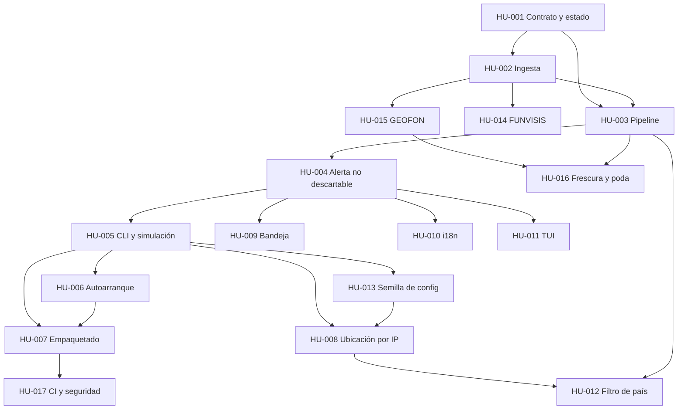

# Índice de Historias de Usuario

> 17 HUs reconstruidas de 18 clusters de producto (58 commits, 2026-06-28 → 2026-07-17).
> Numeración cronológica: HU-001 = cluster más antiguo.
> Los clusters C-01 (andamiaje SDD), C-08 (pruebas e2e) y C-20 (releases) no generan HU por
> diseño; están cubiertos en `../03-EVOLUCION.md` y `../04-MATRIZ-PRUEBAS.md`.

## Matriz de trazabilidad

| HU | Título | Cluster | Commits | Hashes | Era | CA | TC |
|---|---|---|---|---|---|---|---|
| [HU-001](HU-001-contrato-configuracion-estado.md) | Contrato de evento, configuración y estado persistente | C-02 | 1 | `b5c5371` | v0.1.0 | 6 | 10 |
| [HU-002](HU-002-ingesta-emsc-usgs-supervisor.md) | Ingesta en tiempo real con respaldo y auto-recuperación | C-03 | 1 | `fc0ca99` | v0.1.0 | 6 | 11 |
| [HU-003](HU-003-pipeline-normalizacion-filtro-dedup.md) | Un solo aviso por terremoto, y solo si me afecta | C-04 | 1 | `b40c20b` | v0.1.0 | 6 | 12 |
| [HU-004](HU-004-alerta-imposible-de-ignorar.md) | Una alerta que no puedo cerrar por reflejo | C-05 | 3 | `fb50326`, `f90c796`, `f0960ac` | v0.1.0–v0.1.3 | 6 | 10 |
| [HU-005](HU-005-cli-ensamblaje-simulacion.md) | Arrancar el agente y poder probarlo sin esperar un terremoto | C-06 | 1 | `4fb49d0` | v0.1.0 | 5 | 8 |
| [HU-006](HU-006-autoarranque-multiplataforma.md) | Que el agente arranque solo al encender el equipo | C-07 | 1 | `5b79ff1` | v0.1.0 | 5 | 8 |
| [HU-007](HU-007-empaquetado-binarios-release.md) | Instalar el agente sin saber Python | C-09 | 5 | `b6413e3`, `7b1c71c`, `c38d9f6`, `bdc2a9d`, `a02607f` | v0.1.0–v0.1.3 | 5 | 7 |
| [HU-008](HU-008-ubicacion-automatica-ip.md) | No tener que averiguar mis coordenadas | C-10 | 1 | `c20a59b` | v0.1.3 | 5 | 9 |
| [HU-009](HU-009-icono-bandeja.md) | Ver el estado y pausar sin abrir una terminal | C-11 | 1 | `fb3fe14` | v0.1.3 | 5 | 10 |
| [HU-010](HU-010-i18n-ingles.md) | Que el agente me hable en mi idioma | C-12 | 2 | `7f9132e`, `e49404d` | v0.1.3 | 5 | 8 |
| [HU-011](HU-011-dashboard-tui-headless.md) | Usar el agente en un servidor sin escritorio | C-13 | 2 | `7f98980`, `651c024` | v0.1.3–v0.3.0 | 6 | 9 |
| [HU-012](HU-012-filtro-de-pais.md) | No recibir avisos de sismos de otros países | C-14 | 1 | `a3a4a1a` | v0.2.1 | 5 | 9 |
| [HU-013](HU-013-semilla-configuracion.md) | Tener un config.toml desde el primer arranque | C-15 | 1 | `a06f7a1` | v0.3.0 | 6 | 8 |
| [HU-014](HU-014-fuente-funvisis.md) | Enterarme de los temblores pequeños de mi país | C-16 | 1 | `10bb72d` | v0.4.0 | 6 | 9 |
| [HU-015](HU-015-fuente-geofon.md) | No quedarme ciego si las dos redes principales fallan | C-17 | 2 | `ade1199`, `8e0064a` | v0.5.0 | 6 | 10 |
| [HU-016](HU-016-frescura-backlog-poda.md) | No recibir alertas de terremotos de días pasados | C-18 | 1 | `b0f832c` | v0.6.0 | 6 | 12 |
| [HU-017](HU-017-ci-seguridad-precommit.md) | Que ningún cambio rompa el agente sin que nos enteremos | C-19 | 6 | `97b2a8e`, `5ee3b1d`, `f51da9c`, `27e4b45`, `0e707a1`, `559f077` | v0.3.0–v0.4.1 | 6 | 7 |

**Totales**: 17 HUs · 95 criterios de aceptación · 157 casos de prueba.

## Grafo de dependencias

## Cobertura de clusters

| Cluster | Commits | ¿En una HU? |
|---|---|---|
| C-01 andamiaje SDD | 4 | No — narrado en `03-EVOLUCION.md` Era 1 |
| C-02 … C-07, C-09 … C-19 | 30 | Sí, exactamente una cada uno |
| C-08 pruebas e2e de resiliencia | 1 | No — sus 5 tests alimentan `04-MATRIZ-PRUEBAS.md` |
| C-20 releases | 9 | No — delimitan las eras |
| merges de PR | 11 | No aplica |

Ningún cluster de producto queda sin HU; ninguna HU cubre dos clusters.

## Fuentes de los criterios de aceptación

| Fuente | Criterios | Comentario |
|---|---|---|
| Tests existentes en el repo | 78 | las 344 pruebas del repo respaldan la mayoría |
| Commits `fix` del cluster | 11 | cada bug corregido es un criterio que la historia original no tenía |
| Código de validación / manejo de error | 6 | rutas sin test directo pero verificables en el fuente |

Criterios **sin ningún test automatizado hoy** (huecos que la v2 debe cerrar primero):
CA-007.1, CA-007.2, CA-007.3, CA-007.5, CA-010.5, CA-015.5, CA-017.5. Detalle en
`../04-MATRIZ-PRUEBAS.md`.
