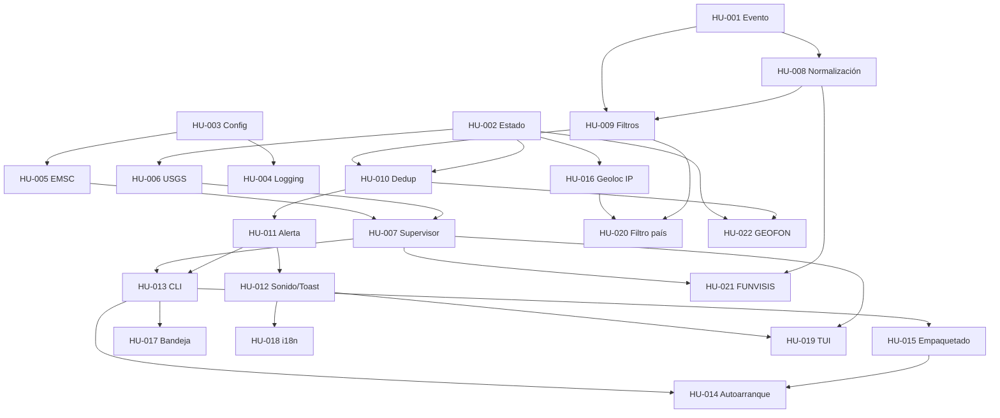

# Índice de Historias de Usuario

> 22 HUs reconstruidas desde 47 commits no-merge. Curaduría de clusters en
> `../00-INVENTARIO.md` §3. Cada HU cita sus commits; cada criterio cita el test o el fix
> que lo respalda.

## Matriz de trazabilidad

| HU | Título | Commits | Hashes | Era | CA | TC |
|---|---|---|---|---|---|---|
| [HU-001](HU-001-contrato-evento-sismico.md) | Contrato interno de evento sísmico | 1 | `b5c5371` | 0 | 7 | 8 |
| [HU-002](HU-002-estado-persistente.md) | Estado persistente entre reinicios | 2 | `b5c5371`, `b0f832c` | 0, 5 | 8 | 10 |
| [HU-003](HU-003-configuracion-validada.md) | Configuración TOML validada y auto-sembrada | 2 | `b5c5371`, `a06f7a1` | 0, 3 | 8 | 10 |
| [HU-004](HU-004-logging-estructurado.md) | Observabilidad: logging estructurado | 1 | `b5c5371` | 0 | 5 | 6 |
| [HU-005](HU-005-canal-push-emsc.md) | Canal push EMSC en tiempo real | 1 | `fc0ca99` | 0 | 9 | 11 |
| [HU-006](HU-006-reconciliacion-usgs.md) | Reconciliación USGS con cursor | 1 | `fc0ca99` | 0 | 10 | 13 |
| [HU-007](HU-007-supervision-resiliente.md) | Supervisión resiliente de tareas | 2 | `fc0ca99`, `f49d139` | 0 | 8 | 10 |
| [HU-008](HU-008-normalizacion-multifuente.md) | Normalización multi-fuente | 1 | `b40c20b` | 0 | 7 | 15 |
| [HU-009](HU-009-filtrado-radio-magnitud-frescura.md) | Filtrado por radio, magnitud y frescura | 2 | `b40c20b`, `b0f832c` | 0, 5 | 9 | 13 |
| [HU-010](HU-010-deduplicacion.md) | Deduplicación intra e inter-fuente | 1 | `b40c20b` | 0 | 10 | 13 |
| [HU-011](HU-011-alerta-no-descartable.md) | Alerta de escritorio no descartable | 3 | `fb50326`, `f90c796`, `f0960ac` | 0, 2 | 10 | 13 |
| [HU-012](HU-012-sonido-toast-presentacion.md) | Sonido, toast y presentación por severidad | 1 | `fb50326` | 0 | 12 | 13 |
| [HU-013](HU-013-cli-y-simulacion.md) | CLI, ensamblaje y modo simulación | 1 | `4fb49d0` | 0 | 12 | 13 |
| [HU-014](HU-014-autoarranque-multiplataforma.md) | Autoarranque multiplataforma | 1 | `5b79ff1` | 0 | 11 | 14 |
| [HU-015](HU-015-empaquetado-distribucion.md) | Empaquetado y distribución | 5 | `b6413e3`, `7b1c71c`, `c38d9f6`, `bdc2a9d`, `a02607f` | 0, 1, 2 | 8 | 11 |
| [HU-016](HU-016-ubicacion-automatica-ip.md) | Ubicación automática por IP | 1 | `c20a59b` | 2 | 9 | 12 |
| [HU-017](HU-017-icono-bandeja.md) | Ícono de bandeja del sistema | 1 | `fb3fe14` | 2 | 11 | 14 |
| [HU-018](HU-018-internacionalizacion.md) | Internacionalización | 1 | `7f9132e` | 2 | 8 | 11 |
| [HU-019](HU-019-dashboard-tui-headless.md) | Dashboard TUI headless | 2 | `7f98980`, `651c024` | 2 | 11 | 13 |
| [HU-020](HU-020-filtro-pais.md) | Filtro de notificación por país | 1 | `a3a4a1a` | 3 | 9 | 14 |
| [HU-021](HU-021-fuente-funvisis.md) | Fuente local FUNVISIS | 1 | `10bb72d` | 4 | 8 | 12 |
| [HU-022](HU-022-fuente-geofon.md) | Fuente global GEOFON | 2 | `ade1199`, `8e0064a` | 4 | 12 | 16 |
| | **Total** | **34 refs** | | | **212** | **275** |

*"34 refs" cuenta referencias a commits; los commits distintos son 25, porque cinco
commits de fase entregaron varias capacidades separables (ver `00-INVENTARIO.md` §3).*

## Grafo de dependencias

## Cobertura de tests por HU

| Cobertura | HUs | Comentario |
|---|---|---|
| **Alta** (test por cada criterio) | HU-001, 002, 003, 005, 006, 008, 009, 010, 012, 013, 016, 018, 019, 020, 021, 022 | 16 de 22 |
| **Media** (huecos puntuales señalados) | HU-007, 011, 014, 017 | Casos límite y de entorno |
| **Baja** | HU-004 (logging), HU-015 (empaquetado) | Ver abajo |

Los dos puntos débiles son consistentes entre sí: **lo que no es lógica de dominio está
poco probado**. No existe `tests/test_logging_conf.py`, y el empaquetado —el área con más
fixes de todo el historial— se valida solo ejecutando el workflow. Ambos se detallan en
`../04-MATRIZ-PRUEBAS.md` §4.
