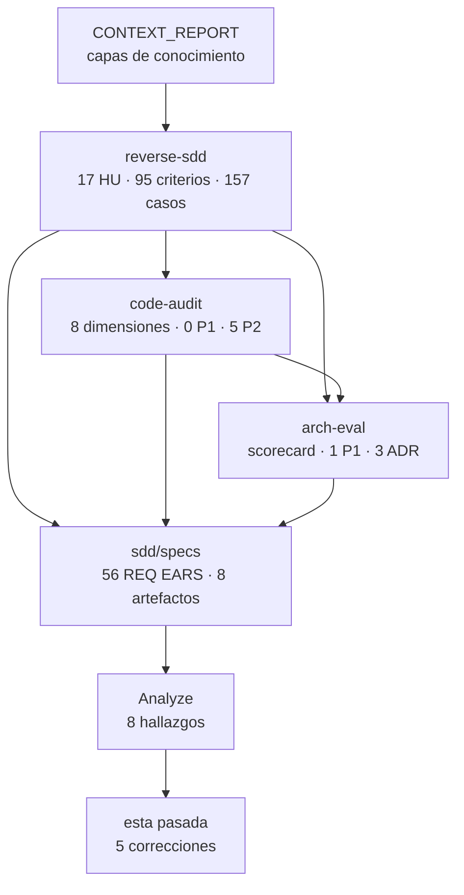

# Pasada de consistencia global — toda la documentación

> 2026-09-06 · Alcance: **71 documentos markdown** de `docs/` y `lat.md/`, generados en cinco
> etapas (capas de contexto, reverse-SDD, auditoría de código, evaluación de arquitectura, kit SDD).
> A diferencia del [Analyze](specs/07-ANALYZE.md), que es solo lectura, esta pasada **aplica
> correcciones** y las registra.

## 1. Punto de control: qué existe realmente

Verificado contra el sistema de archivos, no contra lo reportado.

| Etapa | Ubicación | Archivos | Tamaño |
|---|---|---|---|
| Capas de conocimiento | `docs/CONTEXT_REPORT.md`, `graphify-out/`, `lat.md/` | 17 | 3,0 MB |
| Reverse-SDD | `docs/reverse-sdd/` | 29 | 292 KB |
| Auditoría de código | `docs/code-audit/` | 22 | 208 KB |
| Evaluación de arquitectura | `docs/arch-eval/` | 11 | 104 KB |
| Kit SDD v2 | `docs/sdd/` | 11 | 132 KB |
| Vista C4 | `docs/ARQUITECTURA-C4.md` | 1 | 24 KB |
| Paquetería y versionado | `docs/PAQUETERIA-VERSIONADO.md` | 1 | 20 KB |
| Plan de migración de paquetería | `docs/PLAN-MIGRACION-PAQUETERIA.md` | 1 | 20 KB |
| Presentación | `docs/presentacion/` (deck + generador + sistema visual) | 4 | 476 KB |
| Backlog priorizado | `docs/BACKLOG-PRIORIZADO.md` | 1 | 24 KB (rev. 2: 39 ítems) |
| **Total generado** | | **99** | 4,2 MB |

Los cinco directorios existen con el contenido declarado. Los documentos SDD originales del
proyecto (`docs/PRD.md`, `API-SPEC.md`, `TECHNICAL-DESIGN.md`, `DATA-MODEL.md`,
`IMPLEMENTATION-PLAN.md`) **no fueron modificados** por ninguna etapa.

## 2. Comprobaciones ejecutadas

| Comprobación | Método | Resultado |
|---|---|---|
| Enlaces relativos | resolución de cada enlace markdown relativo contra el sistema de archivos | **0 rotos** de 66 documentos con enlaces (el índice `lat.md/lat.md` no tiene enlaces relativos) |
| Rutas citadas entre comillas invertidas | existencia de cada `` `docs/…` ``, `` `src/…` `` | 1 pendiente, justificada (§5) |
| Citas `[VERIFY: archivo:línea]` | archivo existe y la línea está en rango | 327 únicas en reverse-SDD + 29 en arch-eval, **todas válidas** |
| Citas `[COMMITS: hash]` | `git cat-file -e` sobre cada hash | 39 hashes, **todos existentes** |
| Citas `[TOOL:]` | archivo correspondiente en `analysis/` | todas respaldadas |
| Cifras clave | 14 magnitudes contrastadas entre todos los documentos | 5 discrepancias, todas corregidas (§3) |
| Recuentos de este propio informe | re-verificados tras aplicar las correcciones | corregidos: la primera redacción decía 62 documentos y 88 archivos |
| IDs de requisito | definidos, únicos, sin fantasmas, citados por tareas | 56 definidos, 0 duplicados, 0 fantasma |
| Diagramas Mermaid | analizador de Mermaid 11.17.2 sobre cada bloque ```mermaid | 17 diagramas, **0 con error** |

## 3. Discrepancias encontradas y corregidas

### C-01 · "59 commits" frente a "58 commits" — **corregido**

Ambas cifras eran correctas y medían cosas distintas sin declararlo:

- **58** = historial de `HEAD` (lo que analizó reverse-SDD), 47 sin merges.
- **59** = `git rev-list --all`, que incluye las ramas `develop` y `documentation` (lo que barrió el
  escaneo de secretos de la auditoría).

*Corrección:* cada cifra declara ahora su alcance en `docs/code-audit/01-INFORME-AUDITORIA.md`,
`docs/code-audit/README.md` y `docs/reverse-sdd/00-INVENTARIO.md`.

### C-02 · "35 archivos" frente a "37 archivos" de prueba — **corregido**

También ambas ciertas: 35 archivos `test_*.py`, 37 archivos `.py` en `tests/` contando
`conftest.py` e `__init__.py`.

*Corrección:* la cifra canónica es **35 archivos `test_*.py`**, con la aclaración de los 37 en el
inventario. Unificado en 5 documentos.

### C-03 · Tres términos para la misma magnitud — **corregido**

"344 tests", "344 pruebas" y "344 funciones de test" convivían, y "157 pruebas" aparecía donde
correspondía "157 casos de prueba". El riesgo no es estético: invita a comparar 344 con 157 como si
fueran la misma unidad.

*Corrección:* glosario canónico (§4) aplicado a 11 documentos.

### C-04 · Convención de ID de requisito inconsistente — **corregido**

`REQ-UX-NNN` usa un área de **2** letras; los otros 50 requisitos usan **3**. Una herramienta con
patrón de ancho fijo pierde 6 requisitos — le ocurrió al primer verificador de este mismo trabajo.

*Corrección:* el PRD §2 declara la convención `REQ-{ÁREA}-{NNN}` con ÁREA de 2 o 3 letras y publica
la expresión regular canónica `REQ-[A-Z]{2,3}-\d{3}`.

### C-05 · Dependencia faltante en una tarea — **corregido**

T-003 modifica el `pyproject.toml` que T-001 crea, pero estaba marcada `[P]` (paralelizable) y sin
dependencia declarada. Era el hallazgo A-02 del Analyze.

*Corrección:* retirado el `[P]` y añadido `Depende de: T-001`.

## 4. Glosario canónico

Términos con magnitud asociada, para que ningún documento futuro los mezcle.

| Término | Magnitud | Qué es | Dónde vive |
|---|---|---|---|
| **pruebas** | 344 | Funciones `test_*` que **existen** en el repositorio hoy | `tests/`, 35 archivos `test_*.py` |
| **casos de prueba** | 157 | Casos **especificados** por ingeniería inversa, con prioridad y estado | `docs/reverse-sdd/04-MATRIZ-PRUEBAS.md` |
| **criterios de aceptación** | 95 | Escenarios Gherkin de las Historias de Usuario | `docs/reverse-sdd/HU/` |
| **historias de usuario (HU)** | 17 | Capacidades reconstruidas de clusters de commits | `docs/reverse-sdd/HU/` |
| **requisitos (REQ)** | 56 | Requisitos EARS de la v2, con ID estable | `docs/sdd/specs/01-PRD.md` |
| **módulos** | 40 | Archivos `.py` bajo `src/` en el grafo a nivel de archivo | `docs/arch-eval/analysis/file_level_graph.txt` |
| **commits** | 58 / 47 / 59 | `HEAD` / sin merges / todas las ramas — **siempre con su alcance** | — |

**Regla de granularidad para el fan-out:** el análisis por directorio da `src/vigia_eew` con
fan-out 4; el análisis por archivo da `app.py` con fan-out 25. Toda mención debe nombrar su
granularidad, porque son las dos cifras que más se confunden entre los informes.

## 5. Lo que queda pendiente y por qué

| Ítem | Estado | Razón |
|---|---|---|
| `src/vigia_eew/wiring.py` citado en 3 documentos | **Intencional** | Es un archivo **propuesto** por ADR-001, no existente. Marcado como "futuro" en las tres apariciones para que un verificador estricto de rutas no lo señale como error |
| A-01 del Analyze (REQ-ALE-004 es un `[MUST]` condicional) | **Abierto — requiere decisión humana** | No es un error de redacción: es una decisión de alcance sobre si la garantía de alerta bajo Wayland bloquea el release. Cambia la Fase 4 del plan, que ya es la de mayor riesgo |
| Trazabilidad test → REQ-ID | **No verificable aún** | La convención empieza a regir con la primera tarea de la v2; hoy no hay código que la cumpla |
| Cobertura de pruebas (dimensión 3 de la auditoría) | **⚪ no evaluada** | El entorno de auditoría solo tenía Python 3.10 y el proyecto exige ≥3.11. Documentado como gap, sin cifra inventada |

## 6. Mapa de relaciones entre documentos

Cada etapa referencia a las anteriores sin duplicar su contenido. Verificado: **0 enlaces rotos**.



| Relación | Cómo se evita la duplicación |
|---|---|
| PRD v2 → HU | El PRD define **requisitos EARS**; las HU conservan sus **criterios Gherkin**. 46 de los 56 REQ heredan sus criterios por enlace |
| API Spec v2 → `docs/API-SPEC.md` | Los contratos externos no cambian y no se repiten: la v2 solo especifica sus deltas |
| Tech Design v2 → `docs/TECHNICAL-DESIGN.md` | 16 de los 18 ADRs se heredan por referencia; solo 2 cambian de estado y 5 decisiones son nuevas |
| Plan v2 → los dos planes previos | Reconciliación explícita con reparto declarado: qué se hace ya sobre la v0.6.0 y qué espera a la v2 |
| Constitución → auditorías | Cada artículo cita la evidencia medida que lo origina |

## 7. Veredicto

**La documentación es internamente consistente.** Las cinco discrepancias encontradas eran de
declaración de alcance y de terminología, no de hechos contradictorios: en los cinco casos ambas
cifras eran correctas y medían cosas distintas sin decirlo.

Queda **un ítem abierto que necesita una decisión tuya**, no una corrección: si la presentación de
alerta bajo Wayland (REQ-ALE-004) bloquea el release de la v2 o se degrada a recomendación. Es la
misma pregunta que las tres etapas anteriores señalaron desde ángulos distintos —
`docs/reverse-sdd/01-ARQUITECTURA.md` §7, `docs/code-audit/` §7 y `docs/arch-eval/` §7 — y es lo
único del inventario que afecta a la promesa central del producto.
