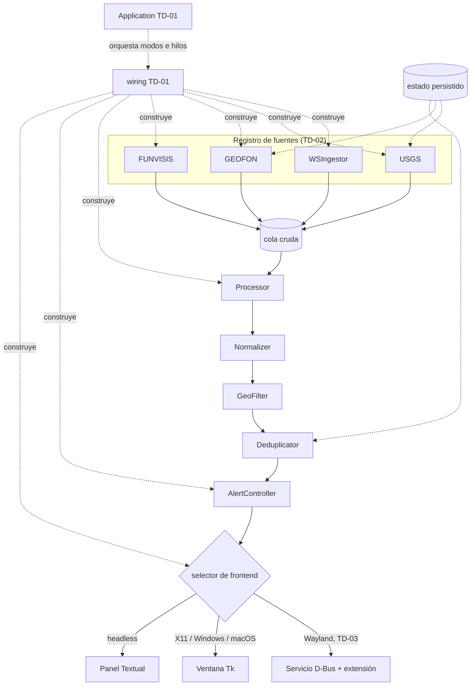

# Technical Design — Vigía-eew v2

> Versión 1.0 · 2026-09-06 · Complementa `docs/TECHNICAL-DESIGN.md` (18 ADRs de la v0.6.0).

## 1. Qué se hereda y qué se decide aquí

De los 18 ADRs existentes, **16 se heredan sin cambio** porque la evaluación arquitectónica los
confirmó con evidencia: cero ciclos, fronteras sin fugas históricas, resiliencia verificada de
punta a punta (`docs/arch-eval/01-INFORME-EVALUACION.md`, fortalezas 1-6).

| ADR heredado | Qué fija | Evidencia que lo sostiene |
|---|---|---|
| ADR-001, 002, 009, 015, 016 | Push primario + polling de respaldo, cuatro fuentes, `websockets`+`httpx` | Atributo 4 en verde |
| ADR-004 | Deduplicación heurística (distancia, tiempo, magnitud) | REQ-PIP-008/009 |
| ADR-005, 012 | Sonido desacoplado, bandeja best-effort | Atributo 4 |
| ADR-006, 013 | Puente asyncio↔Tk; TUI como modo alternativo sin puente | Atributo 3 en verde |
| ADR-007 | Config TOML de solo lectura validada por pydantic | Constitución, restricciones de stack |
| ADR-008 | Un agente por máquina, sin relay central | Atributo 4; evita SPOF |
| ADR-011 | Referencia manual con respaldo por IP, resuelta una vez | REQ-CFG-007 |
| ADR-014 | Filtro de país como lista de bloqueo, offline | REQ-PIP-005 |
| ADR-017, 018 | Frescura por día local y poda al registrar | REQ-PIP-004, REQ-CFG-003 |

**Dos cambian de estado:**

- **ADR-003** (Tkinter por defecto) se mantiene *fuera* de Wayland. Su propio disparador de
  reevaluación —"si no se puede forzar el foco de forma fiable"— se cumplió y nunca se actuó.
- **ADR-010** (frontend D-Bus) pasa de *"solo diseño"* a **decisión a implementar**: es lo que
  sostiene el Art. 1 de la constitución en el escritorio Linux más común.

Las decisiones nuevas de la v2 son cinco, todas derivadas de hallazgos medidos.

---

## 2. TD-01 — Separar composición de orquestación

**Contexto.** `app.py` importa 25 de los 40 módulos del sistema (62,5 %); el segundo mayor fan-out
es 5. Co-cambia con `config.py` (confianza 0,70) y `cli.py` (0,67): las siete features posteriores
a la v0.1.0 lo tocaron. Detalle y alternativas en
[ADR-001 de la evaluación arquitectónica](../../arch-eval/adr/ADR-001-extraer-cableado-de-application.md).

**Decisión.** Dos responsabilidades, dos módulos:

- futuro `wiring.py` — construye componentes a partir de configuración y estado. Fan-out alto **por diseño**;
  fan-in 1.
- `Application` — orquesta los tres modos de ejecución y el ciclo de vida de los hilos.

**Métrica de aceptación:** `app` con fan-out ≤ 8 (hoy 25) y menos de 300 líneas (hoy 450).

**Lo que NO se toca:** `models`, `state`, `pipeline`, `notify` e `ingest/*` no cambian.

## 3. TD-02 — Registro declarativo de fuentes

**Contexto.** Añadir una fuente exige tocar ≥5 archivos: el literal del contrato, la clase de
config, la fábrica del ensamblador, la escalera del normalizador y el ingestor nuevo. Se ejerció
cuatro veces.

**Decisión.** Un registro `dict[Source, SourceSpec]` (contrato en
[API Spec §3](02-API-SPEC.md)) que el ensamblador itera y el normalizador consulta. La escalera
`if/elif` sobre la fuente desaparece.

**Alternativa rechazada:** clase base compartida para los dos pollers FDSN. Con dos implementaciones
la regla de tres no se cumple; ADR-016 ya lo difirió con criterio y la duplicación medida es de 39
líneas sobre 9.186 (0,95 % del total). **Reevaluar con una quinta fuente FDSN, no antes.**

## 4. TD-03 — Frontend de presentación para Wayland

**Contexto.** Bajo Wayland el compositor decide el apilamiento y el foco: un cliente
X11/XWayland como Tkinter no puede garantizar REQ-ALE-001. Es la única brecha entre lo que el
producto promete y lo que cumple.

**Decisión.** Implementar el servicio D-Bus del ADR-010 con la superficie fijada en
[API Spec §4](02-API-SPEC.md), más una extensión de GNOME Shell que lo consuma. El agente
selecciona frontend en arranque y **cae a Tkinter ante cualquier fallo** (Art. 3).

**Riesgo declarado.** Es la única decisión de la v2 cuyo alcance no está estimado: exige código de
extensión en JavaScript sobre la API de GNOME Shell, sujeta a cambios entre versiones, y su
mantenimiento no comparte lenguaje ni pruebas con el resto del proyecto. **El plan la trata como
*spike* antes de comprometerla** ([Plan, Fase 4](05-IMPLEMENTATION-PLAN.md)).

**Alternativa honesta si el spike falla.** Cumplir solo REQ-ALE-003: declarar por escrito que bajo
Wayland la alerta es *best-effort*, y ofrecer como mitigación el modo terminal, donde la garantía sí
se cumple. Es peor producto, pero es honesto — y mejor que prometer lo que no se sostiene.

## 5. TD-04 — Estado compartido explícito

**Contexto.** `Application._loop` y `._sup` se escriben desde el hilo de asyncio y se leen desde el
de Tk sin sincronización; si la parada llega antes de la asignación, la cancelación no se ejecuta.
El mismo proyecto protege bien el estado equivalente en `AgentState` con `Lock`.
Detalle en [ADR-002 de la evaluación arquitectónica](../../arch-eval/adr/ADR-002-sincronizar-estado-compartido-de-application.md).

**Decisión.** `Lock` + evento de "runtime listo"; `_stop` espera ese evento con tiempo límite y
registra un aviso explícito si expira, en lugar de omitir la cancelación en silencio. El contrato de
hilos se documenta en [API Spec §6](02-API-SPEC.md) y en `lat.md/architecture.md`.

**Orden de trabajo no negociable:** el test que reproduce la carrera se escribe **antes** del fix y
debe fallar. Es lo que convierte un hallazgo de lectura de código en evidencia determinista.

## 6. TD-05 — Fronteras como contratos verificables

**Contexto.** 0 ciclos entre 40 módulos y 97 aristas, sin ninguna regla que lo obligue.
Detalle en [ADR-003 de la evaluación arquitectónica](../../arch-eval/adr/ADR-003-fronteras-ejecutables-con-import-linter.md).

**Decisión.** Cuatro contratos de import-linter, derivados del grafo **actual** para que pasen en
verde desde el primer día: capas, núcleo independiente, `app` como sumidero, e ingestores mutuamente
independientes.

**Prueba negativa obligatoria:** un import prohibido introducido a propósito debe hacer fallar el
gate. Sin ella, no hay evidencia de que los contratos muerdan.

---

## 7. Vista de componentes de la v2

Diferencias frente a la v0.6.0: el registro de fuentes sustituye a cuatro fábricas enumeradas, el
selector de frontend es nuevo, y `wiring` separa construcción de orquestación. **El pipeline no
cambia.**

## 8. Estrategia de pruebas

| Tipo | Alcance | Gate |
|---|---|---|
| Unitaria | Lógica pura y adaptadores con dependencias inyectadas | pre-commit |
| Integración (marcada) | Pipeline completo, supervisor con ingestores | CI |
| Interfaz gráfica (marcada) | Tkinter real, tras variable de entorno | CI con display virtual |
| Contrato D-Bus | Servicio contra un bus de sesión efímero | CI (solo Linux) |
| Binario | Ejecutable construido, en modo simulación | CI de release (REQ-OPS-008) |
| Fronteras | `lint-imports` + prueba negativa | pre-commit y CI |

Los 157 **casos de prueba** de `docs/reverse-sdd/04-MATRIZ-PRUEBAS.md` son el punto de partida:
**143 tienen equivalente entre las 344 pruebas de la v0.6.0** y se portan; 14 no existen y se
escriben.

## 9. Constitution check

| Artículo | Cumplimiento |
|---|---|
| Art. 1 | TD-03 es la decisión que lo hace cumplible; su alternativa honesta cumple la segunda mitad del artículo |
| Art. 3 | El selector de frontend cae a Tkinter ante cualquier fallo de D-Bus |
| Art. 5 | TD-05 lo implementa literalmente |
| Art. 6 | TD-04 lo implementa; el contrato de hilos queda documentado |
| Art. 7 | `wiring` (TD-01) concentra la costura de inyección que los tests ya usan |

**Excepciones solicitadas:** ninguna.
