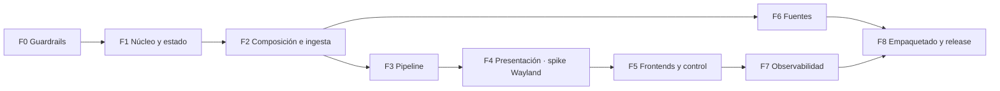

# Implementation Plan — Vigía-eew v2

> Versión 1.0 · 2026-09-06 · **Plan único**: reconcilia y sustituye a los dos planes previos.

## 1. Reconciliación de los tres planes

Hasta ahora existían dos planes con alcances distintos y un solapamiento real:

| Plan | Alcance | Qué pasa con él |
|---|---|---|
| [`docs/reverse-sdd/05-PLAN-RECONSTRUCCION.md`](../../reverse-sdd/05-PLAN-RECONSTRUCCION.md) | 9 fases, reconstrucción completa desde cero | **Absorbido.** Sus fases son el esqueleto de §3; su §4 (reconciliar artefactos SDD) se cumple con este kit |
| [`docs/arch-eval/02-PLAN-MIGRACION.md`](../../arch-eval/02-PLAN-MIGRACION.md) | 5 fases incrementales sobre el código actual | **Vigente y complementario.** Sus fases 0-2 se ejecutan **sobre la v0.6.0**, no aquí |
| Este documento | Construcción de la v2 | La verdad para la v2 |

**Regla de reparto, para que no compitan:**

- Lo que **mejora la v0.6.0 y cuesta menos de una jornada** se hace ya, en el plan de migración
  arquitectónica: import-linter (su Fase 0), la sincronización de hilos (Fase 1) y el registro de
  fuentes (Fase 2). Los tres son de bajo riesgo y reversibles.
- Lo que **solo tiene sentido reconstruyendo** entra aquí: el frontend de Wayland, el ID de
  correlación en el contrato interno, el gate de ocho dimensiones y la extracción de `wiring`.
- La Fase 3 del plan de migración (`wiring.py`) queda **explícitamente adjudicada a la v2** (Fase 2
  de este plan) para no hacer el mismo movimiento dos veces.

## 2. Orden de las fases

Ordenadas por (reducción de riesgo ÷ esfuerzo), con la dependencia técnica como restricción dura.
Cada fase declara sus REQ, su "Done" medible y su vuelta atrás.

## 3. Fases

### Fase 0 — Guardrails
**REQ:** REQ-OBS-003, REQ-OBS-004, REQ-OBS-005 · **Esfuerzo:** S
Poner en pie el gate de las ocho dimensiones **antes** de escribir código de producto: umbral de
cobertura, marcadores de tipo de prueba, contratos de import-linter, y las cinco herramientas que
hoy faltan (jscpd, lizard, complejidad cognitiva, `ruff format`, validación de assets).

**Done:** `pre-commit run --all-files` en verde sobre el esqueleto; prueba negativa de import-linter
falla; `pytest --cov-fail-under` muerde al bajar el umbral artificialmente.
**Vuelta atrás:** retirar la configuración; no hay código de producto afectado.

### Fase 1 — Núcleo: contrato, estado y tiempo
**REQ:** REQ-PIP-001, REQ-CFG-001..005, REQ-OBS-001, INV-1..INV-6 · **Depende de:** F0 · **Esfuerzo:** M
Contrato interno (con `correlation_id` desde el principio, no añadido después), estado persistido
con poda **cableada desde el primer commit**, configuración validada, utilidades de día local y
registro estructurado.

**Done:** las seis invariantes del Data Model con test propio; cobertura de este módulo ≥85 %.
**Vuelta atrás:** no aplica, es la base.

### Fase 2 — Composición e ingesta base
**REQ:** REQ-ING-001..003, REQ-ING-006, REQ-ING-009, REQ-ING-010, REQ-OPS-001..003 · **Depende de:** F1 · **Esfuerzo:** M
`wiring` separado de `Application` desde el diseño (TD-01, evita el refactor posterior), registro de
fuentes (TD-02), supervisor con reinicio aislado, contrato de hilos explícito (TD-04) y el canal
push con su reconexión.

**Done:** `app` con fan-out ≤ 8; el test de carrera del apagado en verde; contrato 4 de
import-linter (ingestores independientes) en verde.

### Fase 3 — Pipeline
**REQ:** REQ-PIP-002..009 · **Depende de:** F2 · **Esfuerzo:** M
Normalización, los cuatro filtros con su orden invariante, y deduplicación entre fuentes con
herencia de `correlation_id`.

**Done:** los 12 casos de HU-003 y los 12 de HU-016 en verde; cobertura del pipeline ≥85 % con
ramas.

### Fase 4 — Presentación y **spike de Wayland**
**REQ:** REQ-ALE-001, 003..008, 010 · **Depende de:** F3 · **Esfuerzo:** L · **La fase de mayor riesgo**

**Se empieza por el spike, no por el código de producto.** Objetivo del spike: demostrar en una
sesión GNOME/Wayland real que una alerta presentada por el servicio D-Bus + extensión de shell
resiste `Escape`, pérdida de foco y cierre de ventana. Tiempo límite: **3 días**.

| Resultado del spike | Qué se hace |
|---|---|
| Funciona | Se implementa TD-03 completo y REQ-ALE-004 entra como MUST |
| No funciona o es inmantenible | REQ-ALE-004 baja a `[MAY]`, se implementa solo REQ-ALE-003 (declarar el alcance) y se propone el modo terminal como mitigación documentada |

**Done:** REQ-ALE-001 verificado en los frontends que la decisión del spike deje activos, más el
requisito de declaración (ALE-003) cumplido en README y en arranque.
**Vuelta atrás:** el selector de frontend cae a Tkinter; el resto de la fase no depende del spike.

### Fase 5 — Frontends y control
**REQ:** REQ-ALE-002, REQ-UX-001..006, REQ-CFG-006..008 · **Depende de:** F4 · **Esfuerzo:** M
Panel de terminal, bandeja, i18n **desde el inicio y en inglés** (REQ-UX-003), siembra de
configuración, ubicación automática y modo simulación.

**Done:** los casos de HU-009, HU-010, HU-011 y HU-013 en verde; `--simulate` funciona sin red.

### Fase 6 — Fuentes adicionales
**REQ:** REQ-ING-004, 005, 007, 008 · **Depende de:** F2 (no de F5) · **Esfuerzo:** M · **[P]** con F4-F5
USGS, GEOFON y FUNVISIS entran **por el registro**, sin tocar ensamblador ni normalizador. Es la
prueba de fuego de TD-02.

**Done:** cada fuente añadida toca exactamente 3 puntos; test de esquema HTTPS por endpoint con la
excepción de FUNVISIS explícita; casos de HU-014 y HU-015 en verde.

### Fase 7 — Observabilidad
**REQ:** REQ-OBS-002 · **Depende de:** F5 · **Esfuerzo:** S
Propagación del ID de correlación de punta a punta y las claves de registro de las cinco etapas.

**Done:** una búsqueda por `corr=` reconstruye el recorrido de un sismo reportado por dos fuentes.

### Fase 8 — Empaquetado, autoarranque y release
**REQ:** REQ-OPS-004..008 · **Depende de:** F6 y F7 · **Esfuerzo:** M
Instaladores nativos, empaquetado, y las dos verificaciones que hoy no existen: validación de
assets antes del build y ejecución del binario en modo simulación.

**Done:** los 5 huecos P1 de HU-007 cerrados con test; release construida y verificada de punta a
punta.

## 4. Cobertura de requisitos por fase

| Fase | REQs | ¿Los 10 nuevos de la v2? |
|---|---|---|
| F0 | 3 | OBS-003, OBS-004, OBS-005 |
| F1 | ~11 | — |
| F2 | ~10 | ING-009, OPS-003 |
| F3 | 8 | — |
| F4 | 8 | ALE-003, ALE-004 |
| F5 | 9 | — |
| F6 | 4 | — |
| F7 | 1 | OBS-002 |
| F8 | 5 | OPS-007, OPS-008 |

Los 56 REQ del PRD están cubiertos; REQ-OPS-002 aparece en F2 con su criterio reforzado.
La verificación exhaustiva de esta tabla la hace el [Analyze](07-ANALYZE.md) §1.

## 5. Lo que este plan NO hace

| Propuesta | Por qué no |
|---|---|
| Reestructurar en `core/`+`adapters/` | Resolvería un ciclo que **no existe**: 0 a nivel de archivo. El SCC reportado es artefacto de granularidad de directorio |
| Clase base para los pollers FDSN | Dos implementaciones no cumplen la regla de tres; 0,95 % de duplicación medida |
| Microservicios o relay central | ADR-008 lo descartó por SPOF; un mantenedor, un proceso por máquina |
| Base de datos | El estado son unos KB en memoria consultados por pertenencia |
| Contenedores | Es un agente de escritorio |

## 6. Constitution check

| Artículo | Cumplimiento |
|---|---|
| Art. 1 | F4 es la fase que lo hace cumplible, con salida honesta declarada si el spike falla |
| Art. 5, Art. 8 | F0 va **primera**: el gate existe antes que el código |
| Art. 6 | F2 incluye el contrato de hilos y su test de carrera |
| Art. 9 | Cada fase actualiza sus artefactos en el mismo cambio; los desvíos abren Delta Spec |

**Excepciones solicitadas:** ninguna. **Riesgo declarado:** F4 es la única fase sin estimación
fiable; el spike con tiempo límite es la mitigación.
