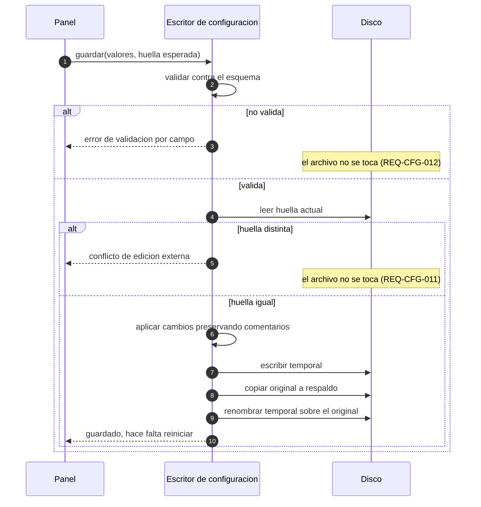
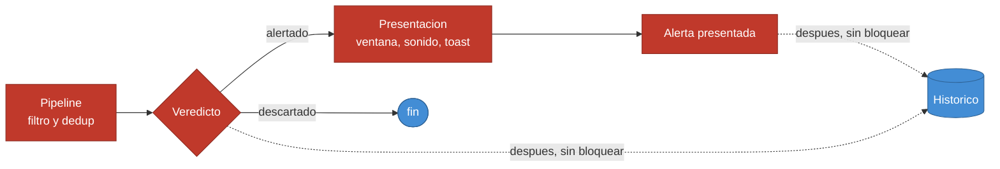

# API Spec delta — Vigía-eew v1.0

> Artefacto 03 del kit v1.0 · Documento base:
> [`docs/sdd/specs/02-API-SPEC.md`](../sdd/specs/02-API-SPEC.md)

## 1. Qué contiene y qué no

Vigía-eew **no expone ninguna API de red**. Es un agente de escritorio de proceso único que
*consume* servicios externos. Lo que este documento especifica son **contratos internos**: las
superficies por las que dos partes del sistema se hablan y que, si cambian, rompen a la otra.

| Contrato | Estado | Dónde vive |
|---|---|---|
| EMSC, USGS, FUNVISIS, GEOFON | **Sin cambios** | [`docs/API-SPEC.md`](../API-SPEC.md) |
| `SeismicEvent` + correlación | **Ya especificado**, sin implementar | [Base §2](../sdd/specs/02-API-SPEC.md) |
| `SourceSpec` (registro de fuentes) | **Ya especificado**, sin implementar | [Base §3](../sdd/specs/02-API-SPEC.md) |
| Servicio de presentación D-Bus | **Ya especificado**, sin implementar | [Base §4](../sdd/specs/02-API-SPEC.md) |
| Contrato de hilos | **Ya especificado**, sin implementar | [Base §6](../sdd/specs/02-API-SPEC.md) |
| **Escritura de configuración** | **Nuevo aquí** | §2 |
| **Almacén del histórico** | **Nuevo aquí** | §2bis |
| **Proveedor de teselas** | **Nuevo aquí** | §2ter |

**Cuatro de los siete contratos internos que la v1.0 necesita ya estaban escritos.** Este delta añade
tres: el que el panel de configuración necesita y que ADR-007 había declarado innecesario, el del
histórico, y el del mapa.

**El proveedor de teselas es el único contrato del producto con un tercero que no es una fuente
sísmica.** Por eso está aquí y no solo en el diseño: lo que un contrato externo permite y lo que no
conviene tenerlo escrito antes de implementarlo.

Los contratos heredados **no se reproducen**. Si al implementarlos se descubre que la especificación
estaba mal, la regla es parar y actualizar el documento base — no divergir en silencio.

---

## 2. Contrato de escritura de configuración *(nuevo)*

Habilitado por la enmienda [E-02](00-ENMIENDAS-CONSTITUCION.md) y decidido en
[ADR-019](04-TECHNICAL-DESIGN-DELTA.md). Cubre REQ-CFG-009 a REQ-CFG-012.

### 2.1 Operaciones

| Operación | Entrada | Salida | Requisito |
|---|---|---|---|
| **cargar** | ruta | valores validados **+ huella del archivo** | REQ-CFG-011 |
| **guardar** | valores + huella esperada | confirmación, o conflicto, o error de validación | REQ-CFG-009..012 |
| **restaurar por defecto** | sección o archivo completo | valores por defecto, **sin escribir** | REQ-GUI-003 |

La huella del archivo se captura al cargar y se compara al guardar. Es lo que convierte
REQ-CFG-011 en verificable: sin ella, "detectar la modificación externa" no tiene con qué comparar.

### 2.2 Secuencia de un guardado

El orden de estos pasos **es el contrato**, porque cada uno protege de un fallo distinto. Invertir
dos de ellos rompe un requisito.

**Las tres invariantes que esta secuencia garantiza:**

| Invariante | Qué la garantiza |
|---|---|
| Nunca queda una configuración inválida en disco | La validación ocurre **antes** de abrir nada para escribir |
| Nunca se pisa una edición externa sin avisar | La huella se compara **después** de validar y **antes** de escribir |
| Nunca queda el archivo a medias | Temporal + renombrado atómico, el mismo patrón que ya usa el estado |

### 2.3 Errores, y qué ve el usuario en cada uno

| Situación | Respuesta | Qué hace el panel |
|---|---|---|
| Un campo no valida | Error por campo, con el nombre del campo | Lo señala junto al control; el guardado queda inhabilitado |
| Una regla entre campos no se cumple | Error de la sección | Lo señala en la sección y explica la relación |
| El archivo cambió en disco | Conflicto, con la ruta | Advierte y ofrece recargar o sobrescribir **con confirmación** |
| El archivo no se puede escribir | Error de entrada/salida | Lo comunica sin cerrar el panel; los valores editados no se pierden |
| El respaldo no se puede crear | Error de entrada/salida | **Aborta el guardado.** Sin respaldo no se escribe |

La última fila es deliberada: el respaldo no es un extra, es parte del contrato. Si no se puede
crear, el guardado no ocurre.

### 2.4 Lo que este contrato NO hace

- **No recarga la configuración en el agente en marcha.** Los componentes reciben la suya al
  construirse; el panel avisa de que hace falta reiniciar (REQ-GUI-004). Cambiar eso es REQ-GUI-007,
  fuera del corte.
- **No sustituye la lectura existente.** `tomllib` sigue siendo el lector; `tomlkit` entra solo en la
  ruta de escritura.
- **No versiona la configuración ni guarda historial.** Un respaldo, el inmediatamente anterior.

---

## 2bis. Contrato del histórico *(nuevo)*

Habilitado por [E-05](00-ENMIENDAS-CONSTITUCION.md), decidido en
[ADR-025](04-TECHNICAL-DESIGN-DELTA.md), con su esquema en
[05-DATA-MODEL §3bis](05-DATA-MODEL-DELTA.md). Cubre REQ-HIS-001 a REQ-HIS-006.

### 2bis.1 Operaciones

| Operación | Entrada | Salida | Requisito |
|---|---|---|---|
| **registrar** | evento evaluado + veredicto + motivo | nada; **nunca lanza hacia el pipeline** | REQ-HIS-001, 002 |
| **consultar** | filtros y orden | página de resultados | REQ-HIS-005 |
| **podar** | retención | número de filas eliminadas | REQ-HIS-004 |
| **abrir/migrar** | ruta | almacén listo, o negativa explicada | REQ-HIS-003 |

**"Nunca lanza hacia el pipeline" es la parte del contrato que importa.** Un fallo al registrar se
anota en el registro de la aplicación y se traga; no puede propagarse hacia arriba, porque arriba
está la presentación de una alerta (Art. 1, REQ-HIS-002).

### 2bis.2 Dónde se llama, y dónde no

Las flechas continuas son la ruta caliente; **las punteadas nunca la bloquean**. Un descarte se
registra igual que una alerta — es lo que permite responder *"¿por qué no me avisó?"*.

### 2bis.3 Filtros de consulta

| Filtro | Tipo | Nota |
|---|---|---|
| Rango de fechas | dos instantes UTC | El de uso más frecuente y el orden por defecto |
| Magnitud mínima / máxima | real | |
| Distancia máxima | real | Contra la distancia **almacenada**, no recalculada |
| Veredicto | alertado / descartado / ambos | |
| Red de origen | conjunto | |
| Recuadro geográfico | dos esquinas | Lo usa el mapa; comparte filtros con el listado (REQ-MAP-004) |

Los resultados se paginan: una consulta sin filtros sobre un histórico de un año no puede intentar
devolverlo entero.

---

## 2ter. Contrato del proveedor de teselas *(nuevo)*

Decidido en [ADR-027](04-TECHNICAL-DESIGN-DELTA.md). Cubre REQ-MAP-001, 002, 005.

| Aspecto | Contrato |
|---|---|
| **Cuándo se pide** | **Solo con el mapa abierto.** En reposo, cero peticiones (REQ-MAP-001) |
| **Identificación** | Cliente identificado con nombre y versión de la aplicación |
| **Volumen** | Solo las teselas visibles. **Sin descarga anticipada ni masiva** |
| **Caché** | Se consulta antes de pedir; una tesela ya vista no se vuelve a solicitar |
| **Atribución** | "© OpenStreetMap contributors" visible mientras el mapa esté en pantalla |
| **Fallo o ausencia de red** | El mapa se declara no disponible; **el listado sigue funcionando** |
| **Inyectable** | El proveedor se inyecta, de modo que las pruebas del mapa corren sin red (Art. 7) |

**Lo que este contrato NO permite**, escrito para que no se erosione con el tiempo: precargar
teselas en segundo plano, descargar regiones enteras por adelantado, y enviar en la petición
cualquier cosa que no sean las coordenadas de la tesela.

---

## 3. Invariantes que todo contrato de este delta respeta

| # | Invariante | Origen |
|---|---|---|
| I-1 | Toda escritura en disco es atómica y deja respaldo o nada | Art. 3 · REQ-CFG-010 |
| I-2 | Toda validación ocurre antes del efecto, nunca después | Art. 3 |
| I-3 | Ningún instante interno es *naive*: todo es UTC consciente de zona | Art. 4 |
| I-4 | Ningún dato de diagnóstico interno sale del proceso | REQ-OBS-002 · CA-105.5 |

**I-4 merece una nota.** El identificador de correlación es un dato **interno de diagnóstico**: sirve
para leer los propios registros del usuario en su máquina. No se envía a ninguna parte, y CA-105.5
lo verifica explícitamente para que nadie lo confunda con telemetría en una revisión futura.
