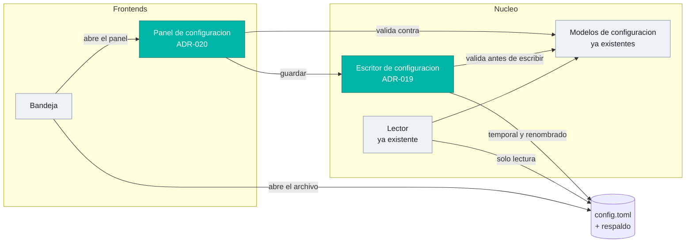

# Technical Design delta — Vigía-eew v1.0

> Artefacto 04 del kit v1.0 · Documentos base: [`docs/TECHNICAL-DESIGN.md`](../TECHNICAL-DESIGN.md)
> (ADR-001..ADR-018) y [`docs/sdd/specs/03-TECHNICAL-DESIGN.md`](../sdd/specs/03-TECHNICAL-DESIGN.md)
> (TD-01..TD-05)

## 1. Qué se hereda, qué se enmienda y qué se decide aquí

| | Cuántos | Cuáles |
|---|---|---|
| **Heredados sin cambio** | 16 | ADR-001..018 salvo los dos de abajo |
| **Enmendados** | 2 | **ADR-007** (config de solo lectura) · **ADR-010** (Wayland) |
| **Heredados de la capa de diseño previa** | 5 | TD-01..TD-05: composición, registro de fuentes, frontend Wayland, estado compartido, fronteras |
| **Nuevos aquí** | **9** | **ADR-019..ADR-027** |

La numeración continúa la del proyecto —que llega a ADR-018— para que exista **una sola serie de
decisiones**, no dos numeraciones paralelas que haya que reconciliar después.

---

## 2. Decisiones enmendadas

### ADR-007 · La configuración deja de ser de solo lectura

**Decía:** `tomllib` como lector, con la consecuencia registrada *"writing config isn't needed in
v1"*.
**Sigue vigente:** `tomllib` como lector. El archivo TOML como fuente de verdad. Sin base de datos.
**Cambia:** existe una ruta de escritura, especificada en ADR-019.

La frase original era correcta cuando se escribió. Deja de serlo en el momento en que el producto
ofrece una interfaz para editar. **Enmendar es lo correcto; ignorarla habría sido lo barato.**

### ADR-010 · Presentación bajo Wayland — de aceptado a en implementación

**No cambia de contenido.** Cambia de estado: lleva **aceptado y sin código desde la v0.1.0**, y la
v1.0 lo convierte en trabajo con fase, tareas y criterio de aceptación (HU-106).

**Cambio real que sí introduce este delta:** el diseño original asumía que la presentación por D-Bus
se construiría. La v1.0 antepone **declarar el alcance de la garantía** (ADR-024) como capacidad
independiente, de modo que el producto deje de prometer de más **aunque el spike concluya que no es
viable**.

---

## 3. ADR-019 · Escritura de configuración preservando comentarios

**Contexto.** El panel guarda cambios en un archivo que lleva **46 líneas de comentarios** que hoy
son la ayuda en línea del usuario, y que el usuario también puede editar a mano.

**Decisión.** `tomlkit` para la ruta de escritura. `tomllib` sigue siendo el lector.

**Alternativas y por qué no:**

| Alternativa | Por qué no |
|---|---|
| `tomli-w` | **No preserva comentarios.** El primer guardado borraría los 46 |
| Serializar desde los modelos y reescribir el archivo | Lo mismo, y además pierde el orden de las secciones |
| Guardar en un archivo aparte y fusionar al leer | Dos fuentes de verdad; contradice REQ-GUI-005 |
| Cambiar el formato a uno con escritor en la biblioteca estándar | Pierde la legibilidad y los comentarios; descartado en el backlog §7 |

**Consecuencias.** Una dependencia nueva —la única que la épica introduce—. La ruta de lectura no
cambia, así que el arranque del agente no se ve afectado en absoluto. `tomlkit` solo se importa en
el camino de escritura.

**Requisitos:** REQ-CFG-009, 010, 011, 012.

---

## 4. ADR-020 · El panel se genera desde el esquema, no a mano

**Contexto.** 39 campos en 10 secciones. Un panel escrito control a control es 39 oportunidades de
que un campo nuevo del modelo no llegue a la interfaz — y nadie se entera hasta que un usuario no
encuentra la opción.

**Decisión.** Los controles se derivan del **esquema de los modelos de configuración existentes**:
el tipo del campo determina el control, y sus restricciones determinan la validación. Una prueba
recorre el esquema y **falla si un campo no tiene control** (CA-108.2).

**Consecuencias.**

| Efecto | Valor |
|---|---|
| Añadir un campo al modelo lo hace aparecer en el panel | La deriva entre modelo y panel se vuelve imposible de ignorar |
| La validación es la misma que ya usa el agente al arrancar | Un solo sitio donde vive la regla |
| Los casos especiales necesitan excepción explícita | Coste real: zona horaria e idioma quieren lista desplegable, no texto libre |

La última fila es la contrapartida honesta: la generación cubre la mayoría, y unos pocos campos
llevan un control declarado a mano. La prueba de cobertura del esquema los acepta si están
declarados, no si están olvidados.

**Alternativa descartada:** una biblioteca de formularios. Añadiría una dependencia de interfaz
gráfica al árbol de un producto cuya UI es Tkinter de la biblioteca estándar por decisión (ADR-005).

**Requisitos:** REQ-GUI-001, 002, 003.

---

## 5. ADR-021 · El identificador de correlación vive en el contrato interno

**Contexto.** El recorrido de un sismo cruza cinco etapas y, en la deduplicación, dos flujos se
convierten en uno.

**Decisión.** El identificador se genera **en la ingesta**, viaja como campo del contrato interno
—ya especificado en la API Spec base §2— y el deduplicador **enlaza** el identificador de la llegada
descartada con el de la superviviente en lugar de descartarlo.

**El punto que importa** es ese enlace. Un identificador que se pierde al deduplicar deja
precisamente el hueco que se quería cubrir: por qué la segunda llegada no produjo una alerta.

**Alternativas y por qué no:**

| Alternativa | Por qué no |
|---|---|
| Usar el identificador de la fuente | No existe antes de normalizar, y cambia entre fuentes para el mismo sismo |
| Un identificador por etapa, enlazado en los registros | Reconstruir el recorrido vuelve a requerir varias búsquedas |
| Contexto implícito por tarea de asyncio | No cruza el puente al hilo de interfaz, que es justo donde termina el recorrido |

**Consecuencias.** Un campo más en el contrato interno y en el estado persistido. **No sale del
proceso** (invariante I-4). Coste de memoria despreciable: es un identificador corto por evento
vivo.

**Requisitos:** REQ-OBS-002.

---

## 6. ADR-022 · Entorno de desarrollo en contenedor con display virtual

**Contexto.** El proyecto necesita tkinter, que no viene en las imágenes base de Python; la CI ya lo
resuelve con el Python gestionado por `uv` `[COMMITS: 0e707a1]`. Además, 3 pruebas de interfaz real
están excluidas por defecto porque necesitan un display.

**Decisión.** Definición de contenedor de desarrollo con el intérprete que el proyecto exija, el
gestor de proyecto, las bibliotecas de sistema de Tk y **un display virtual**; con un comando
posterior a la creación que sincroniza dependencias e instala los hooks.

**El display virtual es la parte con más valor y la menos obvia:** convierte 3 pruebas
excluidas-por-defecto en 3 pruebas que **siempre** se ejecutan para quien use el contenedor.

**Consecuencias.** Permitido por la enmienda E-03. **No contenedoriza el producto** —eso sigue
descartado— y no cambia cómo se ejecuta el agente en la máquina del usuario. Depende de la fase de
runtime: construir la imagen sobre 3.11 y rehacerla después es trabajo duplicado.

**Requisitos:** REQ-DEV-001, 002, 003.

---

## 7. ADR-023 · El binario de Linux se construye sobre una base fijada

**Contexto.** El binario hereda la glibc de `ubuntu-latest`. **La versión mínima de sistema que
soporta cambia cuando GitHub actualiza sus ejecutores**, sin que nada aparezca en un diff.

**Decisión.** La construcción del binario de Linux declara su imagen base con versión explícita.

**Alternativas y por qué no:**

| Alternativa | Por qué no |
|---|---|
| Fijar la versión del ejecutor en lugar del contenedor | Ata el proyecto al calendario de retirada de imágenes del proveedor de CI |
| Compilar estáticamente | PyInstaller no lo ofrece de forma soportada para este caso |
| No hacer nada | Es la situación actual: un cambio de compatibilidad que ocurre sin decisión |

**Consecuencias.** El binario declara qué soporta. La compatibilidad hacia atrás pasa a ser una
decisión con su commit, que es exactamente lo que hoy falta. Permitido por E-03.

**Requisitos:** REQ-OPS-009.

---

## 8. ADR-024 · El alcance de la garantía de alerta se declara por entorno

**Contexto.** El Art. 1 dice que la alerta es el producto. Bajo Wayland, la presentación por encima
de todo **no está garantizada** y el ícono de bandeja depende de una extensión opcional.

**Decisión.** El producto **declara** en qué entornos la garantía se cumple y en cuáles no, en dos
lugares: la documentación y **el propio estado del agente en la máquina del usuario**.

**Por qué es una decisión y no una nota de documentación:** separa "declarar" de "cumplir" en dos
capacidades con esfuerzo, riesgo y valor distintos. La declaración **es independiente del resultado
del spike de Wayland** — si el spike concluye que la garantía no es alcanzable, la declaración pasa
a ser lo único que impide que el producto siga prometiendo de más.

**Consecuencias.** Detección del entorno de escritorio, con degradación segura: **un entorno no
reconocido se trata como no confirmado**, nunca como fallo (CA-106.3). Aparece en el estado del
agente, así que toca la bandeja y el panel de terminal.

**Requisitos:** REQ-ALE-003.

---

## 8bis. ADR-025 · SQLite para el histórico, JSON para el estado

**Contexto.** El histórico (B-41) debe responder consultas por rango de fechas, magnitud, distancia y
red. La constitución dice *"sin base de datos"*, con este argumento: *"el estado son unos KB en
memoria consultados por pertenencia"*.

**Decisión.** SQLite para el histórico, en archivo propio junto al estado. **El estado operativo
sigue en JSON, sin excepción.**

**Por qué el argumento original no cubre este caso.** Es literalmente cierto del estado operativo y
literalmente falso del histórico: decenas de miles de filas al año, consultadas por rango, no por
pertenencia. Un JSON que hay que cargar entero en memoria para filtrar por fechas es la razón por la
que existen las bases de datos.

**Alternativas y por qué no:**

| Alternativa | Por qué no |
|---|---|
| JSON o JSONL creciente | Cargar entero para filtrar por rango; sin índices; el archivo crece sin estructura |
| Un archivo por mes | Reimplementa a mano el particionado y sigue sin índices para magnitud o distancia |
| Motor cliente-servidor | Un servicio que administrar en un producto de escritorio de proceso único |
| Guardar en el mismo JSON del estado | Mezcla la ruta caliente de la alerta con datos de consulta. Es exactamente lo que E-05 evita |

**Consecuencias.**

| Efecto | Detalle |
|---|---|
| **Cero dependencias nuevas** | `sqlite3` viene con Python — es lo que hace la enmienda defendible |
| La escritura sale de la ruta caliente | REQ-HIS-002: un fallo del histórico no impide una alerta |
| Un archivo más que respaldar | En el mismo directorio por plataforma que el estado |
| Migraciones que mantener | `PRAGMA user_version`, aplicadas en transacción al arrancar |

**Requisitos:** REQ-HIS-001, 002, 003, 004, 005, 006.

---

## 8ter. ADR-026 · La prioridad de red resuelve datos, no alertas

**Contexto.** Cuando el mismo sismo llega por dos redes, hoy prevalece **la que llegó primero** — un
accidente de latencia. B-40 pide que el usuario decida.

**Decisión.** La prioridad es un campo de la especificación de fuente y **el deduplicador la usa para
elegir qué llegada prevalece**, con independencia del orden de llegada. La distancia se recalcula con
la ubicación que prevalece.

**Lo que la decisión deja fuera, y es la mitad del ADR:**

| Lo que NO hace | Por qué |
|---|---|
| No decide **si** se alerta | Perdería los sismos locales que solo cataloga la red nacional, que es la razón de que esa fuente exista. Alertar lo sigue decidiendo el filtro |
| No cambia el **orden de consulta** | Serializar por prioridad retrasaría la alerta. Las fuentes siguen concurrentes e independientes (REQ-ING-010) |
| No excluye a las **redes sin prioridad** | Se ordenan al final. Un `config.toml` de la v0.6.0 sigue siendo válido |

**Alternativas y por qué no:** usar la prioridad como umbral de confianza para alertar —descartado
por lo anterior—; y usarla solo como orden de arranque —en la práctica la red más rápida seguiría
ganando y la prioridad no se notaría.

**Consecuencias.** El deduplicador pasa de "conservar el primero" a "conservar el mejor", lo que le
da una regla explícita donde antes había un efecto colateral. **Depende de ADR-001 / TD-02**: sin
registro declarativo, la prioridad habría que añadirla en cuatro sitios.

**Requisitos:** REQ-ING-011, REQ-PIP-010, REQ-GUI-008.

---

## 8quater. ADR-027 · Mapa con teselas de OpenStreetMap, sin dependencias nuevas

**Contexto.** El histórico se ve mejor en un mapa: dos sismos de magnitud 4 a 50 y a 250 km
significan cosas distintas, y una tabla de coordenadas no comunica eso.

**Decisión.** Teselas de **OpenStreetMap**, descargadas bajo demanda, cacheadas en disco y pintadas
sobre un lienzo Tk.

**El hallazgo que hace viable esta opción: no hace falta ninguna dependencia nueva.**

| Pieza | Con qué se hace | ¿Ya estaba? |
|---|---|---|
| Descargar la tesela | `httpx` | Sí, para las fuentes REST |
| Decodificar la imagen | `Pillow` | Sí, por la bandeja |
| Pintarla y componer el mapa | Lienzo de Tk | Sí, biblioteca estándar |

> **Efecto lateral sobre D-2 que conviene registrar.** Esto convierte a Pillow en dependencia de
> primera clase **pase lo que pase con `pystray`**. Hasta ahora estaba en el árbol solo porque la
> bandeja lo exige; si la bandeja se retirara en Linux, Pillow saldría. Con el mapa, no. **Refuerza
> B-02** —el piso de seguridad de Pillow— en lugar de debilitarlo.

**Alternativas y por qué no:**

| Alternativa | Por qué no |
|---|---|
| Teselas empaquetadas con el producto | Un juego mundial son gigabytes |
| Servidor de teselas propio | Un servicio que administrar, en un producto de escritorio |
| Exportar a HTML y abrir el navegador | Saca la funcionalidad del producto y rompe la operación headless |
| Mapa vectorial offline propio | Evitaría la red, pero exige empaquetar y mantener geometrías y renderizarlas a mano |

**Consecuencias, incluidas las incómodas:**

| Consecuencia | Cómo se acota |
|---|---|
| Un destino de red nuevo | Solo con el mapa abierto (REQ-MAP-001). Nunca en segundo plano |
| **La zona que mira el usuario queda expuesta al proveedor** | Caché y carácter bajo demanda. **No se elimina** — se declara |
| Atribución y política de uso | "© OpenStreetMap contributors" visible, cliente identificado, sin descargas masivas (REQ-MAP-005) |
| Riesgo de empaquetado | El puente Pillow↔Tk es justo el tipo de recurso que falta en un binario y solo se ve al ejecutarlo. Lo detecta el smoke de REQ-OPS-008 — **por eso esta fase va después** |
| Sin red y sin caché | El mapa no está disponible y **el listado sigue funcionando** (REQ-MAP-002, Art. 3) |

**Requisitos:** REQ-MAP-001, 002, 003, 004, 005.

---

## 9. Vista de la ruta nueva de configuración

Lo único que cambia estructuralmente en la v1.0 fuera de lo ya diseñado en TD-01..TD-05.

**Dos cosas que el diagrama hace explícitas:** la validación ocurre en dos sitios —en el panel para
el usuario, y en el escritor como última barrera antes del disco— y **el lector no cambia**. El
camino de arranque del agente es idéntico al de hoy.

## 10. Estrategia de pruebas de este delta

| Qué | Cómo | Por qué así |
|---|---|---|
| Escritura de configuración | Sobre archivo temporal real, no simulado | La atomicidad y el respaldo **son** operaciones de sistema de archivos; simularlas no probaría nada |
| Cobertura del esquema por el panel | Recorriendo el esquema, no enumerando campos a mano | Una lista escrita a mano envejece igual que el panel |
| Carrera de apagado | Test que **debe fallar** contra `c3a2c29` | Un test escrito después del arreglo no demuestra que el problema existía |
| Presentación bajo Wayland | Spike primero, con derecho a un veredicto negativo | Es la incógnita de mayor riesgo del plan |
| Fronteras de importación | Herramienta en el gate, no revisión humana | Art. 5: fronteras ejecutables |
| Histórico | Sobre archivo SQLite real, incluida la migración de esquema | Las migraciones fallan en los detalles del motor, no en la lógica |
| Fallo del histórico | Con el archivo en solo lectura, comprobando que **la alerta sale igual** | Es el criterio que protege el Art. 1 |
| Mapa | Con el proveedor de teselas simulado, y una prueba de que **en reposo no hay tráfico** | Verificar REQ-MAP-001 exige observar la ausencia de peticiones, no su forma |

## 11. Constitution check

| Artículo | Cómo lo cumple |
|---|---|
| Art. 1 | ADR-024 cierra la brecha entre promesa y cumplimiento declarándola |
| Art. 3 | ADR-019: validar antes de escribir; sin respaldo no se escribe |
| Art. 5 | TD-05 heredado, verificado en el gate |
| Art. 6 | TD-04 heredado: el estado compartido se declara y se sincroniza |
| Art. 7 | ADR-020: el panel recibe sus modelos inyectados; su prueba corre headless. ADR-027: el proveedor de teselas es inyectable, así que el mapa se prueba sin red |
| Art. 9 | Estos nueve ADR se escriben **antes** que el código, no después |
| Art. 1 | ADR-025 y ADR-027 mantienen histórico y teselas **fuera** del camino entre un evento y su alerta |

**Excepciones solicitadas: ninguna.** Las seis desviaciones respecto de la constitución vigente
están tramitadas como **enmiendas** en
[00-ENMIENDAS-CONSTITUCION.md](00-ENMIENDAS-CONSTITUCION.md), que es el mecanismo que la propia
constitución exige.

**El patrón que comparten ADR-025, ADR-026 y ADR-027**, y que conviene ver junto: los tres añaden
capacidad **sin tocar la ruta caliente de la alerta**. El histórico se escribe después de presentar,
la prioridad actúa en la deduplicación —que ya ocurría— y las teselas solo se piden con el mapa
abierto. Es lo que permite añadir tres funcionalidades grandes a un producto cuyo Art. 1 dice que la
alerta es el producto.
