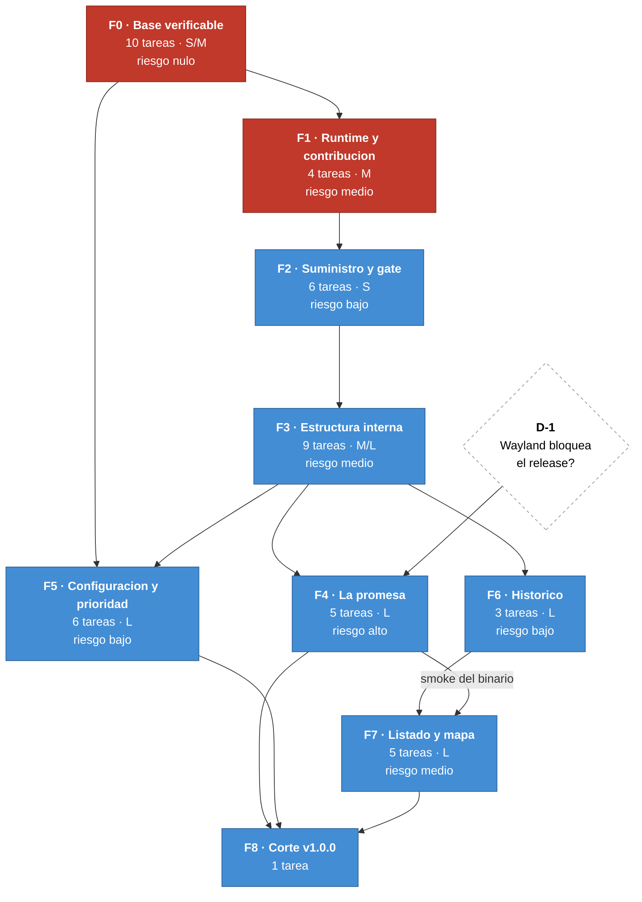

# Implementation Plan — Vigía-eew v1.0

> Artefacto 06 del kit v1.0 · Commit base `c3a2c29` · Destino **v1.0.0**
> **35 ítems del backlog** repartidos en **9 fases**, con 49 tareas en
> [07-TASKS.md](07-TASKS.md).

## 1. Cómo se relaciona con los planes que ya existen

Cinco planes previos contienen trabajo que se solapa. Este plan **los adjudica** en lugar de
repetirlos: cada ítem se ejecuta una sola vez, aquí, y los planes de origen quedan como referencia
de la evidencia que lo motivó.

| Plan previo | Qué aportó | Qué pasa con él |
|---|---|---|
| [`code-audit/02-PLAN-REMEDIACION.md`](../code-audit/02-PLAN-REMEDIACION.md) | R-01..R-06 | Sus ítems son F0 y F2 aquí |
| [`arch-eval/02-PLAN-MIGRACION.md`](../arch-eval/02-PLAN-MIGRACION.md) | F0..F4 | Sus ítems son F0, F2 y F3 aquí |
| [`PLAN-MIGRACION-PAQUETERIA.md`](../PLAN-MIGRACION-PAQUETERIA.md) | M0..M6 | Sus ítems son F0, F1, F2 y F4 aquí |
| [`sdd/specs/05-IMPLEMENTATION-PLAN.md`](../sdd/specs/05-IMPLEMENTATION-PLAN.md) | Fases 0-8 | **Es otro escenario**: reconstruir desde cero. No compite |
| [`BACKLOG-PRIORIZADO.md`](../BACKLOG-PRIORIZADO.md) §6 | Las 5 olas | **Es el insumo directo** de estas fases |

**Resolución de la única ambigüedad de reparto:** la actualización de `pip` por CVE-2026-13346
aparece como A-4 en el plan de paquetería y como R-05 en el de remediación. **La ejecuta este plan**,
en F2, porque es donde ocurre el re-bloqueo que la materializa.

**Un ítem que ningún plan había situado:** B-28 (backlinks) es P2 y no estaba en ninguna de las
cinco olas del backlog —verificado sumando: las olas cubren 30 de los 39 ítems—. Este plan lo coloca
en **F3**, tras B-27 del que depende.

---

## 2. Grafo de fases

### La cadena bloqueante, y por qué cada eslabón lo es

**F0 → F1 → F2** es estrictamente secuencial, y no por orden de preferencia:

1. **F0 antes que nada.** Sin lockfile versionado no se puede *demostrar* que una resolución cambió:
   cualquier verificación posterior compara contra un archivo que no existe en el repositorio.
2. **F1 antes que F2.** `requires-python` **determina qué versiones son resolubles**. Subir el piso
   estrecha el conjunto de wheels válidos y puede cambiar qué resuelve cada dependencia. Fijar
   techos primero obliga a rehacerlos.
3. **F2 antes que F3.** El gate completo es lo que detecta que un refactor de F3 rompió algo. Hacer
   F3 con el gate a medias es refactorizar sin red.

**F5 puede empezar en cuanto F0 termine** en su parte de configuración: el panel solo necesita el ADR
que F0 escribe. Su parte de **prioridad de redes sí depende de F3**, porque la prioridad es un campo
del registro declarativo de fuentes.

**F6 → F7 también es secuencial, y por una razón simple:** el mapa es una vista sobre el histórico.
Sin datos que mostrar, no hay nada que dibujar. Por eso el listado (F7) y el almacén (F6) van
separados: **el listado ya entrega valor sin el mapa**, y si el mapa se complicara, el histórico
seguiría siendo consultable.

**F4 → F7 es una dependencia menos obvia pero real.** El mapa usa el puente entre Pillow y Tk, que
es exactamente el tipo de recurso que falta en un binario y **solo se descubre al ejecutarlo** — el
proyecto ya rompió una release así (`bdc2a9d`). El smoke del binario vive en F4, así que conviene que
exista antes de que el mapa entre en el empaquetado.

**F4 depende de D-1**, no de otra fase. La decisión puede tomarse desde el primer día y cuanto antes
se tome, antes se sabe si el corte de la v1.0.0 incluye Wayland.

---

## 3. Las fases

### F0 · Base verificable

| | |
|---|---|
| **Ítems** | B-01, B-06, B-07, B-09, B-10, B-11, B-14, B-17, B-35 |
| **Tareas** | T-101 a T-110 |
| **Esfuerzo** | ≈ 1 jornada |
| **Riesgo** | **Nulo.** Nada aquí toca lógica de producto |

Deja el proyecto en condiciones de que todo lo demás sea verificable: el lockfile viaja, las
fronteras se comprueban solas, la cobertura muerde, el formato deja de discutirse, y **la carrera de
apagado queda demostrada con un test que falla**.

Incluye también dos cosas que no parecen de esta fase y lo son: la validación de recursos de
empaquetado (B-14, porque ya rompió dos releases y es una S sin dependencias) y el ADR de
configuración escribible (B-35, porque F5 no puede empezar sin él).

**Hecha cuando:** el gate rechaza un archivo sin formatear, una cobertura baja, una frontera violada
y un recurso de empaquetado inválido — y el test de la carrera falla contra `c3a2c29`.

---

### F1 · Runtime y contribución

| | |
|---|---|
| **Ítems** | B-04, B-16, B-34 |
| **Tareas** | T-111 a T-114 |
| **Esfuerzo** | ≈ 1 jornada |
| **Riesgo** | **Medio** — es el único cambio que puede alterar comportamiento |
| **Bloqueada por** | **D-3** y la enmienda E-01 |

Sube el piso a Python 3.13 en los cinco sitios donde vive —tres de ellos en un archivo de CI que
nadie mira al editar `pyproject.toml`— y lo verifica en dos versiones. Con el runtime resuelto, se
construye la imagen de desarrollo.

**Riesgos concretos y su mitigación:**

| Riesgo | Mitigación |
|---|---|
| Una dependencia sin wheel para 3.13/3.14 | Se detecta al re-bloquear, **antes** de tocar código |
| Cambio de comportamiento de la biblioteca estándar | Las 344 pruebas son el detector; si pasan en ambas, la fase está hecha |
| Usuarios en 3.11/3.12 quedan fuera | Real, y **este es el momento de hacerlo**: después de un 1.0.0 exigiría una mayor |

**Hecha cuando:** la suite pasa en 3.13 y 3.14, los tres jobs producen binario, y alguien puede abrir
el repositorio en un contenedor y ejecutar el gate sin instalar nada.

---

### F2 · Cadena de suministro y gate completo

| | |
|---|---|
| **Ítems** | B-02, B-03, B-05, B-08, B-12, B-13 |
| **Tareas** | T-115 a T-120 |
| **Esfuerzo** | ≈ media jornada |
| **Riesgo** | Bajo |

Los rangos dejan de admitir versiones vulnerables y un gate impide que vuelvan. Se cierra la carrera
de apagado que F0 demostró, y entran las dos dimensiones que faltaban en el gate.

**El orden dentro de la fase importa:** el arreglo de la carrera (T-119) va después de su test
(T-103, en F0), no antes. Ese es el único punto donde la secuencia entre fases no es opcional.

**Hecha cuando:** `uv sync --resolution lowest-direct` produce un árbol sin avisos, el test de la
carrera pasa, y el gate cubre las ocho dimensiones.

---

### F3 · Estructura interna

| | |
|---|---|
| **Ítems** | B-18, B-21, B-22, B-24, B-25, B-26, B-27, B-28 |
| **Tareas** | T-121 a T-129 |
| **Esfuerzo** | ≈ 2-3 jornadas |
| **Riesgo** | Medio — es refactor sobre código que funciona |

Añadir una fuente pasa a costar tres puntos, un sismo se sigue de punta a punta en los registros, y
la deuda de calidad agrupada se salda en un PR.

**La red de seguridad es F2.** Refactorizar `Application` y el normalizador con el gate completo y
344 pruebas verdes es una operación distinta de hacerlo sin él. Por eso F3 no se adelanta aunque
tentaría: es la fase con más código tocado y la que más se beneficia de que el gate ya muerda.

**Hecha cuando:** añadir una fuente de prueba toca tres archivos, el fan-out del módulo de
aplicación es ≤ 8, y una búsqueda por identificador de correlación devuelve las cinco etapas.

---

### F4 · La promesa del producto

| | |
|---|---|
| **Ítems** | B-19, B-20, B-15, B-23 |
| **Tareas** | T-130 a T-134 |
| **Esfuerzo** | **Sin estimar** |
| **Riesgo** | **Alto** — la única fase con una incógnita técnica real |
| **Bloqueada por** | **D-1** |

Es la fase que justifica llamar 1.0.0 al resultado: la promesa central del producto pasa a estar
acotada y, si el spike lo permite, cumplida en Wayland. Además el binario deja de publicarse sin
haberse ejecutado.

**Estructura interna de la fase, deliberada:**

1. **T-130 · Declarar el alcance** va primero, es una S y **es independiente del resultado del
   spike**. Si todo lo demás fracasa, esto solo ya deja al producto sin prometer de más.
2. **T-131 · Spike** tiene derecho a un veredicto negativo. Si concluye que no es viable con
   esfuerzo razonable, se documenta y T-132 no se ejecuta.
3. **T-132 · Implementación** solo si el spike da luz verde.

**Hecha cuando:** la matriz de entornos está publicada, el spike tiene veredicto escrito, y el
pipeline ejecuta el binario antes de publicarlo.

---

### F5 · Configuración gráfica y prioridad de redes

| | |
|---|---|
| **Ítems** | B-36, **B-40** (B-37 y B-38 fuera del corte) |
| **Tareas** | T-135 a T-137, **T-139 a T-141** |
| **Esfuerzo** | L |
| **Riesgo** | Bajo, pero con un modo de fallo propio |
| **Depende de** | F0 (por el ADR) y F3 (por el gate, la estructura y el registro de fuentes) |

El usuario configura el agente desde una interfaz en vez de un archivo de texto, **y decide qué red
manda** cuando el mismo sismo llega por varias.

**Las dos capacidades van juntas porque comparten superficie:** la lista de redes con orden es un
control del mismo panel, y su efecto —qué dato prevalece al deduplicar— es una línea del pipeline.
Separarlas obligaría a abrir el panel dos veces.

**El riesgo propio del panel:** es el primer componente que escribe en un archivo que el usuario
también edita a mano. La detección de modificación externa no es un extra — es lo que evita que
alguien pierda trabajo silenciosamente.

**Hecha cuando:** los 39 campos son alcanzables desde el panel, guardar preserva los 46 comentarios,
una edición externa produce una advertencia, y **invertir el orden de dos redes invierte la magnitud
presentada** para un sismo que llegó por ambas.

---

### F6 · Histórico persistente

| | |
|---|---|
| **Ítem** | B-41 |
| **Tareas** | T-142 a T-144 |
| **Esfuerzo** | L |
| **Riesgo** | Bajo |
| **Depende de** | F3 (por el identificador de correlación) y la enmienda **E-05** |

El agente deja de olvidar: cada evento evaluado queda registrado con su veredicto y, si fue
descartado, su motivo.

**Es solo el almacén, sin interfaz.** Separarlo del listado tiene una razón práctica: **el registro
puede empezar a acumular datos mientras se construye la vista**, de modo que cuando el listado exista
ya tenga algo que mostrar. Y una de diseño: si la vista se complicara, el histórico ya está
guardando.

**El criterio que no se puede relajar** es REQ-HIS-002: el histórico se escribe **fuera del camino de
presentación**. Un agente que no puede escribir su histórico sigue siendo un agente que alerta.

**Hecha cuando:** un evento descartado aparece registrado con su motivo, el archivo en solo lectura
no impide una alerta, y la poda respeta la retención configurada.

---

### F7 · Listado y mapa del histórico

| | |
|---|---|
| **Ítems** | B-42, B-43 |
| **Tareas** | T-145 a T-149 |
| **Esfuerzo** | L |
| **Riesgo** | Medio — dependencia de un tercero y riesgo de empaquetado |
| **Depende de** | F6, y de **F4** por el smoke del binario |

El histórico se consulta y se ve sobre un mapa de OpenStreetMap.

**El orden interno importa: el listado va antes que el mapa.** El listado entrega el valor completo
de la funcionalidad —responder *"¿por qué no me avisó?"*— sin depender de red, de un tercero ni del
empaquetado de Pillow. El mapa añade la lectura geográfica encima.

**Los dos riesgos de esta fase, y su mitigación:**

| Riesgo | Mitigación |
|---|---|
| El puente Pillow↔Tk falta en el binario y solo se ve al ejecutarlo | El smoke de F4 lo detecta. **Por eso F7 va después de F4** |
| El mapa depende de un proveedor externo | El listado no. Sin red y sin caché, el mapa se declara no disponible y la vista sigue sirviendo |

**Hecha cuando:** una consulta por magnitud y fechas devuelve exactamente lo que cumple ambas, el
mapa sitúa los sismos con símbolo escalado por magnitud, la atribución está visible, y **con el mapa
cerrado no hay una sola petición al proveedor de teselas**.

---

### F8 · Corte de la v1.0.0

| | |
|---|---|
| **Tarea** | T-138 |
| **Esfuerzo** | S |

Changelog, etiqueta y publicación. **La condición de corte no es "todas las fases hechas"** sino la
lista de comprobación de §5.

---

## 4. Cobertura de requisitos por fase

| Fase | Requisitos que cierra |
|---|---|
| F0 | REQ-DEP-001, REQ-OBS-003, 004, 005, 006, REQ-OPS-007, REQ-DEP-008 · *(prepara REQ-CFG-009..012)* |
| F1 | REQ-DEP-004, 007, REQ-DEV-001, 002, 003, 004 |
| F2 | REQ-DEP-002, 003, 005, 006, REQ-OBS-007, REQ-OPS-002 |
| F3 | REQ-ING-009, REQ-OBS-002, 008, REQ-OPS-003 |
| F4 | REQ-ALE-003, REQ-ALE-004\*, REQ-OPS-008, 009 |
| F5 | REQ-CFG-009, 010, 011, 012, REQ-GUI-001..005, **REQ-GUI-008, REQ-ING-011, REQ-PIP-010** |
| F6 | **REQ-HIS-001, 002, 003, 004, 006** |
| F7 | **REQ-HIS-005, REQ-MAP-001, 002, 003, 004, 005** |

\* Sujeto a D-1.

**Los 52 requisitos en alcance están cubiertos**, salvo los dos `[SHOULD]` diferidos (REQ-GUI-006 y
007), que se declaran fuera del corte en lugar de dejarse sin fase. Verificado en
[08-ANALYZE §2](08-ANALYZE.md).

---

## 5. Condición de corte de la v1.0.0

No es "todas las fases hechas": es esta lista.

| # | Condición | Fase | Estado |
|---|---|---|---|
| 1 | Una instalación limpia resuelve las mismas versiones que se verificaron | F0 | ✅ 2026-09-19 |
| 2 | El runtime declarado recibe correcciones de errores, verificado en dos versiones | F1 | ✅ 2026-09-19 |
| 3 | Ningún rango declarado admite una versión con avisos conocidos | F2 | ✅ 2026-09-19 |
| 4 | El gate mide las ocho dimensiones del Art. 8 | F0 + F2 | ✅ 2026-09-19 |
| 5 | El apagado es determinista, demostrado por un test que antes fallaba | F0 + F2 | ✅ 2026-09-19 |
| 6 | **El alcance de la garantía de alerta está declarado** | F4 | ✅ 2026-09-19 |
| 7 | **La garantía se cumple bajo Wayland, o D-1 la degradó a recomendación** | F4 | ✅ 2026-09-19 · D-1 la degradó a `[SHOULD]` |
| 8 | Ningún binario se publica sin haberse ejecutado | F4 | ✅ 2026-09-19 |
| 9 | **El usuario configura el agente sin editar un archivo, y decide qué red manda** | F5 | ✅ 2026-09-19 |
| 10 | **El agente conserva un histórico consultable de lo que evaluó, con el motivo de cada descarte** | F6 + F7 | ✅ 2026-09-19 |

**Las condiciones 6 y 7 son las que de verdad separan un 0.6.0 de un 1.0.0.** Las demás son higiene
que un proyecto serio debería tener antes de su primera versión estable; estas dos son la diferencia
entre un producto que promete y uno que cumple.

**Las condiciones 9 y 10 son de otra naturaleza y conviene no confundirlas con las anteriores.** No
cierran deuda ni una promesa incumplida: son **capacidad nueva que el mantenedor decidió incluir en
el corte**. Las ocho primeras responden a *"¿está terminada la v1?"*; estas dos responden a *"¿qué
queremos que sea la v1?"*.

**Consecuencia práctica de esa distinción:** si hubiera que recortar alcance para publicar, **es por
aquí por donde se recorta**, no por las ocho primeras. El mapa (F7) es el candidato natural — el
listado ya entrega el valor del histórico sin él.

**Fuera de la lista, deliberadamente:** REQ-GUI-006 (panel en terminal) y REQ-GUI-007 (recarga en
caliente), los dos `[SHOULD]` de B-37 y B-38.

---

## 6. Lo que este plan NO hace

Deliberado, para no pisar lo ya escrito ni ampliar el alcance por inercia:

| Materia | Dónde vive |
|---|---|
| Reconstruir el producto desde cero | [`sdd/specs/05-IMPLEMENTATION-PLAN.md`](../sdd/specs/05-IMPLEMENTATION-PLAN.md) — otro escenario |
| Los 6 ítems condicionales (B-29..B-33, B-39) | [01-FUNCIONALIDADES §3](01-FUNCIONALIDADES.md) con su disparador |
| Contenerizar el producto | Descartado: necesita sesión gráfica, audio y bus del usuario |
| Migrar el gestor de proyecto o el cliente HTTP | Descartado en el backlog §7: no cierran ningún hallazgo |
| La paridad del panel en terminal y la recarga en caliente | Especificadas en HU-108, fuera del corte |

## 7. Constitution check

| Artículo | Cómo lo cumple este plan |
|---|---|
| Art. 8 (gate de ocho dimensiones) | F0 y F2 lo completan **antes** de que F3 toque código |
| Art. 9 (spec y código a la vez) | Las especificaciones de este kit preceden a todas las tareas |
| Art. 3 (fail-safe) | F5 no puede empezar sin el ADR de F0 que decide cómo se escribe sin romper |
| Restricciones de stack | Cuatro desviaciones, las cuatro tramitadas como enmiendas en el artefacto 00 |
